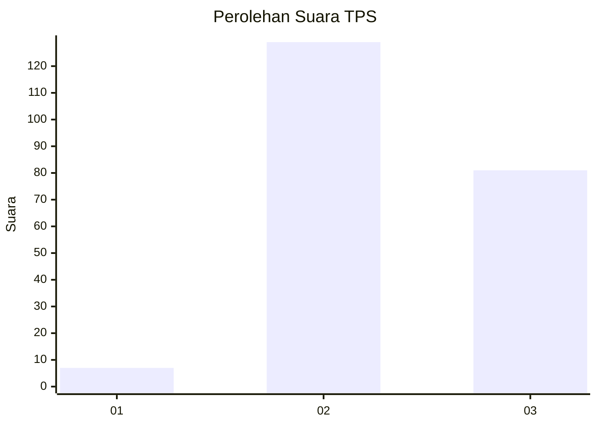
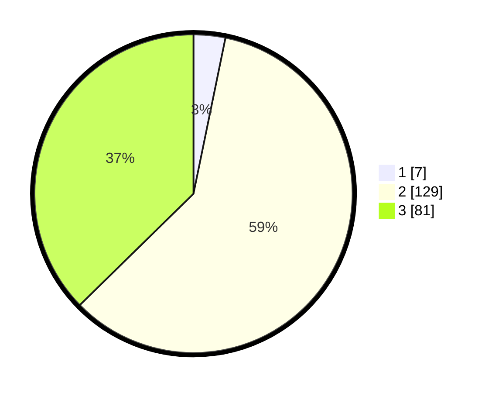

# Hasil

## Grafik

## Tabel

| No. | Nama Paslon    | Suara | Suara (raw) | Persentase |
|:--- |:-------------- | -----:| -----------:| ----------:|
| 1   | ANIES MUHAIMIN | 7     | [7][p-1]    | 3,23       |
| 2   | PRABOWO GIBRAN | 129   | [129][p-2]  | 59,45      |
| 3   | GANJAR MAHFUD  | 81    | [81][p-3]   | 37,33      |

[p-1]: https://github.com/gigit-pemilu/pemilu-2024-51-bali/blob/main/pilpres/hitung-suara/sub/51-bali/sub/03-badung/sub/06-kuta-utara/sub/2006-dalung/sub/039-tps/sub/paslon-1.txt
[p-2]: https://github.com/gigit-pemilu/pemilu-2024-51-bali/blob/main/pilpres/hitung-suara/sub/51-bali/sub/03-badung/sub/06-kuta-utara/sub/2006-dalung/sub/039-tps/sub/paslon-2.txt
[p-3]: https://github.com/gigit-pemilu/pemilu-2024-51-bali/blob/main/pilpres/hitung-suara/sub/51-bali/sub/03-badung/sub/06-kuta-utara/sub/2006-dalung/sub/039-tps/sub/paslon-3.txt

## Foto C Plano

https://sirekap-obj-formc.kpu.go.id/a462/pemilu/ppwp/51/03/06/20/06/5103062006039-20240214-231853--51551f1d-887e-4ea0-ab49-31baf05fe152.jpg

https://sirekap-obj-formc.kpu.go.id/a462/pemilu/ppwp/51/03/06/20/06/5103062006039-20240214-232433--aab8ba03-9fde-4fae-8d80-751a446c59dc.jpg

https://sirekap-obj-formc.kpu.go.id/a462/pemilu/ppwp/51/03/06/20/06/5103062006039-20240214-232653--f2a3cded-7c1e-4ec8-abed-787e78f49afd.jpg

## Metadata

| Key        | Value               |
| ---------- | ------------------- |
| Time Stamp | 2024-02-25 11:00:00 |

