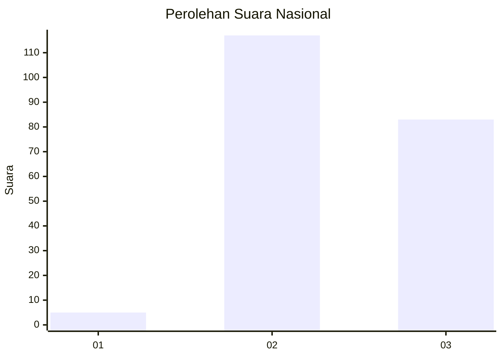
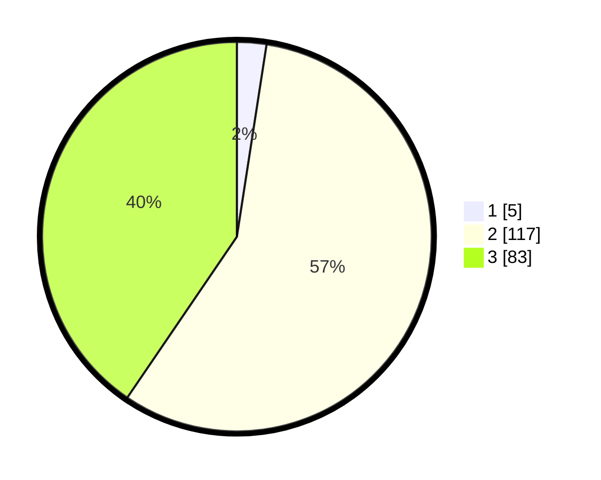

# Hasil

## Grafik

## Tabel

| No. | Nama Paslon    | Suara | Suara (raw) | Persentase |
|:--- |:-------------- | -----:| -----------:| ----------:|
| 1   | ANIES MUHAIMIN | 5     | [5][p-1]    | 2,44       |
| 2   | PRABOWO GIBRAN | 117   | [117][p-2]  | 57,07      |
| 3   | GANJAR MAHFUD  | 83    | [83][p-3]   | 40,49      |

[p-1]: https://github.com/gigit-pemilu/pemilu-2024/blob/main/pilpres/hitung-suara/sub/51-bali/sub/03-badung/sub/06-kuta-utara/sub/2006-dalung/sub/045-tps/sub/paslon-1.txt
[p-2]: https://github.com/gigit-pemilu/pemilu-2024/blob/main/pilpres/hitung-suara/sub/51-bali/sub/03-badung/sub/06-kuta-utara/sub/2006-dalung/sub/045-tps/sub/paslon-2.txt
[p-3]: https://github.com/gigit-pemilu/pemilu-2024/blob/main/pilpres/hitung-suara/sub/51-bali/sub/03-badung/sub/06-kuta-utara/sub/2006-dalung/sub/045-tps/sub/paslon-3.txt

## Foto C Plano

https://sirekap-obj-formc.kpu.go.id/84c8/pemilu/ppwp/51/03/06/20/06/5103062006045-20240214-141126--a30baff8-e8bc-4bbc-98cb-ab5f765b2a19.jpg

https://sirekap-obj-formc.kpu.go.id/84c8/pemilu/ppwp/51/03/06/20/06/5103062006045-20240214-141209--d1b66aa4-f22b-4d7e-88c0-e66975c1c3ff.jpg

https://sirekap-obj-formc.kpu.go.id/84c8/pemilu/ppwp/51/03/06/20/06/5103062006045-20240214-141501--01ed9bf7-0d94-47dd-8494-ce5432c3c508.jpg

## Metadata

| Key        | Value               |
| ---------- | ------------------- |
| Time Stamp | 2024-02-21 18:00:00 |

## DATA PEMILIH TETAP

Jumlah pemilih dalam DPT: **245**.
 * L: **118**.
 * P: **127**.

## DATA PENGGUNA HAK PILIH

Jumlah pengguna hak pilih dalam DPT: **203**.
 * L: **98**.
 * P: **105**.

Jumlah pengguna hak pilih dalam DPTb: **4**.
 * L: **1**.
 * P: **3**.

Jumlah pengguna hak pilih dalam DPK: **1**.
 * L: **1**.
 * P: **0**.

Jumlah pengguna hak pilih: **208**.
 * L: **100**.
 * P: **108**.

## JUMLAH SUARA SAH DAN TIDAK SAH

JUMLAH SELURUH SUARA SAH: **205**.

JUMLAH SUARA TIDAK SAH: **3**.

JUMLAH SELURUH SUARA SAH DAN SUARA TIDAK SAH: **208**.

