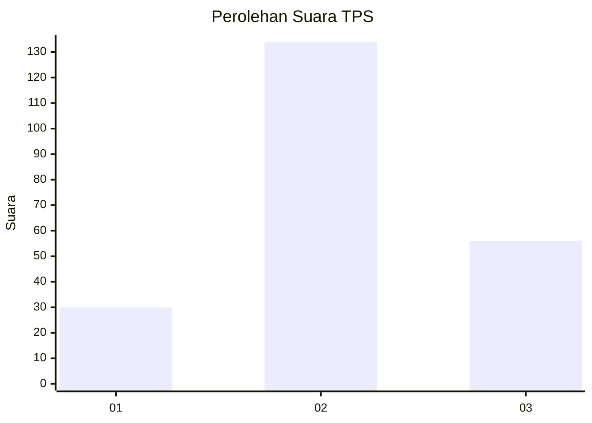
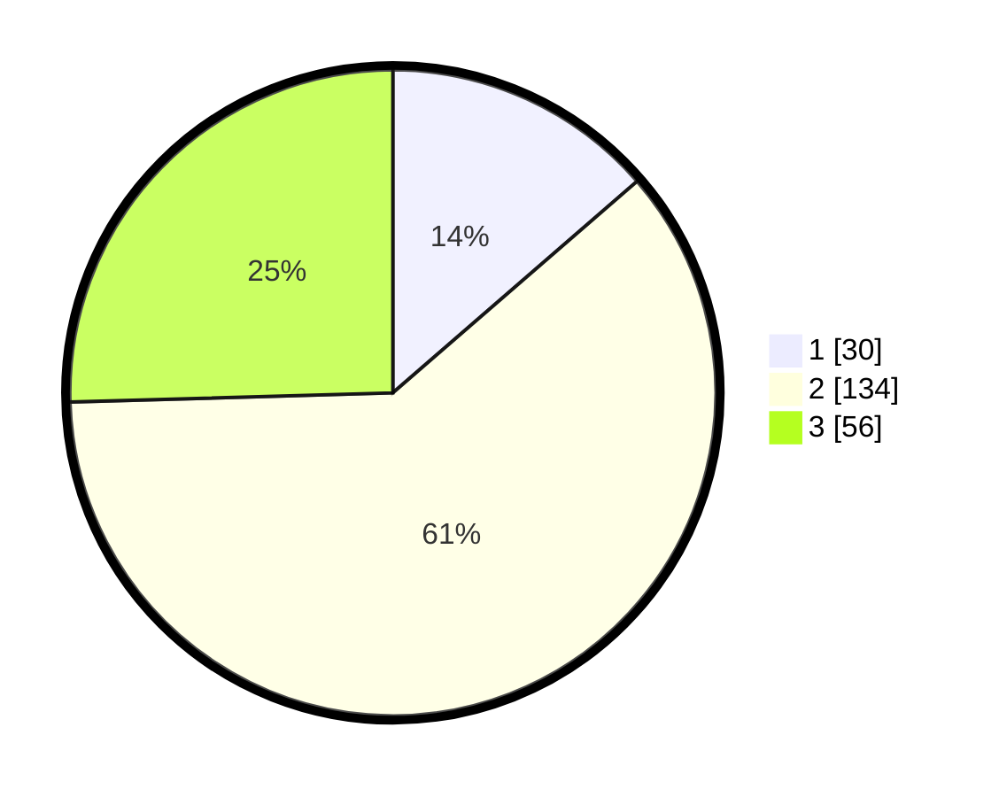

# Hasil

## Grafik

## Tabel

| No. | Nama Paslon    | Suara | Suara (raw) | Persentase |
|:--- |:-------------- | -----:| -----------:| ----------:|
| 1   | ANIES MUHAIMIN | 30    | [30][p-1]   | 13,64      |
| 2   | PRABOWO GIBRAN | 134   | [134][p-2]  | 60,91      |
| 3   | GANJAR MAHFUD  | 56    | [56][p-3]   | 25,45      |

[p-1]: https://github.com/gigit-pemilu/pemilu-2024-51-bali/blob/main/pilpres/hitung-suara/sub/51-bali/sub/03-badung/sub/06-kuta-utara/sub/2006-dalung/sub/046-tps/sub/paslon-1.txt
[p-2]: https://github.com/gigit-pemilu/pemilu-2024-51-bali/blob/main/pilpres/hitung-suara/sub/51-bali/sub/03-badung/sub/06-kuta-utara/sub/2006-dalung/sub/046-tps/sub/paslon-2.txt
[p-3]: https://github.com/gigit-pemilu/pemilu-2024-51-bali/blob/main/pilpres/hitung-suara/sub/51-bali/sub/03-badung/sub/06-kuta-utara/sub/2006-dalung/sub/046-tps/sub/paslon-3.txt

## Foto C Plano

https://sirekap-obj-formc.kpu.go.id/cd4b/pemilu/ppwp/51/03/06/20/06/5103062006046-20240214-224241--12927250-3c0d-4511-97e0-f57a7977edcf.jpg

https://sirekap-obj-formc.kpu.go.id/cd4b/pemilu/ppwp/51/03/06/20/06/5103062006046-20240214-224352--0edc02fe-aa9c-42c3-9b0a-03a9b66a6584.jpg

https://sirekap-obj-formc.kpu.go.id/cd4b/pemilu/ppwp/51/03/06/20/06/5103062006046-20240214-224458--a5218728-c926-4eb8-887c-460409f9981f.jpg

## Metadata

| Key        | Value               |
| ---------- | ------------------- |
| Time Stamp | 2024-02-24 22:31:28 |

