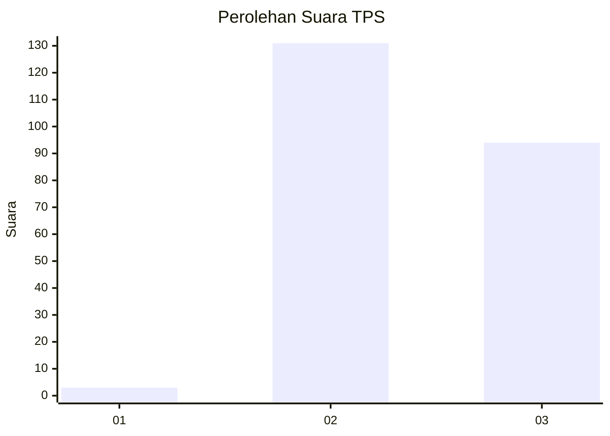
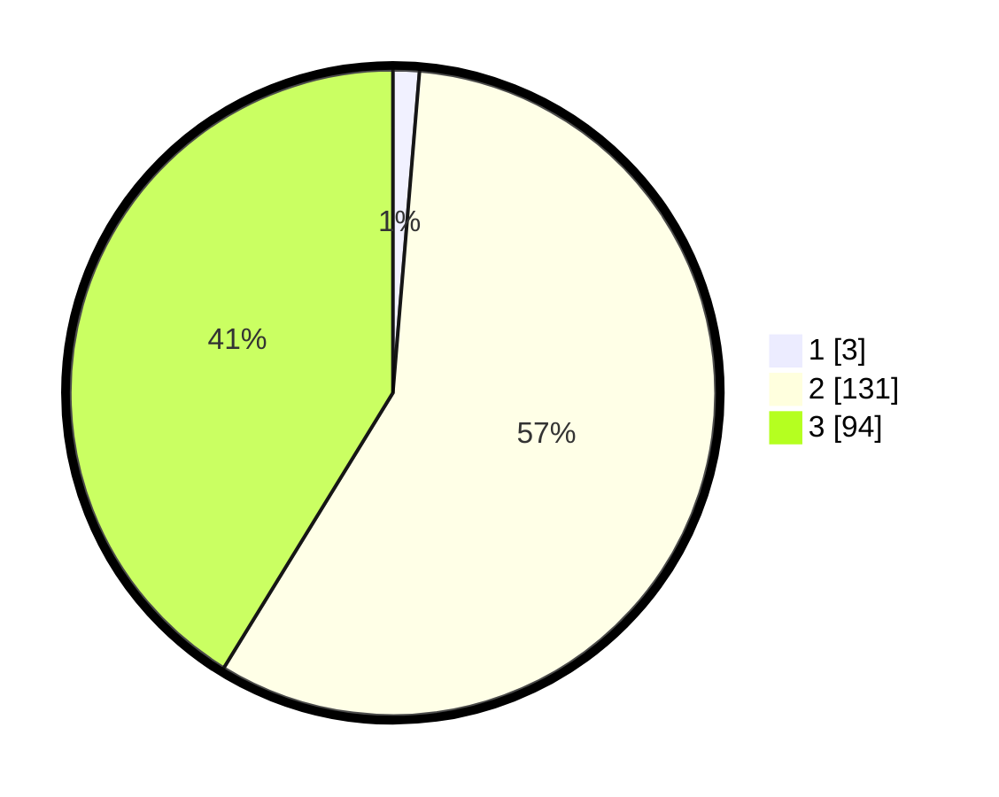

# Hasil

## Grafik

## Tabel

| No. | Nama Paslon    | Suara | Suara (raw) | Persentase |
|:--- |:-------------- | -----:| -----------:| ----------:|
| 1   | ANIES MUHAIMIN | 3     | [3][p-1]    | 1,32       |
| 2   | PRABOWO GIBRAN | 131   | [131][p-2]  | 57,46      |
| 3   | GANJAR MAHFUD  | 94    | [94][p-3]   | 41,23      |

[p-1]: https://github.com/gigit-pemilu/pemilu-2024-51-bali/blob/main/pilpres/hitung-suara/sub/51-bali/sub/03-badung/sub/06-kuta-utara/sub/2006-dalung/sub/052-tps/sub/paslon-1.txt
[p-2]: https://github.com/gigit-pemilu/pemilu-2024-51-bali/blob/main/pilpres/hitung-suara/sub/51-bali/sub/03-badung/sub/06-kuta-utara/sub/2006-dalung/sub/052-tps/sub/paslon-2.txt
[p-3]: https://github.com/gigit-pemilu/pemilu-2024-51-bali/blob/main/pilpres/hitung-suara/sub/51-bali/sub/03-badung/sub/06-kuta-utara/sub/2006-dalung/sub/052-tps/sub/paslon-3.txt

## Foto C Plano

https://sirekap-obj-formc.kpu.go.id/5adf/pemilu/ppwp/51/03/06/20/06/5103062006052-20240214-205000--05a33055-dd56-4daf-b031-3676ea42bf6a.jpg

https://sirekap-obj-formc.kpu.go.id/5adf/pemilu/ppwp/51/03/06/20/06/5103062006052-20240214-205006--bdb687db-89e4-4e26-92f0-3d2fb3fee878.jpg

https://sirekap-obj-formc.kpu.go.id/5adf/pemilu/ppwp/51/03/06/20/06/5103062006052-20240214-205011--20aa96b3-a2b1-4034-9b9c-2674ddbb6adf.jpg

## Metadata

| Key        | Value               |
| ---------- | ------------------- |
| Time Stamp | 2024-02-24 22:31:28 |

