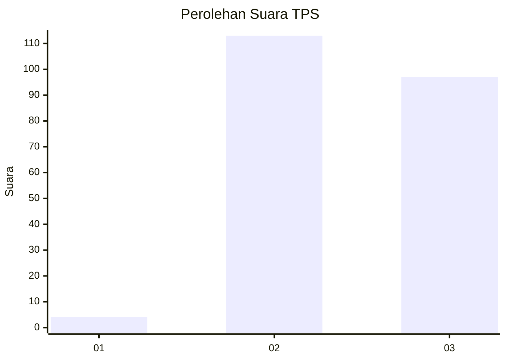
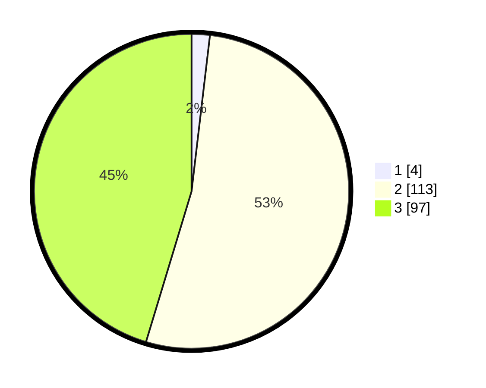

# Hasil

## Grafik

## Tabel

| No. | Nama Paslon    | Suara | Suara (raw) | Persentase |
|:--- |:-------------- | -----:| -----------:| ----------:|
| 1   | ANIES MUHAIMIN | 4     | [4][p-1]    | 1,87       |
| 2   | PRABOWO GIBRAN | 113   | [113][p-2]  | 52,80      |
| 3   | GANJAR MAHFUD  | 97    | [97][p-3]   | 45,33      |

[p-1]: https://github.com/gigit-pemilu/pemilu-2024-51-bali/blob/main/pilpres/hitung-suara/sub/51-bali/sub/03-badung/sub/06-kuta-utara/sub/2006-dalung/sub/053-tps/sub/paslon-1.txt
[p-2]: https://github.com/gigit-pemilu/pemilu-2024-51-bali/blob/main/pilpres/hitung-suara/sub/51-bali/sub/03-badung/sub/06-kuta-utara/sub/2006-dalung/sub/053-tps/sub/paslon-2.txt
[p-3]: https://github.com/gigit-pemilu/pemilu-2024-51-bali/blob/main/pilpres/hitung-suara/sub/51-bali/sub/03-badung/sub/06-kuta-utara/sub/2006-dalung/sub/053-tps/sub/paslon-3.txt

## Foto C Plano

https://sirekap-obj-formc.kpu.go.id/0f46/pemilu/ppwp/51/03/06/20/06/5103062006053-20240214-212920--78d36af3-67f5-4f1f-8dc8-e9bdaa03f43a.jpg

https://sirekap-obj-formc.kpu.go.id/0f46/pemilu/ppwp/51/03/06/20/06/5103062006053-20240214-212927--189d115a-436d-4e92-85ce-f0841634458a.jpg

https://sirekap-obj-formc.kpu.go.id/0f46/pemilu/ppwp/51/03/06/20/06/5103062006053-20240214-212933--b94b8a10-ac26-4459-bec7-7e8b9af07118.jpg

## Metadata

| Key        | Value               |
| ---------- | ------------------- |
| Time Stamp | 2024-02-15 00:41:44 |

## DATA PEMILIH TETAP

Jumlah pemilih dalam DPT: **243**.
 * L: **119**.
 * P: **124**.

## DATA PENGGUNA HAK PILIH

Jumlah pengguna hak pilih dalam DPT: **210**.
 * L: **99**.
 * P: **111**.

Jumlah pengguna hak pilih dalam DPTb: **4**.
 * L: **3**.
 * P: **1**.

Jumlah pengguna hak pilih dalam DPK: **0**.
 * L: **0**.
 * P: **0**.

Jumlah pengguna hak pilih: **214**.
 * L: **102**.
 * P: **112**.

## JUMLAH SUARA SAH DAN TIDAK SAH

JUMLAH SELURUH SUARA SAH: **214**.

JUMLAH SUARA TIDAK SAH: **0**.

JUMLAH SELURUH SUARA SAH DAN SUARA TIDAK SAH: **214**.

