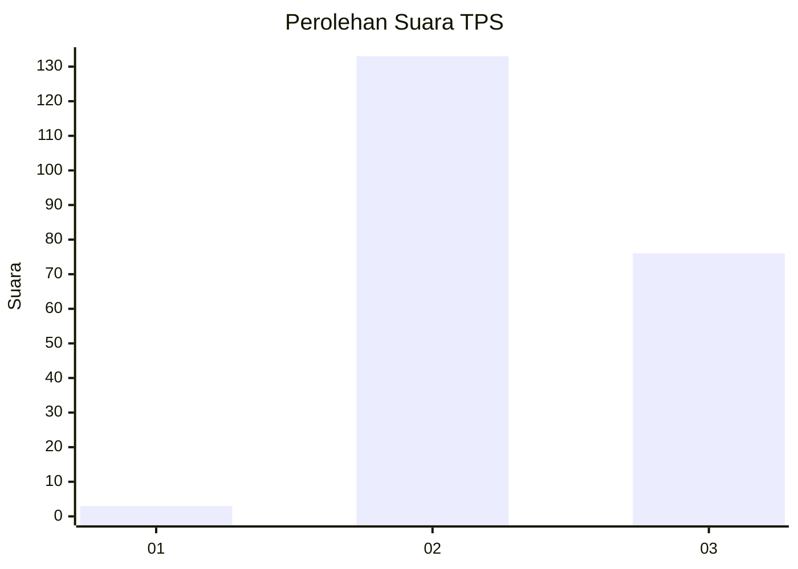
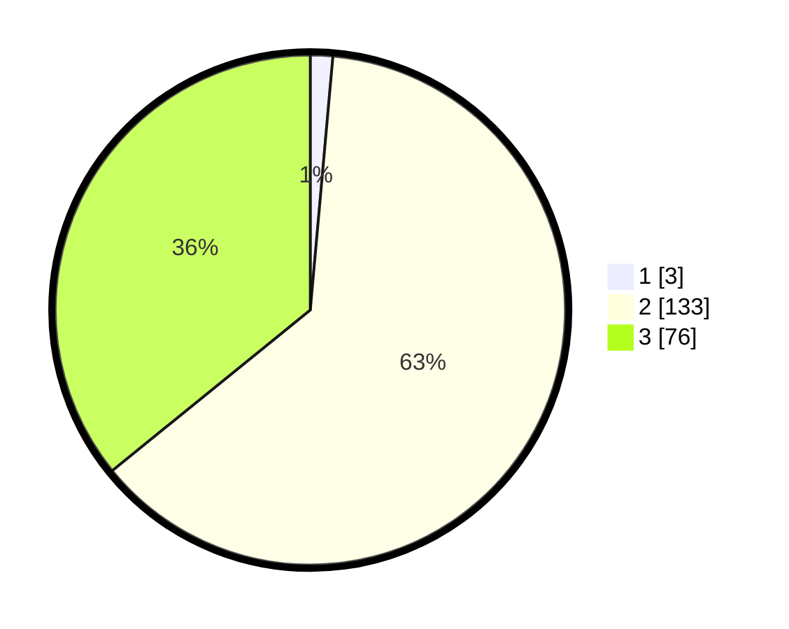

# Hasil

## Grafik

## Tabel

| No. | Nama Paslon    | Suara | Suara (raw) | Persentase |
|:--- |:-------------- | -----:| -----------:| ----------:|
| 1   | ANIES MUHAIMIN | 3     | [3][p-1]    | 1,42       |
| 2   | PRABOWO GIBRAN | 133   | [133][p-2]  | 62,74      |
| 3   | GANJAR MAHFUD  | 76    | [76][p-3]   | 35,85      |

[p-1]: https://github.com/gigit-pemilu/pemilu-2024-51-bali/blob/main/pilpres/hitung-suara/sub/51-bali/sub/03-badung/sub/06-kuta-utara/sub/2006-dalung/sub/054-tps/sub/paslon-1.txt
[p-2]: https://github.com/gigit-pemilu/pemilu-2024-51-bali/blob/main/pilpres/hitung-suara/sub/51-bali/sub/03-badung/sub/06-kuta-utara/sub/2006-dalung/sub/054-tps/sub/paslon-2.txt
[p-3]: https://github.com/gigit-pemilu/pemilu-2024-51-bali/blob/main/pilpres/hitung-suara/sub/51-bali/sub/03-badung/sub/06-kuta-utara/sub/2006-dalung/sub/054-tps/sub/paslon-3.txt

## Foto C Plano

https://sirekap-obj-formc.kpu.go.id/41ce/pemilu/ppwp/51/03/06/20/06/5103062006054-20240216-153106--1f105373-931b-4cda-9065-7b7433453baf.jpg

https://sirekap-obj-formc.kpu.go.id/41ce/pemilu/ppwp/51/03/06/20/06/5103062006054-20240216-153107--c85f98b0-ca13-4755-908f-c4b15fbdb0de.jpg

https://sirekap-obj-formc.kpu.go.id/41ce/pemilu/ppwp/51/03/06/20/06/5103062006054-20240216-153107--b2a33115-2c91-400e-b9cf-68cb80dca62a.jpg

## Metadata

| Key        | Value               |
| ---------- | ------------------- |
| Time Stamp | 2024-02-21 12:00:00 |

## DATA PEMILIH TETAP

Jumlah pemilih dalam DPT: **239**.
 * L: **122**.
 * P: **117**.

## DATA PENGGUNA HAK PILIH

Jumlah pengguna hak pilih dalam DPT: **203**.
 * L: **98**.
 * P: **105**.

Jumlah pengguna hak pilih dalam DPTb: **8**.
 * L: **4**.
 * P: **4**.

Jumlah pengguna hak pilih dalam DPK: **3**.
 * L: **0**.
 * P: **3**.

Jumlah pengguna hak pilih: **214**.
 * L: **102**.
 * P: **112**.

## JUMLAH SUARA SAH DAN TIDAK SAH

JUMLAH SELURUH SUARA SAH: **212**.

JUMLAH SUARA TIDAK SAH: **2**.

JUMLAH SELURUH SUARA SAH DAN SUARA TIDAK SAH: **214**.

