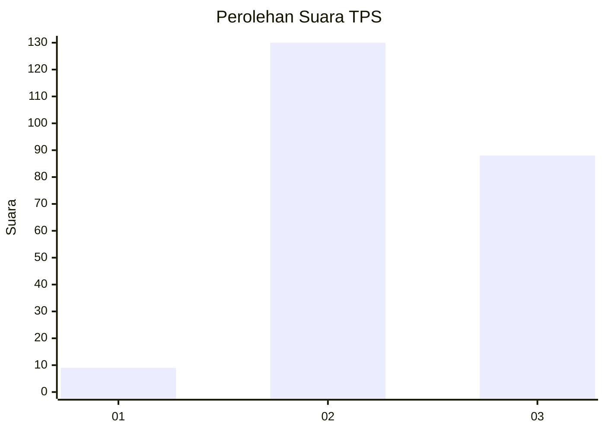
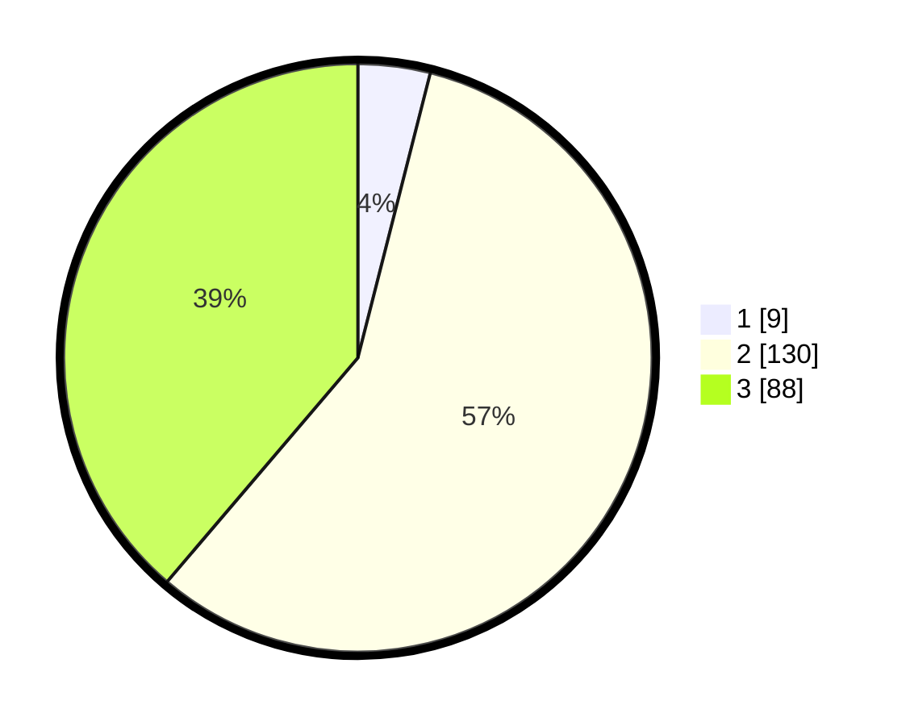

# Hasil

## Grafik

## Tabel

| No. | Nama Paslon    | Suara | Suara (raw) | Persentase |
|:--- |:-------------- | -----:| -----------:| ----------:|
| 1   | ANIES MUHAIMIN | 9     | [9][p-1]    | 3,96       |
| 2   | PRABOWO GIBRAN | 130   | [130][p-2]  | 57,27      |
| 3   | GANJAR MAHFUD  | 88    | [88][p-3]   | 38,77      |

[p-1]: https://github.com/gigit-pemilu/pemilu-2024-51-bali/blob/main/pilpres/hitung-suara/sub/51-bali/sub/03-badung/sub/06-kuta-utara/sub/2006-dalung/sub/058-tps/sub/paslon-1.txt
[p-2]: https://github.com/gigit-pemilu/pemilu-2024-51-bali/blob/main/pilpres/hitung-suara/sub/51-bali/sub/03-badung/sub/06-kuta-utara/sub/2006-dalung/sub/058-tps/sub/paslon-2.txt
[p-3]: https://github.com/gigit-pemilu/pemilu-2024-51-bali/blob/main/pilpres/hitung-suara/sub/51-bali/sub/03-badung/sub/06-kuta-utara/sub/2006-dalung/sub/058-tps/sub/paslon-3.txt

## Foto C Plano

https://sirekap-obj-formc.kpu.go.id/ae4a/pemilu/ppwp/51/03/06/20/06/5103062006058-20240214-141509--10f97d0a-6707-4bb9-a7e9-1e09baa212ec.jpg

https://sirekap-obj-formc.kpu.go.id/ae4a/pemilu/ppwp/51/03/06/20/06/5103062006058-20240215-202306--60886ae9-3083-457a-950c-00f8d94cf116.jpg

https://sirekap-obj-formc.kpu.go.id/ae4a/pemilu/ppwp/51/03/06/20/06/5103062006058-20240214-185945--52b1a499-d9a5-4e14-aa46-214591d5f836.jpg

## Metadata

| Key        | Value               |
| ---------- | ------------------- |
| Time Stamp | 2024-02-21 12:00:00 |

## DATA PEMILIH TETAP

Jumlah pemilih dalam DPT: **288**.
 * L: **145**.
 * P: **143**.

## DATA PENGGUNA HAK PILIH

Jumlah pengguna hak pilih dalam DPT: **211**.
 * L: **107**.
 * P: **104**.

Jumlah pengguna hak pilih dalam DPTb: **17**.
 * L: **8**.
 * P: **9**.

Jumlah pengguna hak pilih dalam DPK: **0**.
 * L: **0**.
 * P: **0**.

Jumlah pengguna hak pilih: **228**.
 * L: **115**.
 * P: **113**.

## JUMLAH SUARA SAH DAN TIDAK SAH

JUMLAH SELURUH SUARA SAH: **227**.

JUMLAH SUARA TIDAK SAH: **1**.

JUMLAH SELURUH SUARA SAH DAN SUARA TIDAK SAH: **228**.

