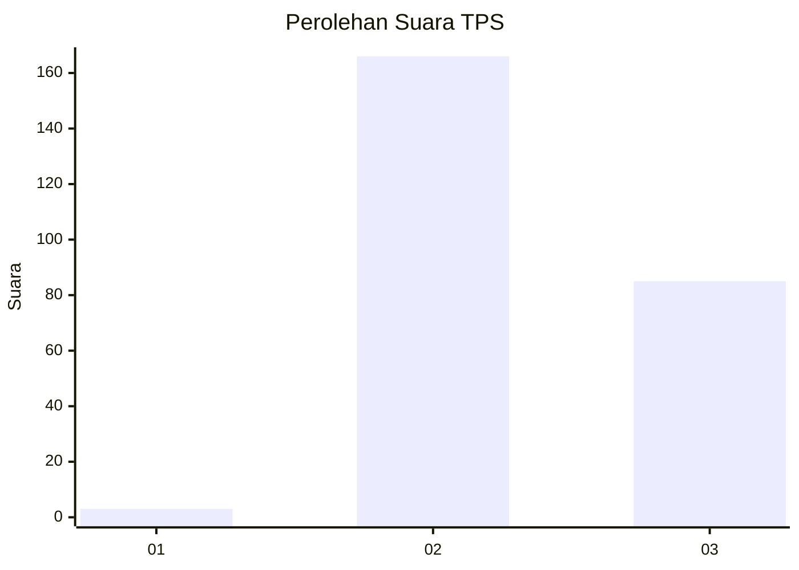
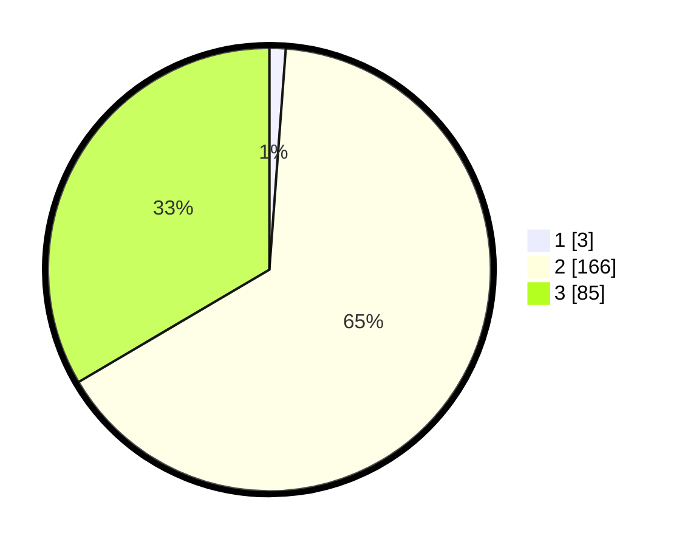

# Hasil

## Grafik

## Tabel

| No. | Nama Paslon    | Suara | Suara (raw) | Persentase |
|:--- |:-------------- | -----:| -----------:| ----------:|
| 1   | ANIES MUHAIMIN | 3     | [3][p-1]    | 1,18       |
| 2   | PRABOWO GIBRAN | 166   | [166][p-2]  | 65,35      |
| 3   | GANJAR MAHFUD  | 85    | [85][p-3]   | 33,46      |

[p-1]: https://github.com/gigit-pemilu/pemilu-2024-51-bali/blob/main/pilpres/hitung-suara/sub/51-bali/sub/03-badung/sub/06-kuta-utara/sub/2006-dalung/sub/059-tps/sub/paslon-1.txt
[p-2]: https://github.com/gigit-pemilu/pemilu-2024-51-bali/blob/main/pilpres/hitung-suara/sub/51-bali/sub/03-badung/sub/06-kuta-utara/sub/2006-dalung/sub/059-tps/sub/paslon-2.txt
[p-3]: https://github.com/gigit-pemilu/pemilu-2024-51-bali/blob/main/pilpres/hitung-suara/sub/51-bali/sub/03-badung/sub/06-kuta-utara/sub/2006-dalung/sub/059-tps/sub/paslon-3.txt

## Foto C Plano

https://sirekap-obj-formc.kpu.go.id/80f5/pemilu/ppwp/51/03/06/20/06/5103062006059-20240214-185920--5aea15b6-7a8f-46b4-9577-70289e35ada5.jpg

https://sirekap-obj-formc.kpu.go.id/80f5/pemilu/ppwp/51/03/06/20/06/5103062006059-20240214-190653--2b54d3da-2bdb-49eb-8a3b-c41ea7fc45e8.jpg

https://sirekap-obj-formc.kpu.go.id/80f5/pemilu/ppwp/51/03/06/20/06/5103062006059-20240216-145807--6a509389-1503-4462-9bc1-583297a2b467.jpg

## Metadata

| Key        | Value               |
| ---------- | ------------------- |
| Time Stamp | 2024-02-21 12:00:00 |

## DATA PEMILIH TETAP

Jumlah pemilih dalam DPT: **296**.
 * L: **150**.
 * P: **146**.

## DATA PENGGUNA HAK PILIH

Jumlah pengguna hak pilih dalam DPT: **239**.
 * L: **123**.
 * P: **116**.

Jumlah pengguna hak pilih dalam DPTb: **10**.
 * L: **5**.
 * P: **5**.

Jumlah pengguna hak pilih dalam DPK: **6**.
 * L: **3**.
 * P: **3**.

Jumlah pengguna hak pilih: **255**.
 * L: **131**.
 * P: **124**.

## JUMLAH SUARA SAH DAN TIDAK SAH

JUMLAH SELURUH SUARA SAH: **254**.

JUMLAH SUARA TIDAK SAH: **1**.

JUMLAH SELURUH SUARA SAH DAN SUARA TIDAK SAH: **255**.

