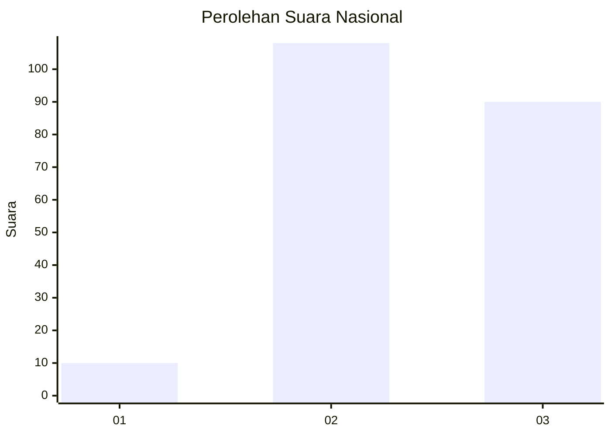
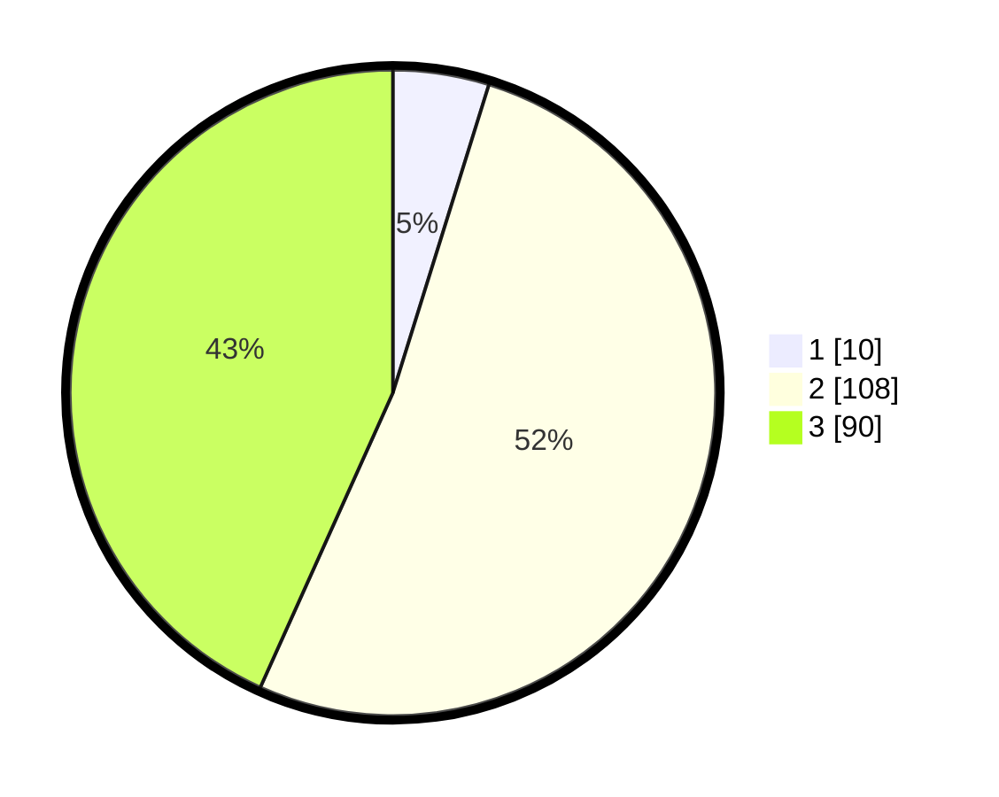

# Hasil

## Grafik

## Tabel

| No. | Nama Paslon    | Suara | Suara (raw) | Persentase |
|:--- |:-------------- | -----:| -----------:| ----------:|
| 1   | ANIES MUHAIMIN | 10    | [10][p-1]   | 4,81       |
| 2   | PRABOWO GIBRAN | 108   | [108][p-2]  | 51,92      |
| 3   | GANJAR MAHFUD  | 90    | [90][p-3]   | 43,27      |

[p-1]: https://github.com/gigit-pemilu/pemilu-2024/blob/main/pilpres/hitung-suara/sub/51-bali/sub/03-badung/sub/06-kuta-utara/sub/2006-dalung/sub/062-tps/sub/paslon-1.txt
[p-2]: https://github.com/gigit-pemilu/pemilu-2024/blob/main/pilpres/hitung-suara/sub/51-bali/sub/03-badung/sub/06-kuta-utara/sub/2006-dalung/sub/062-tps/sub/paslon-2.txt
[p-3]: https://github.com/gigit-pemilu/pemilu-2024/blob/main/pilpres/hitung-suara/sub/51-bali/sub/03-badung/sub/06-kuta-utara/sub/2006-dalung/sub/062-tps/sub/paslon-3.txt

## Foto C Plano

https://sirekap-obj-formc.kpu.go.id/f410/pemilu/ppwp/51/03/06/20/06/5103062006062-20240216-190528--ed0b398f-05a9-4fd0-b3da-fed81acbbf5b.jpg

https://sirekap-obj-formc.kpu.go.id/f410/pemilu/ppwp/51/03/06/20/06/5103062006062-20240216-190703--200a8aca-071d-45fe-aa1c-368f0fac22eb.jpg

## Metadata

| Key        | Value               |
| ---------- | ------------------- |
| Time Stamp | 2024-02-24 22:31:28 |

