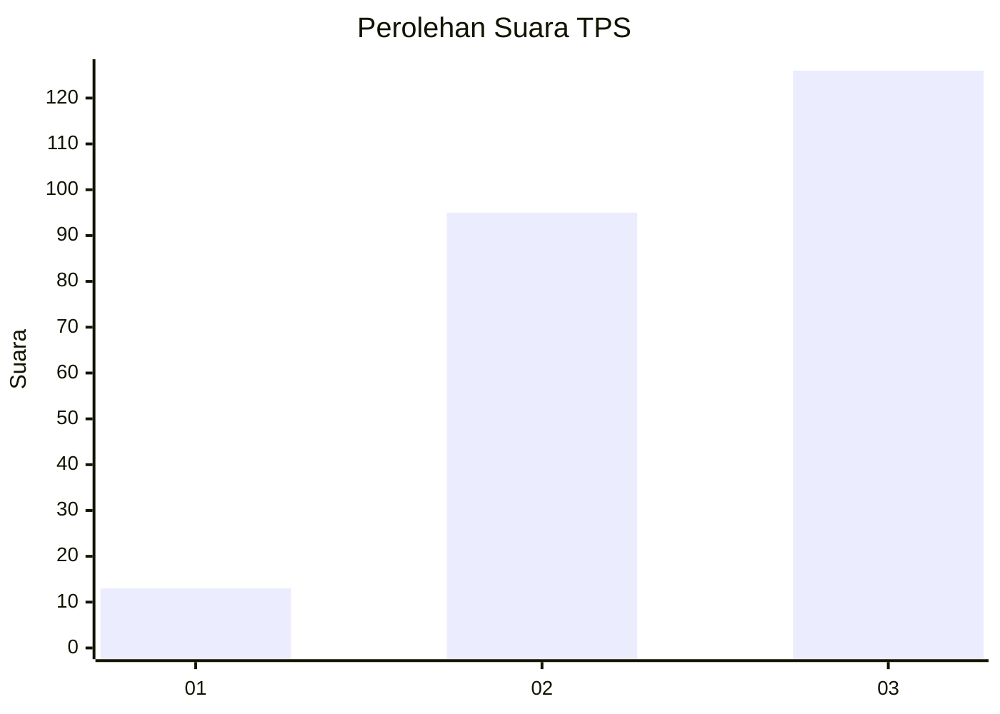
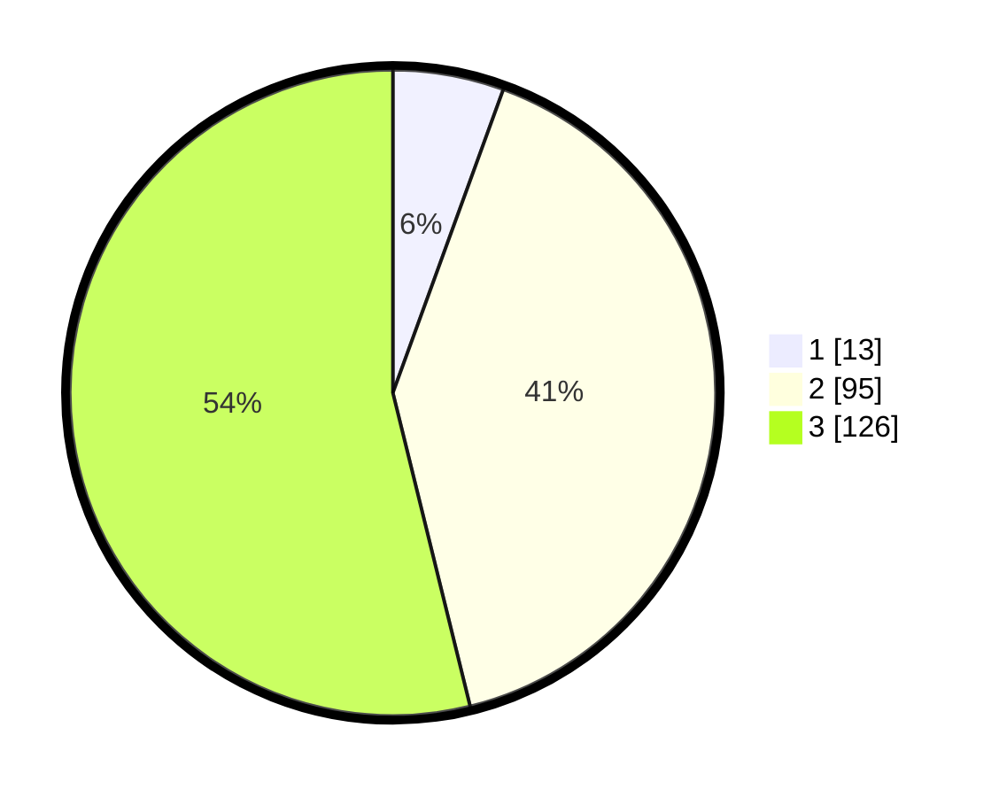

# Hasil

## Grafik

## Tabel

| No. | Nama Paslon    | Suara | Suara (raw) | Persentase |
|:--- |:-------------- | -----:| -----------:| ----------:|
| 1   | ANIES MUHAIMIN | 13    | [13][p-1]   | 5,56       |
| 2   | PRABOWO GIBRAN | 95    | [95][p-2]   | 40,60      |
| 3   | GANJAR MAHFUD  | 126   | [126][p-3]  | 53,85      |

[p-1]: https://github.com/gigit-pemilu/pemilu-2024-51-bali/blob/main/pilpres/hitung-suara/sub/51-bali/sub/03-badung/sub/06-kuta-utara/sub/2006-dalung/sub/065-tps/sub/paslon-1.txt
[p-2]: https://github.com/gigit-pemilu/pemilu-2024-51-bali/blob/main/pilpres/hitung-suara/sub/51-bali/sub/03-badung/sub/06-kuta-utara/sub/2006-dalung/sub/065-tps/sub/paslon-2.txt
[p-3]: https://github.com/gigit-pemilu/pemilu-2024-51-bali/blob/main/pilpres/hitung-suara/sub/51-bali/sub/03-badung/sub/06-kuta-utara/sub/2006-dalung/sub/065-tps/sub/paslon-3.txt

## Foto C Plano

https://sirekap-obj-formc.kpu.go.id/603b/pemilu/ppwp/51/03/06/20/06/5103062006065-20240214-130535--cdc52ed6-1e9e-4c41-8df4-024a8b71ac71.jpg

https://sirekap-obj-formc.kpu.go.id/603b/pemilu/ppwp/51/03/06/20/06/5103062006065-20240216-133414--023d9258-7276-4144-9531-9011a73979aa.jpg

https://sirekap-obj-formc.kpu.go.id/603b/pemilu/ppwp/51/03/06/20/06/5103062006065-20240214-130654--21ff0608-32b0-44aa-873a-2e9827646db7.jpg

## Metadata

| Key        | Value               |
| ---------- | ------------------- |
| Time Stamp | 2024-02-21 10:00:00 |

## DATA PEMILIH TETAP

Jumlah pemilih dalam DPT: **245**.
 * L: **115**.
 * P: **130**.

## DATA PENGGUNA HAK PILIH

Jumlah pengguna hak pilih dalam DPT: **222**.
 * L: **120**.
 * P: **102**.

Jumlah pengguna hak pilih dalam DPTb: **12**.
 * L: **5**.
 * P: **7**.

Jumlah pengguna hak pilih dalam DPK: **0**.
 * L: **0**.
 * P: **0**.

Jumlah pengguna hak pilih: **234**.
 * L: **125**.
 * P: **109**.

## JUMLAH SUARA SAH DAN TIDAK SAH

JUMLAH SELURUH SUARA SAH: **234**.

JUMLAH SUARA TIDAK SAH: **0**.

JUMLAH SELURUH SUARA SAH DAN SUARA TIDAK SAH: **234**.

