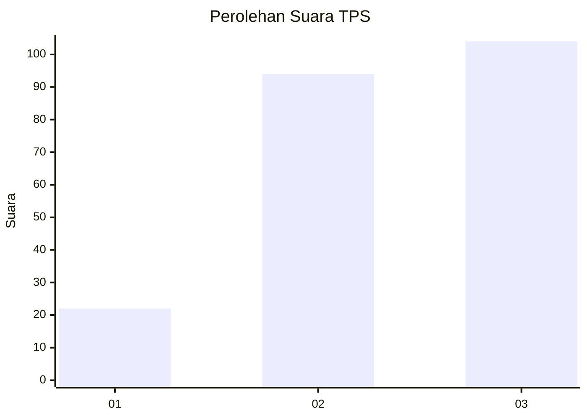
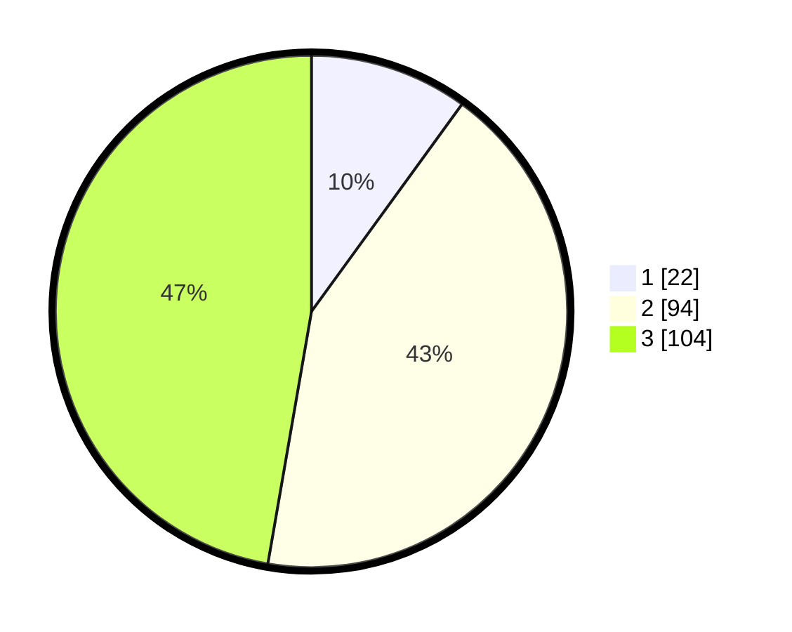

# Hasil

## Grafik

## Tabel

| No. | Nama Paslon    | Suara | Suara (raw) | Persentase |
|:--- |:-------------- | -----:| -----------:| ----------:|
| 1   | ANIES MUHAIMIN | 22    | [22][p-1]   | 10,00      |
| 2   | PRABOWO GIBRAN | 94    | [94][p-2]   | 42,73      |
| 3   | GANJAR MAHFUD  | 104   | [104][p-3]  | 47,27      |

[p-1]: https://github.com/gigit-pemilu/pemilu-2024-51-bali/blob/main/pilpres/hitung-suara/sub/51-bali/sub/03-badung/sub/06-kuta-utara/sub/2006-dalung/sub/067-tps/sub/paslon-1.txt
[p-2]: https://github.com/gigit-pemilu/pemilu-2024-51-bali/blob/main/pilpres/hitung-suara/sub/51-bali/sub/03-badung/sub/06-kuta-utara/sub/2006-dalung/sub/067-tps/sub/paslon-2.txt
[p-3]: https://github.com/gigit-pemilu/pemilu-2024-51-bali/blob/main/pilpres/hitung-suara/sub/51-bali/sub/03-badung/sub/06-kuta-utara/sub/2006-dalung/sub/067-tps/sub/paslon-3.txt

## Foto C Plano

https://sirekap-obj-formc.kpu.go.id/9fae/pemilu/ppwp/51/03/06/20/06/5103062006067-20240216-050253--843e6c84-6133-4561-92c2-907f6431eaa3.jpg

https://sirekap-obj-formc.kpu.go.id/9fae/pemilu/ppwp/51/03/06/20/06/5103062006067-20240216-050301--ca3a9b6f-4a12-493e-8c51-6d2ce746c57b.jpg

https://sirekap-obj-formc.kpu.go.id/9fae/pemilu/ppwp/51/03/06/20/06/5103062006067-20240216-050255--1928c3bc-faea-4a56-b643-72d3af7ac3b4.jpg

## Metadata

| Key        | Value               |
| ---------- | ------------------- |
| Time Stamp | 2024-02-24 22:31:28 |

## DATA PEMILIH TETAP

Jumlah pemilih dalam DPT: **207**.
 * L: **98**.
 * P: **109**.

## DATA PENGGUNA HAK PILIH

Jumlah pengguna hak pilih dalam DPT: **207**.
 * L: **98**.
 * P: **109**.

Jumlah pengguna hak pilih dalam DPTb: **0**.
 * L: **0**.
 * P: **0**.

Jumlah pengguna hak pilih dalam DPK: **14**.
 * L: **6**.
 * P: **8**.

Jumlah pengguna hak pilih: **221**.
 * L: **104**.
 * P: **117**.

## JUMLAH SUARA SAH DAN TIDAK SAH

JUMLAH SELURUH SUARA SAH: **220**.

JUMLAH SUARA TIDAK SAH: **1**.

JUMLAH SELURUH SUARA SAH DAN SUARA TIDAK SAH: **221**.

