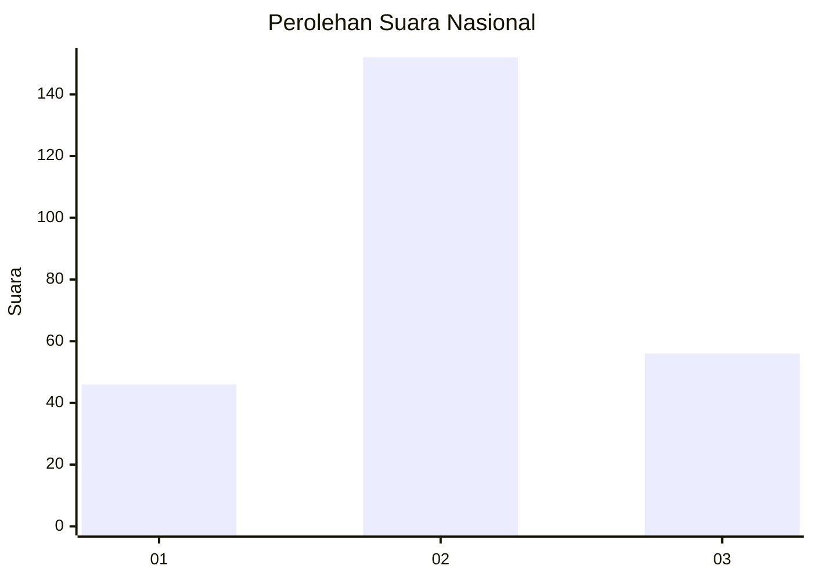
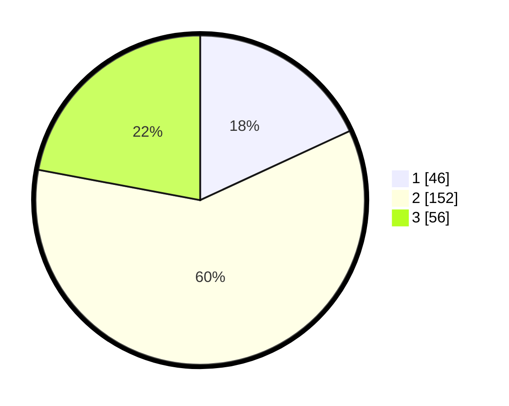

# Hasil

## Grafik

## Tabel

| No. | Nama Paslon    | Suara | Suara (raw) | Persentase |
|:--- |:-------------- | -----:| -----------:| ----------:|
| 1   | ANIES MUHAIMIN | 46    | [46][p-1]   | 18,11      |
| 2   | PRABOWO GIBRAN | 152   | [152][p-2]  | 59,84      |
| 3   | GANJAR MAHFUD  | 56    | [56][p-3]   | 22,05      |

[p-1]: https://github.com/gigit-pemilu/pemilu-2024/blob/main/pilpres/hitung-suara/sub/51-bali/sub/03-badung/sub/06-kuta-utara/sub/2006-dalung/sub/068-tps/sub/paslon-1.txt
[p-2]: https://github.com/gigit-pemilu/pemilu-2024/blob/main/pilpres/hitung-suara/sub/51-bali/sub/03-badung/sub/06-kuta-utara/sub/2006-dalung/sub/068-tps/sub/paslon-2.txt
[p-3]: https://github.com/gigit-pemilu/pemilu-2024/blob/main/pilpres/hitung-suara/sub/51-bali/sub/03-badung/sub/06-kuta-utara/sub/2006-dalung/sub/068-tps/sub/paslon-3.txt

## Foto C Plano

https://sirekap-obj-formc.kpu.go.id/241e/pemilu/ppwp/51/03/06/20/06/5103062006068-20240214-212222--74991dac-1a4b-4649-a00a-88ed1d6b2412.jpg

https://sirekap-obj-formc.kpu.go.id/241e/pemilu/ppwp/51/03/06/20/06/5103062006068-20240214-212510--220da590-0562-4c99-be50-9a80c648952c.jpg

https://sirekap-obj-formc.kpu.go.id/241e/pemilu/ppwp/51/03/06/20/06/5103062006068-20240214-212635--00f445a8-3bc9-4c74-8fb2-a17f6e301b79.jpg

## Metadata

| Key        | Value               |
| ---------- | ------------------- |
| Time Stamp | 2024-02-15 01:47:43 |

## DATA PEMILIH TETAP

Jumlah pemilih dalam DPT: **285**.
 * L: **147**.
 * P: **138**.

## DATA PENGGUNA HAK PILIH

Jumlah pengguna hak pilih dalam DPT: **243**.
 * L: **131**.
 * P: **112**.

Jumlah pengguna hak pilih dalam DPTb: **7**.
 * L: **2**.
 * P: **5**.

Jumlah pengguna hak pilih dalam DPK: **7**.
 * L: **4**.
 * P: **3**.

Jumlah pengguna hak pilih: **257**.
 * L: **137**.
 * P: **120**.

## JUMLAH SUARA SAH DAN TIDAK SAH

JUMLAH SELURUH SUARA SAH: **254**.

JUMLAH SUARA TIDAK SAH: **3**.

JUMLAH SELURUH SUARA SAH DAN SUARA TIDAK SAH: **257**.

