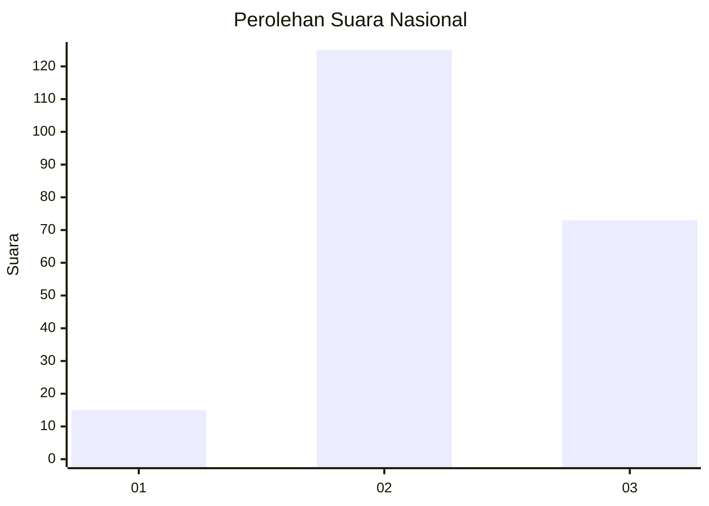
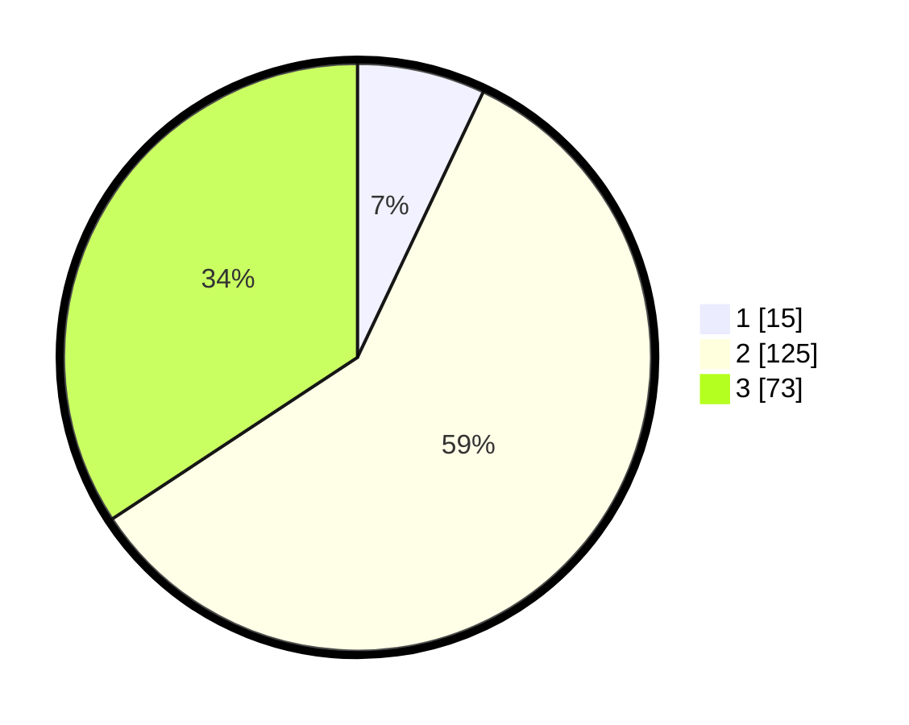

# Hasil

## Grafik

## Tabel

| No. | Nama Paslon    | Suara | Suara (raw) | Persentase |
|:--- |:-------------- | -----:| -----------:| ----------:|
| 1   | ANIES MUHAIMIN | 15    | [15][p-1]   | 7,04       |
| 2   | PRABOWO GIBRAN | 125   | [125][p-2]  | 58,69      |
| 3   | GANJAR MAHFUD  | 73    | [73][p-3]   | 34,27      |

[p-1]: https://github.com/gigit-pemilu/pemilu-2024/blob/main/pilpres/hitung-suara/sub/51-bali/sub/03-badung/sub/06-kuta-utara/sub/2006-dalung/sub/072-tps/sub/paslon-1.txt
[p-2]: https://github.com/gigit-pemilu/pemilu-2024/blob/main/pilpres/hitung-suara/sub/51-bali/sub/03-badung/sub/06-kuta-utara/sub/2006-dalung/sub/072-tps/sub/paslon-2.txt
[p-3]: https://github.com/gigit-pemilu/pemilu-2024/blob/main/pilpres/hitung-suara/sub/51-bali/sub/03-badung/sub/06-kuta-utara/sub/2006-dalung/sub/072-tps/sub/paslon-3.txt

## Foto C Plano

https://sirekap-obj-formc.kpu.go.id/c1a5/pemilu/ppwp/51/03/06/20/06/5103062006072-20240214-131544--d7588c40-bef7-4de6-959c-399cd74ee8a1.jpg

https://sirekap-obj-formc.kpu.go.id/c1a5/pemilu/ppwp/51/03/06/20/06/5103062006072-20240214-131408--e4cd079b-2e0d-4f85-8ec3-f19ffa1e9fa2.jpg

https://sirekap-obj-formc.kpu.go.id/c1a5/pemilu/ppwp/51/03/06/20/06/5103062006072-20240214-131320--3e311945-d01d-48b3-9b93-bfe6edad0db6.jpg

## Metadata

| Key        | Value               |
| ---------- | ------------------- |
| Time Stamp | 2024-02-24 22:31:28 |

