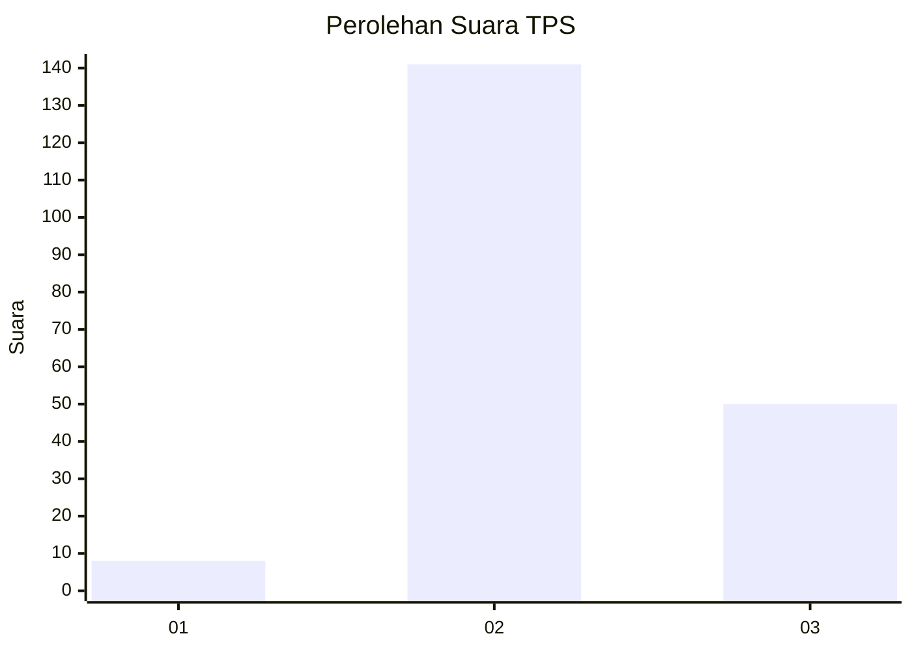
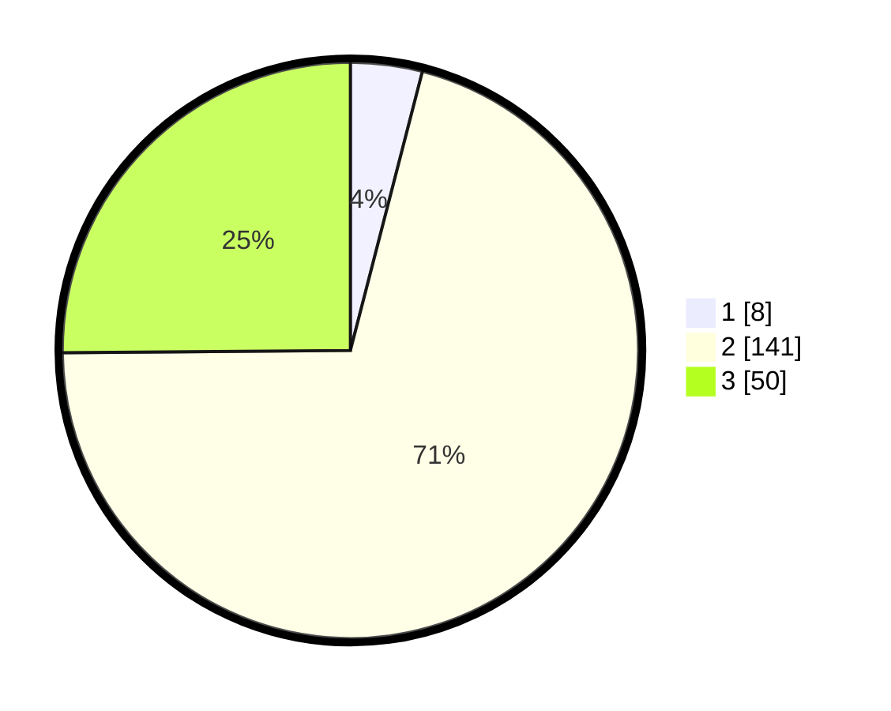

# Hasil

## Grafik

## Tabel

| No. | Nama Paslon    | Suara | Suara (raw) | Persentase |
|:--- |:-------------- | -----:| -----------:| ----------:|
| 1   | ANIES MUHAIMIN | 8     | [8][p-1]    | 4,02       |
| 2   | PRABOWO GIBRAN | 141   | [141][p-2]  | 70,85      |
| 3   | GANJAR MAHFUD  | 50    | [50][p-3]   | 25,13      |

[p-1]: https://github.com/gigit-pemilu/pemilu-2024-51-bali/blob/main/pilpres/hitung-suara/sub/51-bali/sub/03-badung/sub/06-kuta-utara/sub/2006-dalung/sub/074-tps/sub/paslon-1.txt
[p-2]: https://github.com/gigit-pemilu/pemilu-2024-51-bali/blob/main/pilpres/hitung-suara/sub/51-bali/sub/03-badung/sub/06-kuta-utara/sub/2006-dalung/sub/074-tps/sub/paslon-2.txt
[p-3]: https://github.com/gigit-pemilu/pemilu-2024-51-bali/blob/main/pilpres/hitung-suara/sub/51-bali/sub/03-badung/sub/06-kuta-utara/sub/2006-dalung/sub/074-tps/sub/paslon-3.txt

## Foto C Plano

https://sirekap-obj-formc.kpu.go.id/b6c3/pemilu/ppwp/51/03/06/20/06/5103062006074-20240217-184501--88b859c4-3e4b-4c49-9e3a-776823717222.jpg

https://sirekap-obj-formc.kpu.go.id/b6c3/pemilu/ppwp/51/03/06/20/06/5103062006074-20240217-184644--d466eff5-5228-465a-afef-364a034b5cfc.jpg

https://sirekap-obj-formc.kpu.go.id/b6c3/pemilu/ppwp/51/03/06/20/06/5103062006074-20240214-200907--8cd4d49b-a708-4740-931a-2ac14f347ea3.jpg

## Metadata

| Key        | Value               |
| ---------- | ------------------- |
| Time Stamp | 2024-02-24 22:31:28 |

