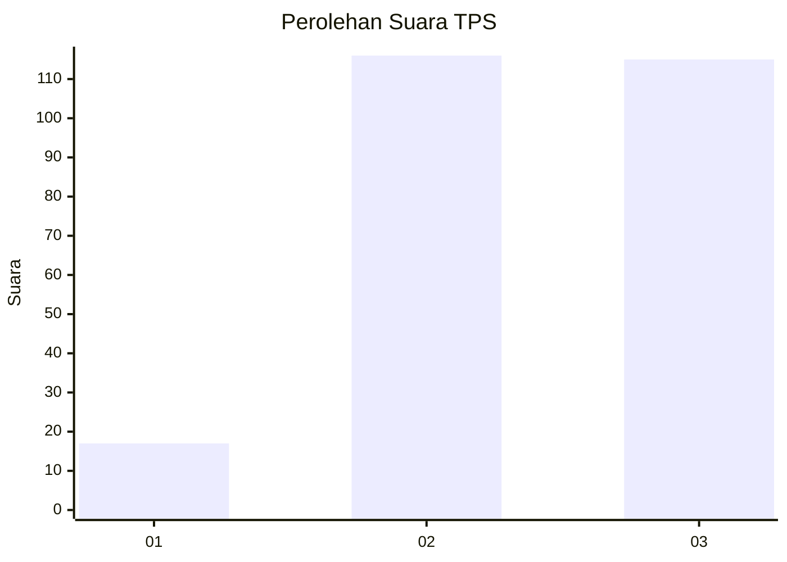
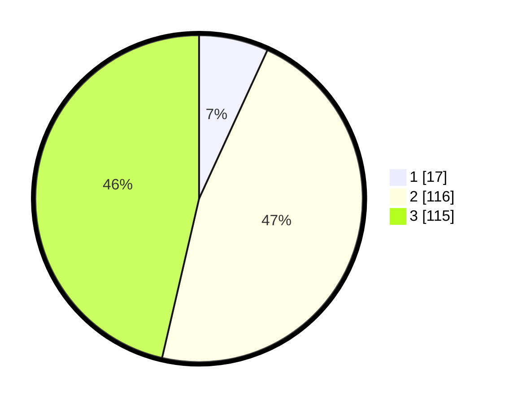

# Hasil

## Grafik

## Tabel

| No. | Nama Paslon    | Suara | Suara (raw) | Persentase |
|:--- |:-------------- | -----:| -----------:| ----------:|
| 1   | ANIES MUHAIMIN | 17    | [17][p-1]   | 6,85       |
| 2   | PRABOWO GIBRAN | 116   | [116][p-2]  | 46,77      |
| 3   | GANJAR MAHFUD  | 115   | [115][p-3]  | 46,37      |

[p-1]: https://github.com/gigit-pemilu/pemilu-2024-51-bali/blob/main/pilpres/hitung-suara/sub/51-bali/sub/03-badung/sub/06-kuta-utara/sub/2006-dalung/sub/076-tps/sub/paslon-1.txt
[p-2]: https://github.com/gigit-pemilu/pemilu-2024-51-bali/blob/main/pilpres/hitung-suara/sub/51-bali/sub/03-badung/sub/06-kuta-utara/sub/2006-dalung/sub/076-tps/sub/paslon-2.txt
[p-3]: https://github.com/gigit-pemilu/pemilu-2024-51-bali/blob/main/pilpres/hitung-suara/sub/51-bali/sub/03-badung/sub/06-kuta-utara/sub/2006-dalung/sub/076-tps/sub/paslon-3.txt

## Foto C Plano

https://sirekap-obj-formc.kpu.go.id/8142/pemilu/ppwp/51/03/06/20/06/5103062006076-20240214-141211--0054c2ca-751d-4193-ad01-421adb7120ce.jpg

https://sirekap-obj-formc.kpu.go.id/8142/pemilu/ppwp/51/03/06/20/06/5103062006076-20240214-141238--0de3760a-a030-4b91-9a90-4a8ec3e6985b.jpg

https://sirekap-obj-formc.kpu.go.id/8142/pemilu/ppwp/51/03/06/20/06/5103062006076-20240214-141317--7e59502c-b836-4479-a1a7-6876bbee79db.jpg

## Metadata

| Key        | Value               |
| ---------- | ------------------- |
| Time Stamp | 2024-02-24 22:31:28 |

## DATA PEMILIH TETAP

Jumlah pemilih dalam DPT: **279**.
 * L: **138**.
 * P: **141**.

## DATA PENGGUNA HAK PILIH

Jumlah pengguna hak pilih dalam DPT: **248**.
 * L: **122**.
 * P: **126**.

Jumlah pengguna hak pilih dalam DPTb: **0**.
 * L: **0**.
 * P: **0**.

Jumlah pengguna hak pilih dalam DPK: **4**.
 * L: **0**.
 * P: **4**.

Jumlah pengguna hak pilih: **252**.
 * L: **122**.
 * P: **130**.

## JUMLAH SUARA SAH DAN TIDAK SAH

JUMLAH SELURUH SUARA SAH: **248**.

JUMLAH SUARA TIDAK SAH: **4**.

JUMLAH SELURUH SUARA SAH DAN SUARA TIDAK SAH: **252**.

