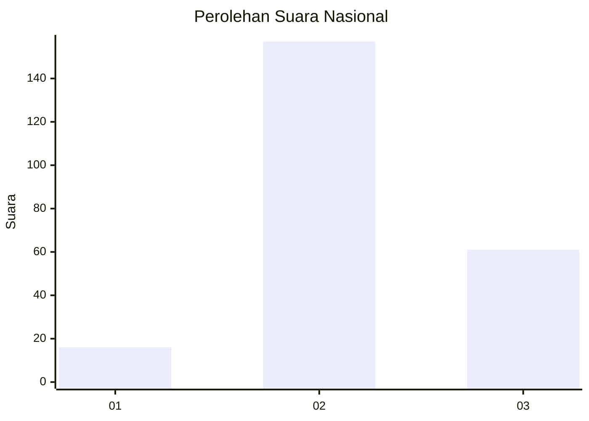

# Hasil

## Grafik

## Tabel

| No. | Nama Paslon    | Suara | Suara (raw) | Persentase |
|:--- |:-------------- | -----:| -----------:| ----------:|
| 1   | ANIES MUHAIMIN | 16    | [16][p-1]   | 6,84       |
| 2   | PRABOWO GIBRAN | 157   | [157][p-2]  | 67,09      |
| 3   | GANJAR MAHFUD  | 61    | [61][p-3]   | 26,07      |

[p-1]: https://github.com/gigit-pemilu/pemilu-2024/blob/main/pilpres/hitung-suara/sub/51-bali/sub/03-badung/sub/06-kuta-utara/sub/2006-dalung/sub/077-tps/sub/paslon-1.txt
[p-2]: https://github.com/gigit-pemilu/pemilu-2024/blob/main/pilpres/hitung-suara/sub/51-bali/sub/03-badung/sub/06-kuta-utara/sub/2006-dalung/sub/077-tps/sub/paslon-2.txt
[p-3]: https://github.com/gigit-pemilu/pemilu-2024/blob/main/pilpres/hitung-suara/sub/51-bali/sub/03-badung/sub/06-kuta-utara/sub/2006-dalung/sub/077-tps/sub/paslon-3.txt

## Foto C Plano

https://sirekap-obj-formc.kpu.go.id/f778/pemilu/ppwp/51/03/06/20/06/5103062006077-20240214-155629--dc234c6c-b456-4f2d-834f-4d7dc8212f3c.jpg

https://sirekap-obj-formc.kpu.go.id/f778/pemilu/ppwp/51/03/06/20/06/5103062006077-20240214-155617--189bbc52-4046-4243-baad-6727cbcd2f23.jpg

https://sirekap-obj-formc.kpu.go.id/f778/pemilu/ppwp/51/03/06/20/06/5103062006077-20240214-155747--eee46b8d-51c5-4b62-8d12-ca27b356d636.jpg

## Metadata

| Key        | Value               |
| ---------- | ------------------- |
| Time Stamp | 2024-02-24 22:31:28 |

## DATA PEMILIH TETAP

Jumlah pemilih dalam DPT: **281**.
 * L: **137**.
 * P: **144**.

## DATA PENGGUNA HAK PILIH

Jumlah pengguna hak pilih dalam DPT: **222**.
 * L: **104**.
 * P: **118**.

Jumlah pengguna hak pilih dalam DPTb: **0**.
 * L: **0**.
 * P: **0**.

Jumlah pengguna hak pilih dalam DPK: **14**.
 * L: **8**.
 * P: **6**.

Jumlah pengguna hak pilih: **236**.
 * L: **112**.
 * P: **124**.

## JUMLAH SUARA SAH DAN TIDAK SAH

JUMLAH SELURUH SUARA SAH: **234**.

JUMLAH SUARA TIDAK SAH: **2**.

JUMLAH SELURUH SUARA SAH DAN SUARA TIDAK SAH: **236**.

