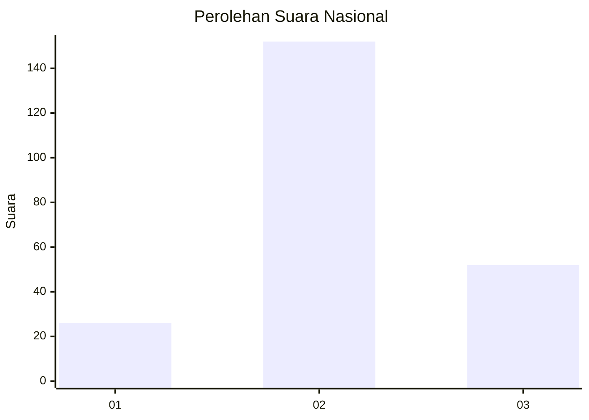
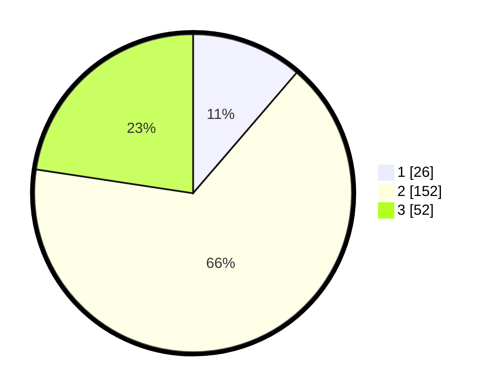

# Hasil

## Grafik

## Tabel

| No. | Nama Paslon    | Suara | Suara (raw) | Persentase |
|:--- |:-------------- | -----:| -----------:| ----------:|
| 1   | ANIES MUHAIMIN | 26    | [26][p-1]   | 11,30      |
| 2   | PRABOWO GIBRAN | 152   | [152][p-2]  | 66,09      |
| 3   | GANJAR MAHFUD  | 52    | [52][p-3]   | 22,61      |

[p-1]: https://github.com/gigit-pemilu/pemilu-2024/blob/main/pilpres/hitung-suara/sub/51-bali/sub/03-badung/sub/06-kuta-utara/sub/2006-dalung/sub/078-tps/sub/paslon-1.txt
[p-2]: https://github.com/gigit-pemilu/pemilu-2024/blob/main/pilpres/hitung-suara/sub/51-bali/sub/03-badung/sub/06-kuta-utara/sub/2006-dalung/sub/078-tps/sub/paslon-2.txt
[p-3]: https://github.com/gigit-pemilu/pemilu-2024/blob/main/pilpres/hitung-suara/sub/51-bali/sub/03-badung/sub/06-kuta-utara/sub/2006-dalung/sub/078-tps/sub/paslon-3.txt

## Foto C Plano

https://sirekap-obj-formc.kpu.go.id/081f/pemilu/ppwp/51/03/06/20/06/5103062006078-20240214-141927--c9bdc859-0cf1-420c-8042-f9d60fc1bbdf.jpg

https://sirekap-obj-formc.kpu.go.id/081f/pemilu/ppwp/51/03/06/20/06/5103062006078-20240214-191137--699deef6-c20b-40bf-9ee7-65758de30e63.jpg

https://sirekap-obj-formc.kpu.go.id/081f/pemilu/ppwp/51/03/06/20/06/5103062006078-20240214-191218--665c8574-1fc6-4cf8-9f4c-0dd3453fcb72.jpg

## Metadata

| Key        | Value               |
| ---------- | ------------------- |
| Time Stamp | 2024-02-24 22:31:28 |

## DATA PEMILIH TETAP

Jumlah pemilih dalam DPT: **269**.
 * L: **134**.
 * P: **135**.

## DATA PENGGUNA HAK PILIH

Jumlah pengguna hak pilih dalam DPT: **228**.
 * L: **110**.
 * P: **118**.

Jumlah pengguna hak pilih dalam DPTb: **4**.
 * L: **1**.
 * P: **3**.

Jumlah pengguna hak pilih dalam DPK: **1**.
 * L: **0**.
 * P: **1**.

Jumlah pengguna hak pilih: **233**.
 * L: **111**.
 * P: **122**.

## JUMLAH SUARA SAH DAN TIDAK SAH

JUMLAH SELURUH SUARA SAH: **230**.

JUMLAH SUARA TIDAK SAH: **3**.

JUMLAH SELURUH SUARA SAH DAN SUARA TIDAK SAH: **233**.

