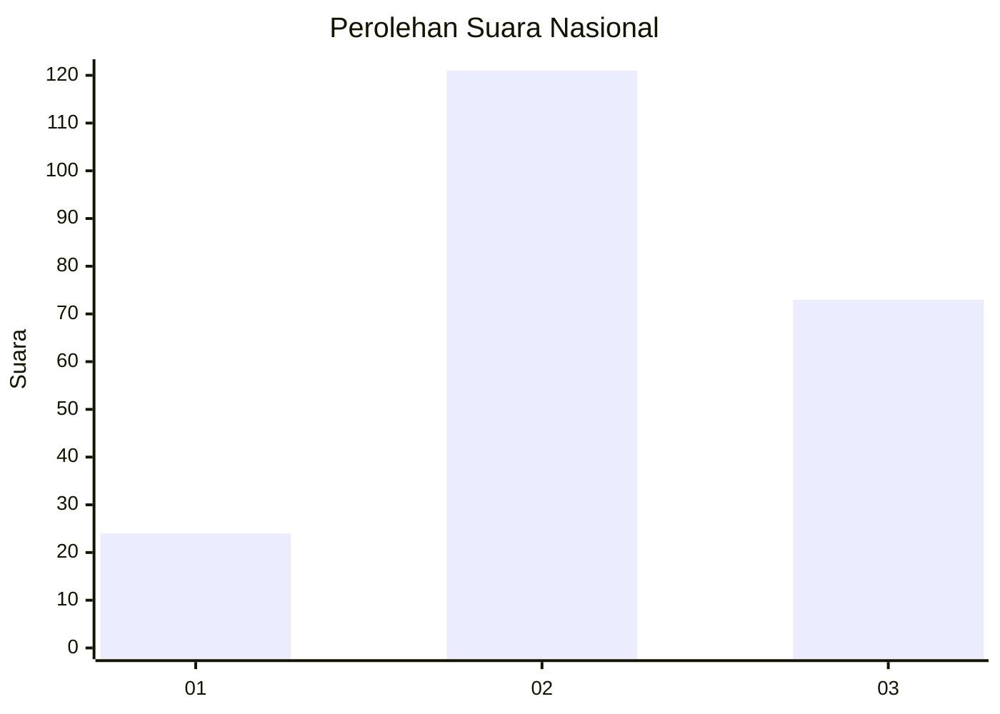
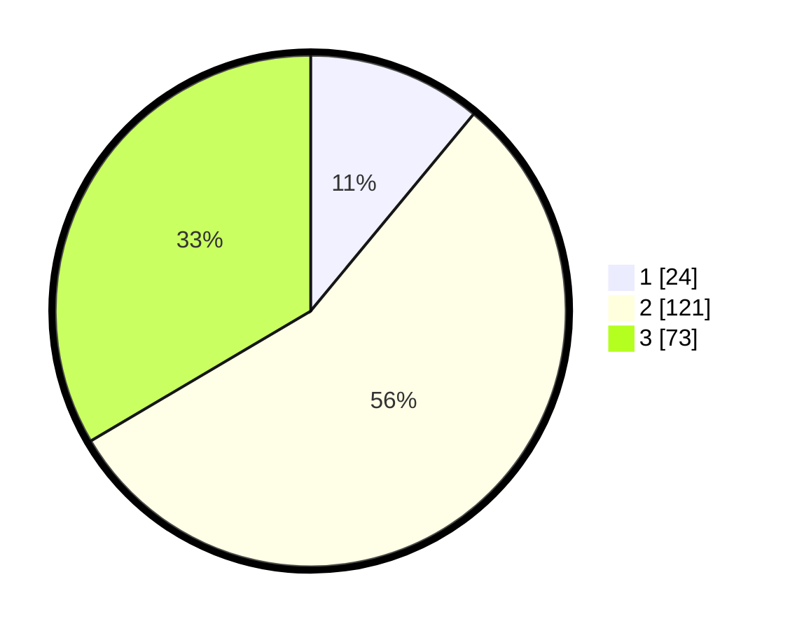

# Hasil

## Grafik

## Tabel

| No. | Nama Paslon    | Suara | Suara (raw) | Persentase |
|:--- |:-------------- | -----:| -----------:| ----------:|
| 1   | ANIES MUHAIMIN | 24    | [24][p-1]   | 11,01      |
| 2   | PRABOWO GIBRAN | 121   | [121][p-2]  | 55,50      |
| 3   | GANJAR MAHFUD  | 73    | [73][p-3]   | 33,49      |

[p-1]: https://github.com/gigit-pemilu/pemilu-2024/blob/main/pilpres/hitung-suara/sub/51-bali/sub/03-badung/sub/06-kuta-utara/sub/2006-dalung/sub/081-tps/sub/paslon-1.txt
[p-2]: https://github.com/gigit-pemilu/pemilu-2024/blob/main/pilpres/hitung-suara/sub/51-bali/sub/03-badung/sub/06-kuta-utara/sub/2006-dalung/sub/081-tps/sub/paslon-2.txt
[p-3]: https://github.com/gigit-pemilu/pemilu-2024/blob/main/pilpres/hitung-suara/sub/51-bali/sub/03-badung/sub/06-kuta-utara/sub/2006-dalung/sub/081-tps/sub/paslon-3.txt

## Foto C Plano

https://sirekap-obj-formc.kpu.go.id/4fd3/pemilu/ppwp/51/03/06/20/06/5103062006081-20240214-141845--cb4f8b77-ca52-4685-9f2c-c2b2f7768f4f.jpg

https://sirekap-obj-formc.kpu.go.id/4fd3/pemilu/ppwp/51/03/06/20/06/5103062006081-20240216-175001--30592891-56a9-410c-a1b6-7915fdb8e2fc.jpg

https://sirekap-obj-formc.kpu.go.id/4fd3/pemilu/ppwp/51/03/06/20/06/5103062006081-20240214-202951--c025f094-7044-4701-a1f2-48c6956cf08b.jpg

## Metadata

| Key        | Value               |
| ---------- | ------------------- |
| Time Stamp | 2024-02-25 00:00:00 |

## DATA PEMILIH TETAP

Jumlah pemilih dalam DPT: **259**.
 * L: **129**.
 * P: **130**.

## DATA PENGGUNA HAK PILIH

Jumlah pengguna hak pilih dalam DPT: **211**.
 * L: **105**.
 * P: **106**.

Jumlah pengguna hak pilih dalam DPTb: **1**.
 * L: **0**.
 * P: **1**.

Jumlah pengguna hak pilih dalam DPK: **8**.
 * L: **5**.
 * P: **3**.

Jumlah pengguna hak pilih: **220**.
 * L: **110**.
 * P: **110**.

## JUMLAH SUARA SAH DAN TIDAK SAH

JUMLAH SELURUH SUARA SAH: **218**.

JUMLAH SUARA TIDAK SAH: **2**.

JUMLAH SELURUH SUARA SAH DAN SUARA TIDAK SAH: **220**.

