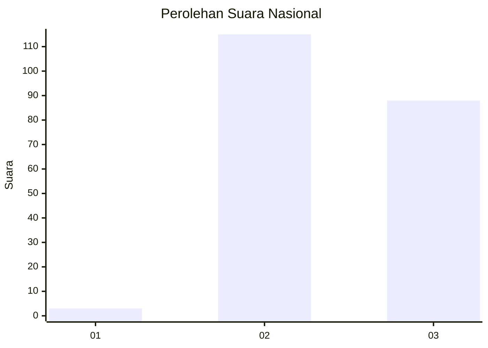
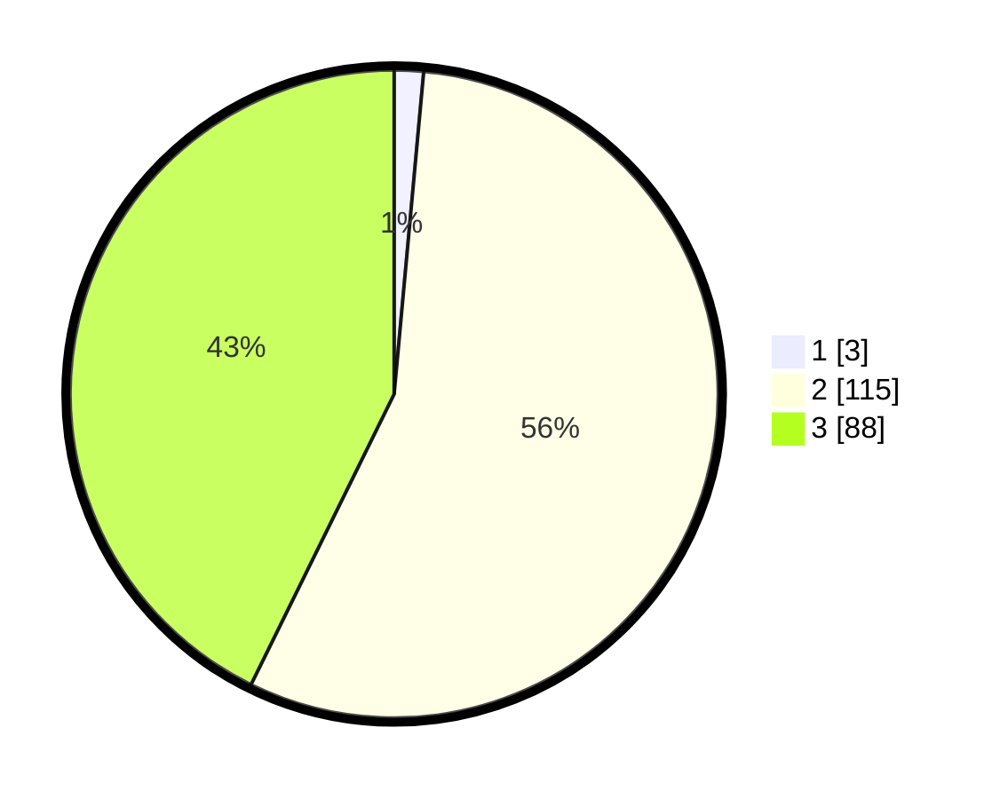

# Hasil

## Grafik

## Tabel

| No. | Nama Paslon    | Suara | Suara (raw) | Persentase |
|:--- |:-------------- | -----:| -----------:| ----------:|
| 1   | ANIES MUHAIMIN | 3     | [3][p-1]    | 1,46       |
| 2   | PRABOWO GIBRAN | 115   | [115][p-2]  | 55,83      |
| 3   | GANJAR MAHFUD  | 88    | [88][p-3]   | 42,72      |

[p-1]: https://github.com/gigit-pemilu/pemilu-2024/blob/main/pilpres/hitung-suara/sub/51-bali/sub/04-gianyar/sub/01-sukawati/sub/2001-batubulan/sub/001-tps/sub/paslon-1.txt
[p-2]: https://github.com/gigit-pemilu/pemilu-2024/blob/main/pilpres/hitung-suara/sub/51-bali/sub/04-gianyar/sub/01-sukawati/sub/2001-batubulan/sub/001-tps/sub/paslon-2.txt
[p-3]: https://github.com/gigit-pemilu/pemilu-2024/blob/main/pilpres/hitung-suara/sub/51-bali/sub/04-gianyar/sub/01-sukawati/sub/2001-batubulan/sub/001-tps/sub/paslon-3.txt

## Foto C Plano

https://sirekap-obj-formc.kpu.go.id/f709/pemilu/ppwp/51/04/01/20/01/5104012001001-20240216-003635--36834550-5805-4cf2-87b8-582c1e24841c.jpg

https://sirekap-obj-formc.kpu.go.id/f709/pemilu/ppwp/51/04/01/20/01/5104012001001-20240216-003641--fe906b32-7758-48df-9b58-3b9543bd29cd.jpg

https://sirekap-obj-formc.kpu.go.id/f709/pemilu/ppwp/51/04/01/20/01/5104012001001-20240216-003638--61d5dd09-e1d9-4e16-bd03-caecbc6f9c6a.jpg

## Metadata

| Key        | Value               |
| ---------- | ------------------- |
| Time Stamp | 2024-02-16 09:30:28 |

## DATA PEMILIH TETAP

Jumlah pemilih dalam DPT: **216**.
 * L: **109**.
 * P: **107**.

## DATA PENGGUNA HAK PILIH

Jumlah pengguna hak pilih dalam DPT: **208**.
 * L: **109**.
 * P: **99**.

Jumlah pengguna hak pilih dalam DPTb: **3**.
 * L: **1**.
 * P: **2**.

Jumlah pengguna hak pilih dalam DPK: **0**.
 * L: **0**.
 * P: **0**.

Jumlah pengguna hak pilih: **211**.
 * L: **110**.
 * P: **101**.

## JUMLAH SUARA SAH DAN TIDAK SAH

JUMLAH SELURUH SUARA SAH: **206**.

JUMLAH SUARA TIDAK SAH: **5**.

JUMLAH SELURUH SUARA SAH DAN SUARA TIDAK SAH: **211**.

