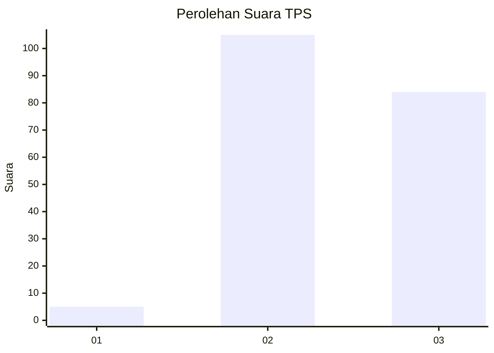
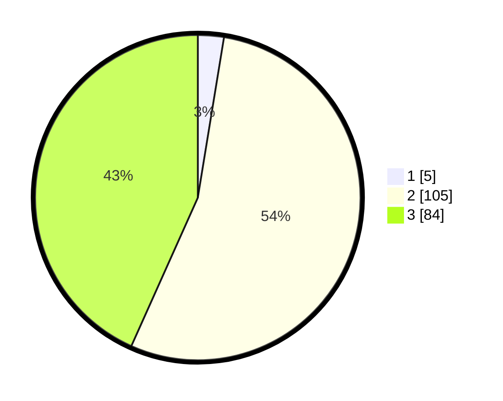

# Hasil

## Grafik

## Tabel

| No. | Nama Paslon    | Suara | Suara (raw) | Persentase |
|:--- |:-------------- | -----:| -----------:| ----------:|
| 1   | ANIES MUHAIMIN | 5     | [5][p-1]    | 2,58       |
| 2   | PRABOWO GIBRAN | 105   | [105][p-2]  | 54,12      |
| 3   | GANJAR MAHFUD  | 84    | [84][p-3]   | 43,30      |

[p-1]: https://github.com/gigit-pemilu/pemilu-2024-51-bali/blob/main/pilpres/hitung-suara/sub/51-bali/sub/04-gianyar/sub/01-sukawati/sub/2001-batubulan/sub/002-tps/sub/paslon-1.txt
[p-2]: https://github.com/gigit-pemilu/pemilu-2024-51-bali/blob/main/pilpres/hitung-suara/sub/51-bali/sub/04-gianyar/sub/01-sukawati/sub/2001-batubulan/sub/002-tps/sub/paslon-2.txt
[p-3]: https://github.com/gigit-pemilu/pemilu-2024-51-bali/blob/main/pilpres/hitung-suara/sub/51-bali/sub/04-gianyar/sub/01-sukawati/sub/2001-batubulan/sub/002-tps/sub/paslon-3.txt

## Foto C Plano

https://sirekap-obj-formc.kpu.go.id/b592/pemilu/ppwp/51/04/01/20/01/5104012001002-20240216-143933--44a8d6f2-b350-48e4-976d-999a698b03bb.jpg

https://sirekap-obj-formc.kpu.go.id/b592/pemilu/ppwp/51/04/01/20/01/5104012001002-20240216-143934--48aa3e67-71e0-4c09-af38-f8b9dff02061.jpg

https://sirekap-obj-formc.kpu.go.id/b592/pemilu/ppwp/51/04/01/20/01/5104012001002-20240216-143934--bf97e70f-fc39-4ed2-96ea-a112a642ad19.jpg

## Metadata

| Key        | Value               |
| ---------- | ------------------- |
| Time Stamp | 2024-02-16 16:25:10 |

## DATA PEMILIH TETAP

Jumlah pemilih dalam DPT: **218**.
 * L: **108**.
 * P: **110**.

## DATA PENGGUNA HAK PILIH

Jumlah pengguna hak pilih dalam DPT: **196**.
 * L: **96**.
 * P: **100**.

Jumlah pengguna hak pilih dalam DPTb: **2**.
 * L: **1**.
 * P: **1**.

Jumlah pengguna hak pilih dalam DPK: **0**.
 * L: **0**.
 * P: **0**.

Jumlah pengguna hak pilih: **198**.
 * L: **97**.
 * P: **101**.

## JUMLAH SUARA SAH DAN TIDAK SAH

JUMLAH SELURUH SUARA SAH: **194**.

JUMLAH SUARA TIDAK SAH: **4**.

JUMLAH SELURUH SUARA SAH DAN SUARA TIDAK SAH: **198**.

