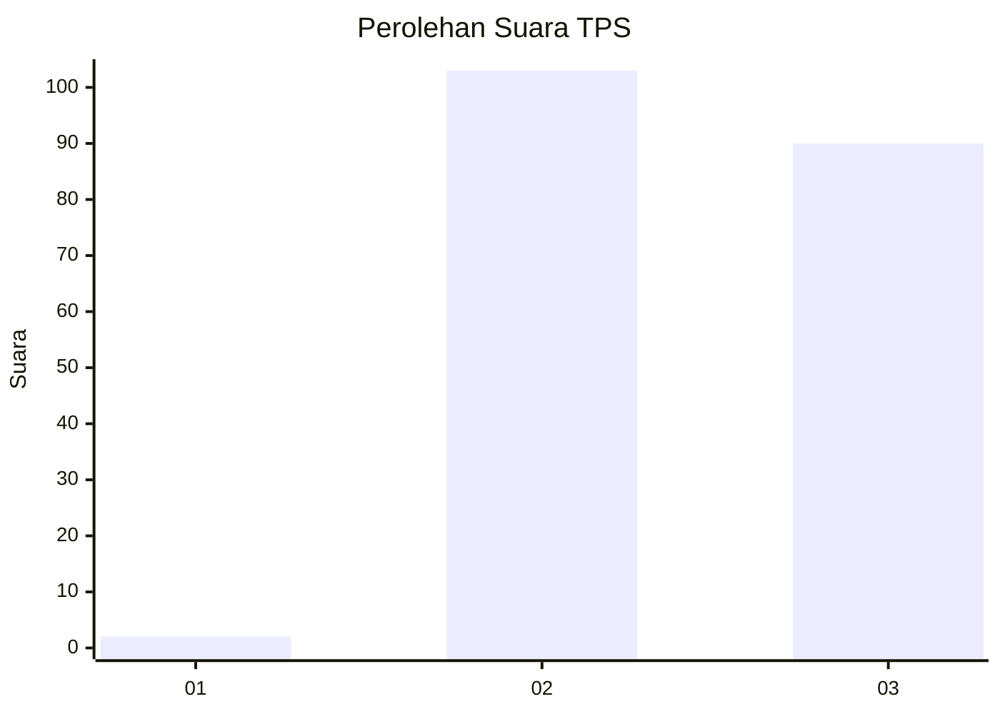
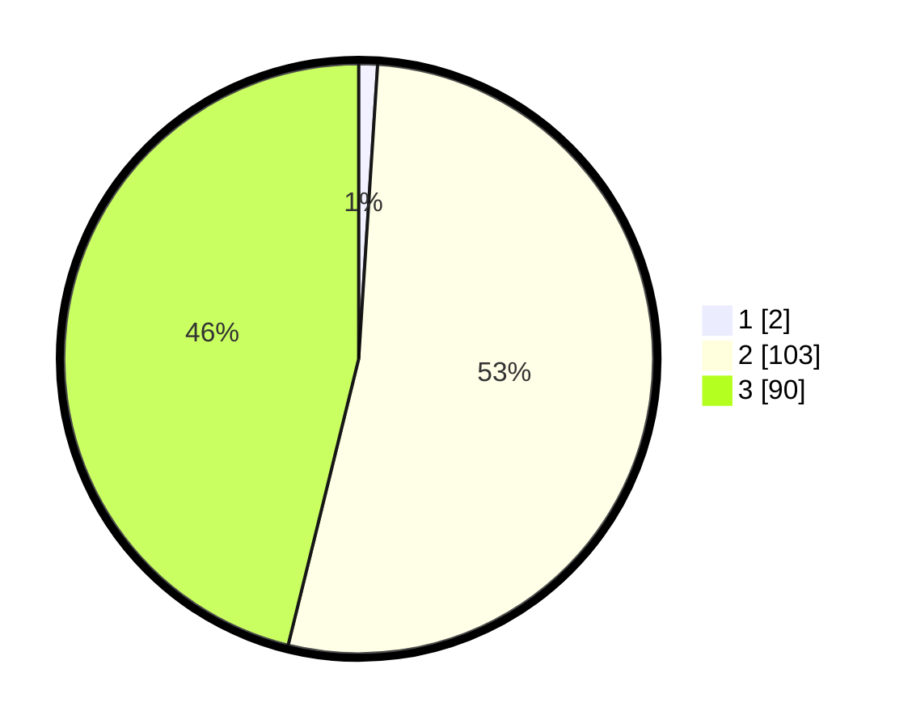

# Hasil

## Grafik

## Tabel

| No. | Nama Paslon    | Suara | Suara (raw) | Persentase |
|:--- |:-------------- | -----:| -----------:| ----------:|
| 1   | ANIES MUHAIMIN | 2     | [2][p-1]    | 1,03       |
| 2   | PRABOWO GIBRAN | 103   | [103][p-2]  | 52,82      |
| 3   | GANJAR MAHFUD  | 90    | [90][p-3]   | 46,15      |

[p-1]: https://github.com/gigit-pemilu/pemilu-2024-51-bali/blob/main/pilpres/hitung-suara/sub/51-bali/sub/04-gianyar/sub/01-sukawati/sub/2001-batubulan/sub/003-tps/sub/paslon-1.txt
[p-2]: https://github.com/gigit-pemilu/pemilu-2024-51-bali/blob/main/pilpres/hitung-suara/sub/51-bali/sub/04-gianyar/sub/01-sukawati/sub/2001-batubulan/sub/003-tps/sub/paslon-2.txt
[p-3]: https://github.com/gigit-pemilu/pemilu-2024-51-bali/blob/main/pilpres/hitung-suara/sub/51-bali/sub/04-gianyar/sub/01-sukawati/sub/2001-batubulan/sub/003-tps/sub/paslon-3.txt

## Foto C Plano

https://sirekap-obj-formc.kpu.go.id/a078/pemilu/ppwp/51/04/01/20/01/5104012001003-20240216-212656--2095c186-d19e-47ae-997c-90c4e8aafb37.jpg

https://sirekap-obj-formc.kpu.go.id/a078/pemilu/ppwp/51/04/01/20/01/5104012001003-20240216-212657--349d143c-7699-4d58-b842-dd9e73ac1d85.jpg

https://sirekap-obj-formc.kpu.go.id/a078/pemilu/ppwp/51/04/01/20/01/5104012001003-20240216-212657--e1aa054f-2c0f-451f-92c5-1555160e8627.jpg

## Metadata

| Key        | Value               |
| ---------- | ------------------- |
| Time Stamp | 2024-02-16 22:01:00 |

## DATA PEMILIH TETAP

Jumlah pemilih dalam DPT: **211**.
 * L: **103**.
 * P: **108**.

## DATA PENGGUNA HAK PILIH

Jumlah pengguna hak pilih dalam DPT: **196**.
 * L: **97**.
 * P: **99**.

Jumlah pengguna hak pilih dalam DPTb: **0**.
 * L: **0**.
 * P: **0**.

Jumlah pengguna hak pilih dalam DPK: **0**.
 * L: **0**.
 * P: **0**.

Jumlah pengguna hak pilih: **196**.
 * L: **97**.
 * P: **99**.

## JUMLAH SUARA SAH DAN TIDAK SAH

JUMLAH SELURUH SUARA SAH: **195**.

JUMLAH SUARA TIDAK SAH: **1**.

JUMLAH SELURUH SUARA SAH DAN SUARA TIDAK SAH: **196**.

