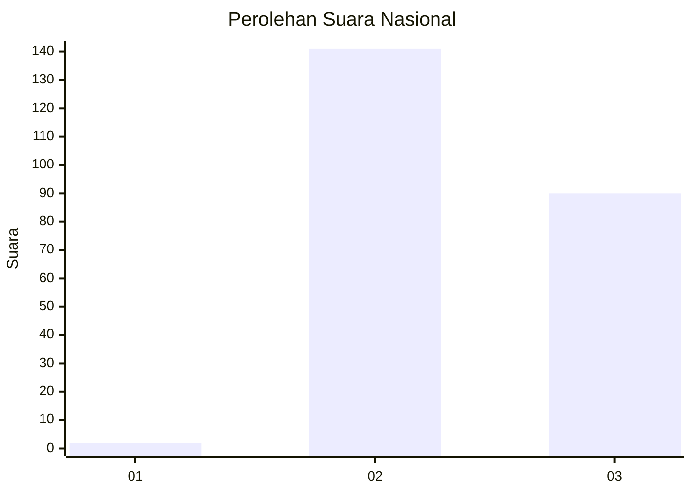
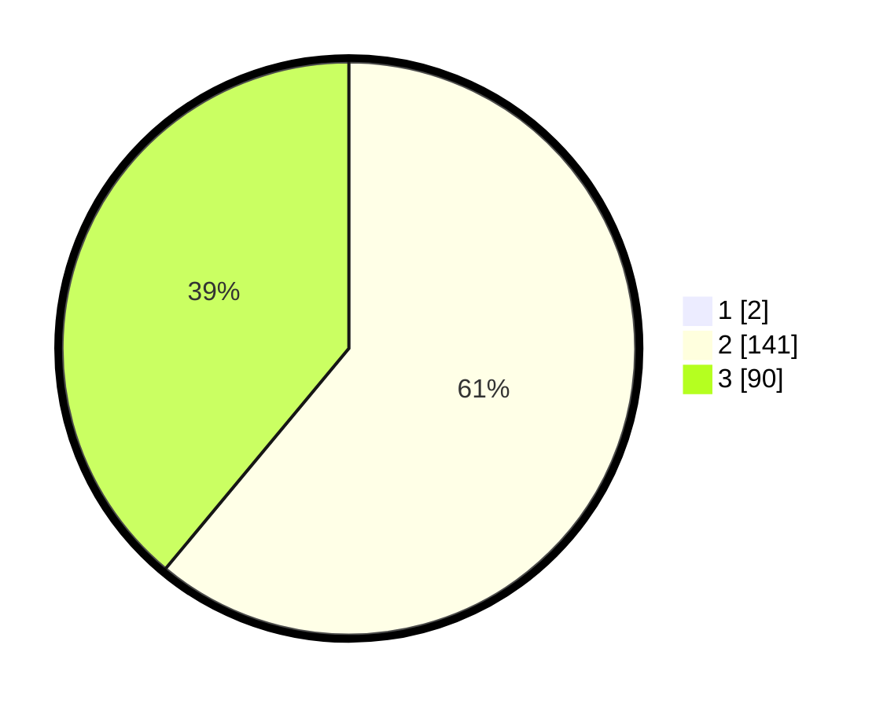

# Hasil

## Grafik

## Tabel

| No. | Nama Paslon    | Suara | Suara (raw) | Persentase |
|:--- |:-------------- | -----:| -----------:| ----------:|
| 1   | ANIES MUHAIMIN | 2     | [2][p-1]    | 0,86       |
| 2   | PRABOWO GIBRAN | 141   | [141][p-2]  | 60,52      |
| 3   | GANJAR MAHFUD  | 90    | [90][p-3]   | 38,63      |

[p-1]: https://github.com/gigit-pemilu/pemilu-2024/blob/main/pilpres/hitung-suara/sub/51-bali/sub/04-gianyar/sub/01-sukawati/sub/2001-batubulan/sub/004-tps/sub/paslon-1.txt
[p-2]: https://github.com/gigit-pemilu/pemilu-2024/blob/main/pilpres/hitung-suara/sub/51-bali/sub/04-gianyar/sub/01-sukawati/sub/2001-batubulan/sub/004-tps/sub/paslon-2.txt
[p-3]: https://github.com/gigit-pemilu/pemilu-2024/blob/main/pilpres/hitung-suara/sub/51-bali/sub/04-gianyar/sub/01-sukawati/sub/2001-batubulan/sub/004-tps/sub/paslon-3.txt

## Foto C Plano

https://sirekap-obj-formc.kpu.go.id/f00f/pemilu/ppwp/51/04/01/20/01/5104012001004-20240216-004728--101844e8-d322-46e1-9dca-5dc3a7edb82d.jpg

https://sirekap-obj-formc.kpu.go.id/f00f/pemilu/ppwp/51/04/01/20/01/5104012001004-20240216-004731--bdd038dd-1c43-4b10-be62-41b24800a9a9.jpg

https://sirekap-obj-formc.kpu.go.id/f00f/pemilu/ppwp/51/04/01/20/01/5104012001004-20240216-004730--00a9b425-acac-49ec-b756-c2b5c31c42d8.jpg

## Metadata

| Key        | Value               |
| ---------- | ------------------- |
| Time Stamp | 2024-02-16 09:30:28 |

## DATA PEMILIH TETAP

Jumlah pemilih dalam DPT: **251**.
 * L: **119**.
 * P: **132**.

## DATA PENGGUNA HAK PILIH

Jumlah pengguna hak pilih dalam DPT: **229**.
 * L: **111**.
 * P: **118**.

Jumlah pengguna hak pilih dalam DPTb: **3**.
 * L: **2**.
 * P: **1**.

Jumlah pengguna hak pilih dalam DPK: **1**.
 * L: **1**.
 * P: **0**.

Jumlah pengguna hak pilih: **233**.
 * L: **114**.
 * P: **119**.

## JUMLAH SUARA SAH DAN TIDAK SAH

JUMLAH SELURUH SUARA SAH: **233**.

JUMLAH SUARA TIDAK SAH: **0**.

JUMLAH SELURUH SUARA SAH DAN SUARA TIDAK SAH: **233**.

