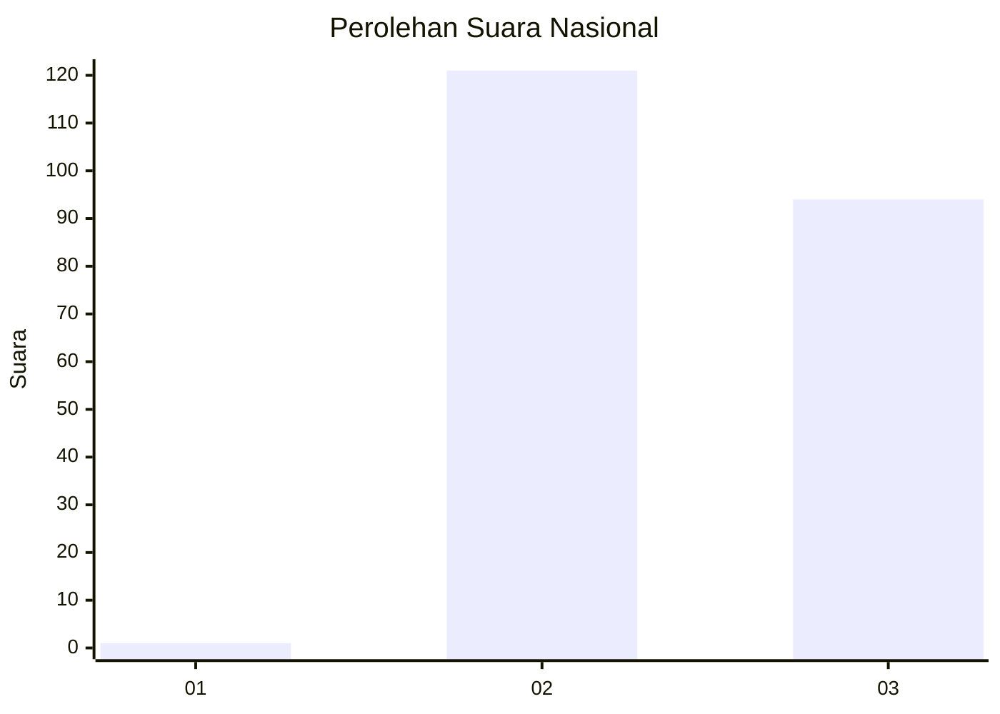
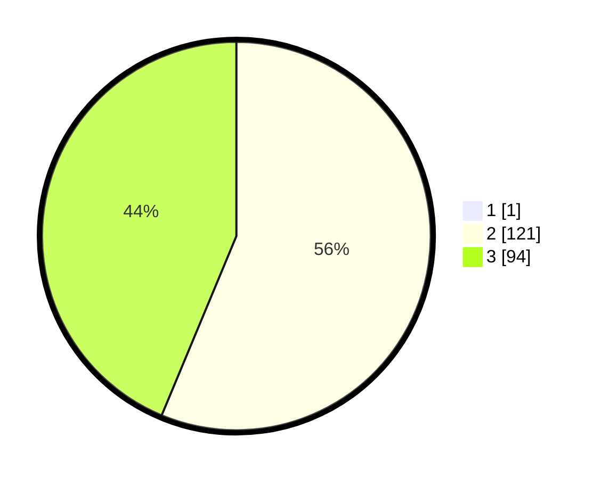

# Hasil

## Grafik

## Tabel

| No. | Nama Paslon    | Suara | Suara (raw) | Persentase |
|:--- |:-------------- | -----:| -----------:| ----------:|
| 1   | ANIES MUHAIMIN | 1     | [1][p-1]    | 0,46       |
| 2   | PRABOWO GIBRAN | 121   | [121][p-2]  | 56,02      |
| 3   | GANJAR MAHFUD  | 94    | [94][p-3]   | 43,52      |

[p-1]: https://github.com/gigit-pemilu/pemilu-2024/blob/main/pilpres/hitung-suara/sub/51-bali/sub/04-gianyar/sub/01-sukawati/sub/2001-batubulan/sub/005-tps/sub/paslon-1.txt
[p-2]: https://github.com/gigit-pemilu/pemilu-2024/blob/main/pilpres/hitung-suara/sub/51-bali/sub/04-gianyar/sub/01-sukawati/sub/2001-batubulan/sub/005-tps/sub/paslon-2.txt
[p-3]: https://github.com/gigit-pemilu/pemilu-2024/blob/main/pilpres/hitung-suara/sub/51-bali/sub/04-gianyar/sub/01-sukawati/sub/2001-batubulan/sub/005-tps/sub/paslon-3.txt

## Foto C Plano

https://sirekap-obj-formc.kpu.go.id/16e7/pemilu/ppwp/51/04/01/20/01/5104012001005-20240216-063506--6b6d673a-8ede-4d1c-939a-85aa0640a708.jpg

https://sirekap-obj-formc.kpu.go.id/16e7/pemilu/ppwp/51/04/01/20/01/5104012001005-20240215-020621--ec452660-75ce-40e2-a9f6-c8e6ab6a820b.jpg

https://sirekap-obj-formc.kpu.go.id/16e7/pemilu/ppwp/51/04/01/20/01/5104012001005-20240216-063514--7a1c5567-7fc3-4f2e-bc65-d1ba46e3fcd4.jpg

## Metadata

| Key        | Value               |
| ---------- | ------------------- |
| Time Stamp | 2024-02-16 08:00:28 |

## DATA PEMILIH TETAP

Jumlah pemilih dalam DPT: **247**.
 * L: **121**.
 * P: **126**.

## DATA PENGGUNA HAK PILIH

Jumlah pengguna hak pilih dalam DPT: **217**.
 * L: **110**.
 * P: **107**.

Jumlah pengguna hak pilih dalam DPTb: **3**.
 * L: **1**.
 * P: **2**.

Jumlah pengguna hak pilih dalam DPK: **0**.
 * L: **0**.
 * P: **0**.

Jumlah pengguna hak pilih: **220**.
 * L: **111**.
 * P: **109**.

## JUMLAH SUARA SAH DAN TIDAK SAH

JUMLAH SELURUH SUARA SAH: **216**.

JUMLAH SUARA TIDAK SAH: **4**.

JUMLAH SELURUH SUARA SAH DAN SUARA TIDAK SAH: **220**.

