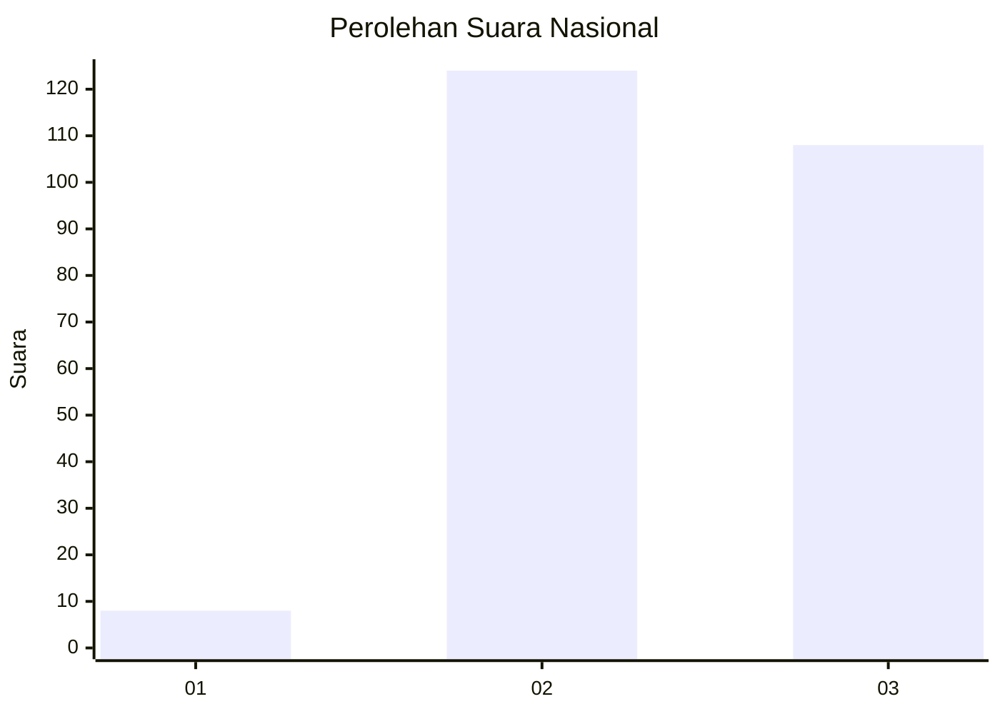
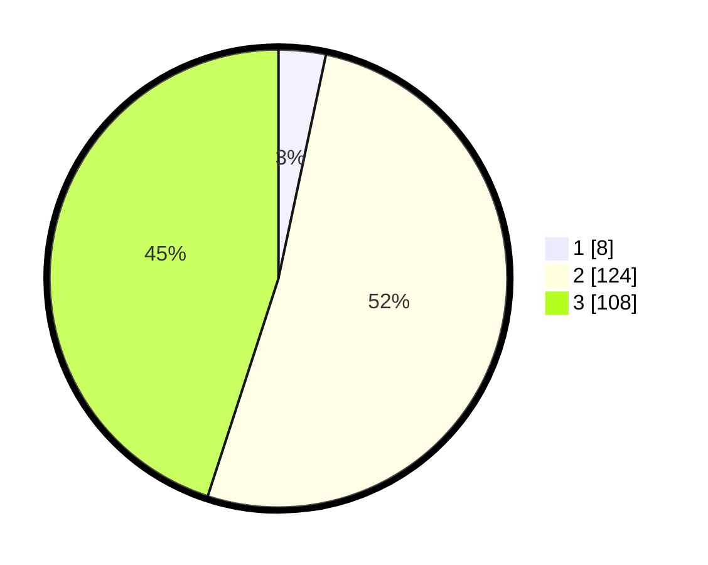

# Hasil

## Grafik

## Tabel

| No. | Nama Paslon    | Suara | Suara (raw) | Persentase |
|:--- |:-------------- | -----:| -----------:| ----------:|
| 1   | ANIES MUHAIMIN | 8     | [8][p-1]    | 3,33       |
| 2   | PRABOWO GIBRAN | 124   | [124][p-2]  | 51,67      |
| 3   | GANJAR MAHFUD  | 108   | [108][p-3]  | 45,00      |

[p-1]: https://github.com/gigit-pemilu/pemilu-2024/blob/main/pilpres/hitung-suara/sub/51-bali/sub/04-gianyar/sub/01-sukawati/sub/2001-batubulan/sub/020-tps/sub/paslon-1.txt
[p-2]: https://github.com/gigit-pemilu/pemilu-2024/blob/main/pilpres/hitung-suara/sub/51-bali/sub/04-gianyar/sub/01-sukawati/sub/2001-batubulan/sub/020-tps/sub/paslon-2.txt
[p-3]: https://github.com/gigit-pemilu/pemilu-2024/blob/main/pilpres/hitung-suara/sub/51-bali/sub/04-gianyar/sub/01-sukawati/sub/2001-batubulan/sub/020-tps/sub/paslon-3.txt

## Foto C Plano

https://sirekap-obj-formc.kpu.go.id/f1c2/pemilu/ppwp/51/04/01/20/01/5104012001020-20240215-003306--fcdd28e3-0223-4493-b0b9-779a9c1eb0ee.jpg

https://sirekap-obj-formc.kpu.go.id/f1c2/pemilu/ppwp/51/04/01/20/01/5104012001020-20240215-003328--b4f58527-6dc8-412f-b8a4-d19d5d01e85f.jpg

https://sirekap-obj-formc.kpu.go.id/f1c2/pemilu/ppwp/51/04/01/20/01/5104012001020-20240215-003317--e3f34b5d-42cd-4b84-803b-a60a362d7178.jpg

## Metadata

| Key        | Value               |
| ---------- | ------------------- |
| Time Stamp | 2024-02-15 12:00:28 |

## DATA PEMILIH TETAP

Jumlah pemilih dalam DPT: **272**.
 * L: **142**.
 * P: **130**.

## DATA PENGGUNA HAK PILIH

Jumlah pengguna hak pilih dalam DPT: **232**.
 * L: **118**.
 * P: **114**.

Jumlah pengguna hak pilih dalam DPTb: **0**.
 * L: **0**.
 * P: **0**.

Jumlah pengguna hak pilih dalam DPK: **10**.
 * L: **4**.
 * P: **6**.

Jumlah pengguna hak pilih: **242**.
 * L: **122**.
 * P: **120**.

## JUMLAH SUARA SAH DAN TIDAK SAH

JUMLAH SELURUH SUARA SAH: **240**.

JUMLAH SUARA TIDAK SAH: **2**.

JUMLAH SELURUH SUARA SAH DAN SUARA TIDAK SAH: **242**.

