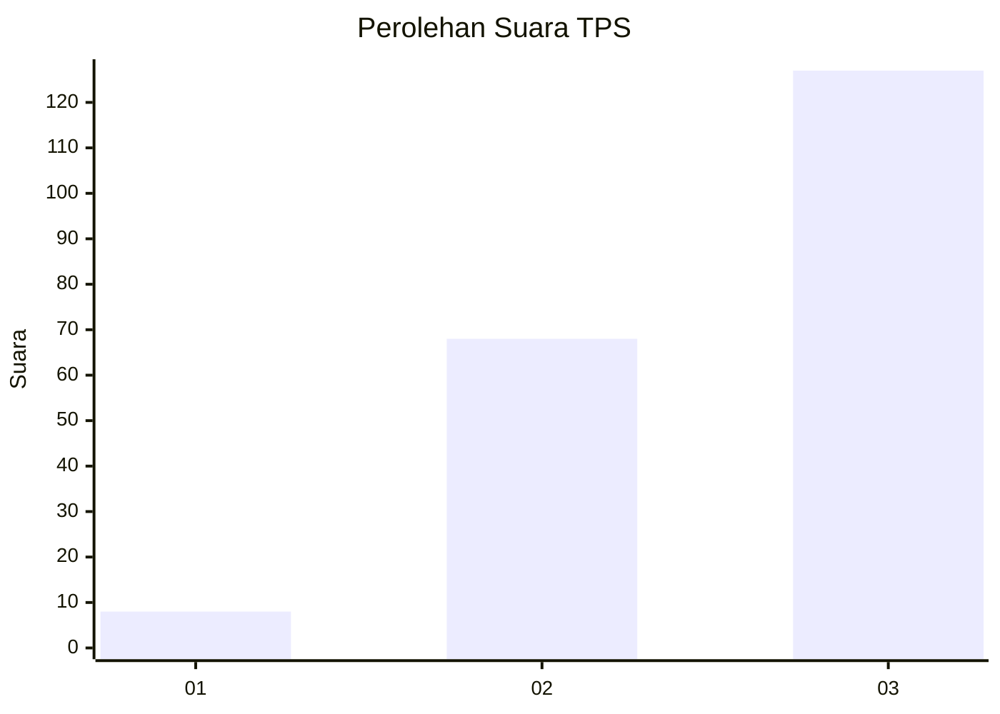
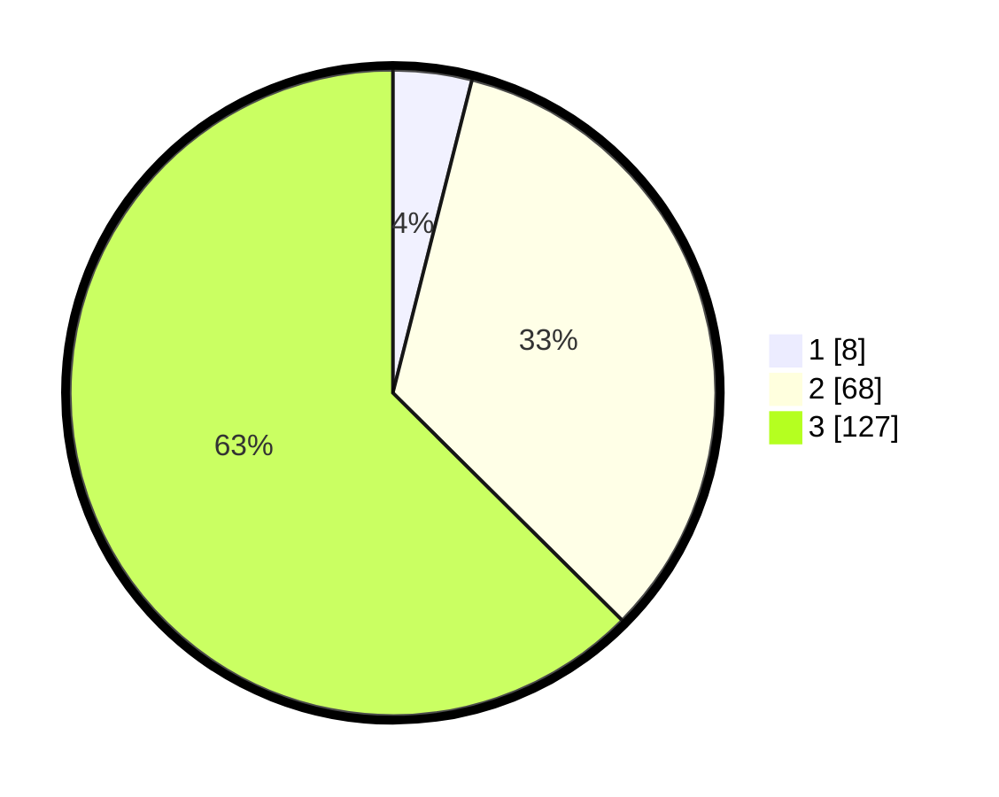

# Hasil

## Grafik

## Tabel

| No. | Nama Paslon    | Suara | Suara (raw) | Persentase |
|:--- |:-------------- | -----:| -----------:| ----------:|
| 1   | ANIES MUHAIMIN | 8     | [8][p-1]    | 3,94       |
| 2   | PRABOWO GIBRAN | 68    | [68][p-2]   | 33,50      |
| 3   | GANJAR MAHFUD  | 127   | [127][p-3]  | 62,56      |

[p-1]: https://github.com/gigit-pemilu/pemilu-2024-51-bali/blob/main/pilpres/hitung-suara/sub/51-bali/sub/04-gianyar/sub/01-sukawati/sub/2001-batubulan/sub/027-tps/sub/paslon-1.txt
[p-2]: https://github.com/gigit-pemilu/pemilu-2024-51-bali/blob/main/pilpres/hitung-suara/sub/51-bali/sub/04-gianyar/sub/01-sukawati/sub/2001-batubulan/sub/027-tps/sub/paslon-2.txt
[p-3]: https://github.com/gigit-pemilu/pemilu-2024-51-bali/blob/main/pilpres/hitung-suara/sub/51-bali/sub/04-gianyar/sub/01-sukawati/sub/2001-batubulan/sub/027-tps/sub/paslon-3.txt

## Foto C Plano

https://sirekap-obj-formc.kpu.go.id/6282/pemilu/ppwp/51/04/01/20/01/5104012001027-20240215-192615--47f27fd6-bbd6-443d-acea-9a304cac2e57.jpg

https://sirekap-obj-formc.kpu.go.id/6282/pemilu/ppwp/51/04/01/20/01/5104012001027-20240215-192639--feb88b12-53f4-469d-ba06-972faf12adb1.jpg

https://sirekap-obj-formc.kpu.go.id/6282/pemilu/ppwp/51/04/01/20/01/5104012001027-20240215-192625--1d367b32-62c5-42e4-8f98-cd5f4614ffd4.jpg

## Metadata

| Key        | Value               |
| ---------- | ------------------- |
| Time Stamp | 2024-02-15 19:30:26 |

## DATA PEMILIH TETAP

Jumlah pemilih dalam DPT: **209**.
 * L: **101**.
 * P: **108**.

## DATA PENGGUNA HAK PILIH

Jumlah pengguna hak pilih dalam DPT: **205**.
 * L: **98**.
 * P: **107**.

Jumlah pengguna hak pilih dalam DPTb: **0**.
 * L: **0**.
 * P: **0**.

Jumlah pengguna hak pilih dalam DPK: **0**.
 * L: **0**.
 * P: **0**.

Jumlah pengguna hak pilih: **205**.
 * L: **98**.
 * P: **107**.

## JUMLAH SUARA SAH DAN TIDAK SAH

JUMLAH SELURUH SUARA SAH: **203**.

JUMLAH SUARA TIDAK SAH: **2**.

JUMLAH SELURUH SUARA SAH DAN SUARA TIDAK SAH: **205**.

