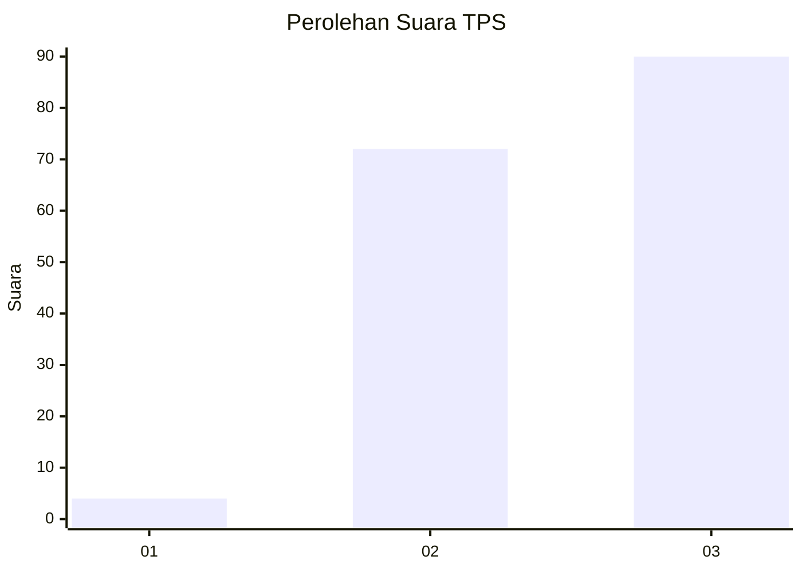
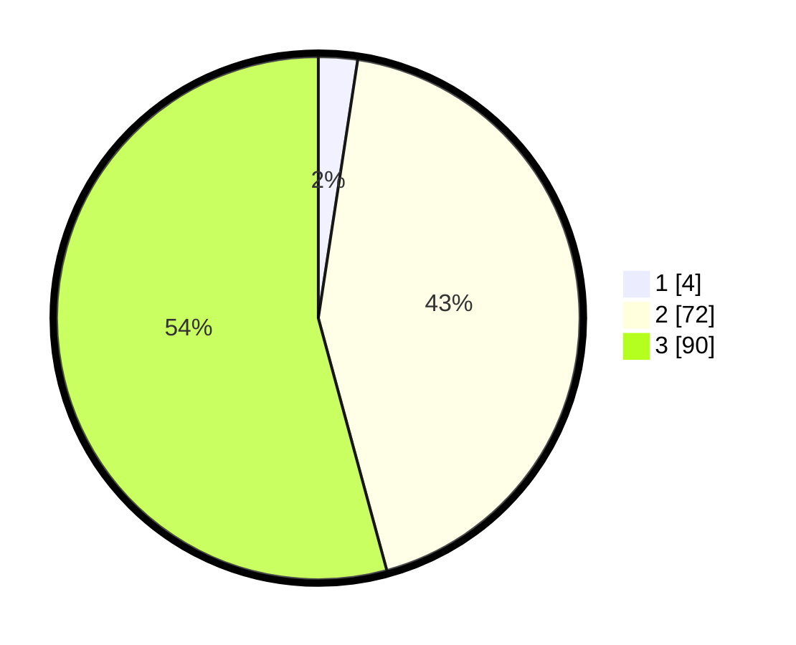

# Hasil

## Grafik

## Tabel

| No. | Nama Paslon    | Suara | Suara (raw) | Persentase |
|:--- |:-------------- | -----:| -----------:| ----------:|
| 1   | ANIES MUHAIMIN | 4     | [4][p-1]    | 2,41       |
| 2   | PRABOWO GIBRAN | 72    | [72][p-2]   | 43,37      |
| 3   | GANJAR MAHFUD  | 90    | [90][p-3]   | 54,22      |

[p-1]: https://github.com/gigit-pemilu/pemilu-2024-51-bali/blob/main/pilpres/hitung-suara/sub/51-bali/sub/04-gianyar/sub/01-sukawati/sub/2001-batubulan/sub/028-tps/sub/paslon-1.txt
[p-2]: https://github.com/gigit-pemilu/pemilu-2024-51-bali/blob/main/pilpres/hitung-suara/sub/51-bali/sub/04-gianyar/sub/01-sukawati/sub/2001-batubulan/sub/028-tps/sub/paslon-2.txt
[p-3]: https://github.com/gigit-pemilu/pemilu-2024-51-bali/blob/main/pilpres/hitung-suara/sub/51-bali/sub/04-gianyar/sub/01-sukawati/sub/2001-batubulan/sub/028-tps/sub/paslon-3.txt

## Foto C Plano

https://sirekap-obj-formc.kpu.go.id/fafc/pemilu/ppwp/51/04/01/20/01/5104012001028-20240216-135538--2e9e128b-cdaf-49f2-b1f1-e4834f4ddfa3.jpg

https://sirekap-obj-formc.kpu.go.id/fafc/pemilu/ppwp/51/04/01/20/01/5104012001028-20240216-135539--17bf39b3-169a-4cd3-87dc-0acdb8a9f7c8.jpg

https://sirekap-obj-formc.kpu.go.id/fafc/pemilu/ppwp/51/04/01/20/01/5104012001028-20240216-135538--cf6bab35-c98f-4fd9-96a8-a23ddf593fd7.jpg

## Metadata

| Key        | Value               |
| ---------- | ------------------- |
| Time Stamp | 2024-02-16 14:30:33 |

## DATA PEMILIH TETAP

Jumlah pemilih dalam DPT: **204**.
 * L: **101**.
 * P: **103**.

## DATA PENGGUNA HAK PILIH

Jumlah pengguna hak pilih dalam DPT: **166**.
 * L: **81**.
 * P: **85**.

Jumlah pengguna hak pilih dalam DPTb: **2**.
 * L: **0**.
 * P: **2**.

Jumlah pengguna hak pilih dalam DPK: **1**.
 * L: **1**.
 * P: **0**.

Jumlah pengguna hak pilih: **169**.
 * L: **82**.
 * P: **87**.

## JUMLAH SUARA SAH DAN TIDAK SAH

JUMLAH SELURUH SUARA SAH: **166**.

JUMLAH SUARA TIDAK SAH: **3**.

JUMLAH SELURUH SUARA SAH DAN SUARA TIDAK SAH: **169**.

