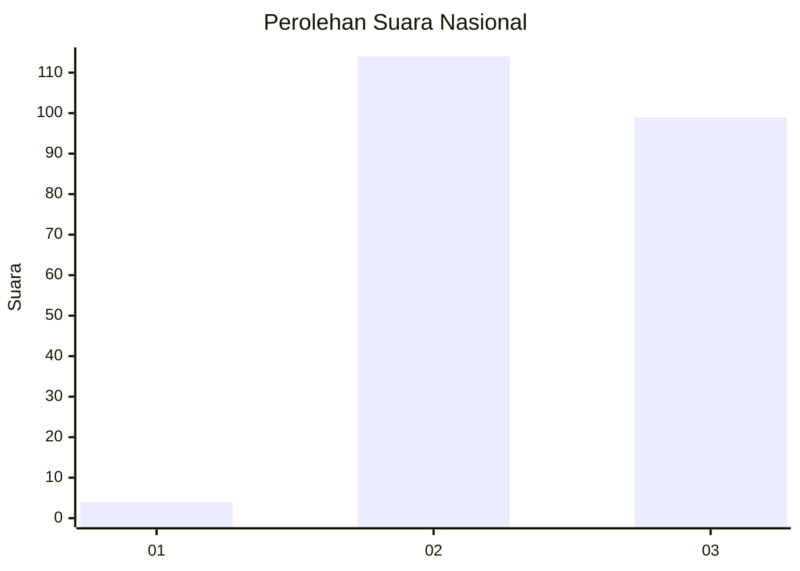
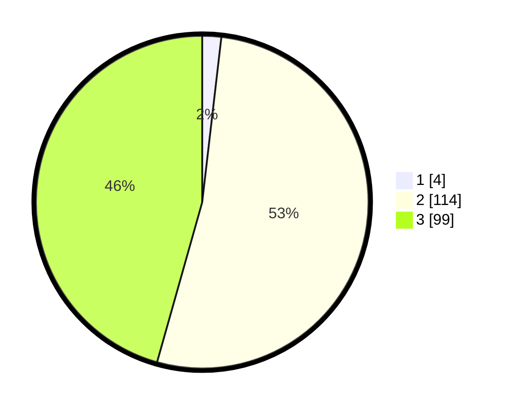

# Hasil

## Grafik

## Tabel

| No. | Nama Paslon    | Suara | Suara (raw) | Persentase |
|:--- |:-------------- | -----:| -----------:| ----------:|
| 1   | ANIES MUHAIMIN | 4     | [4][p-1]    | 1,84       |
| 2   | PRABOWO GIBRAN | 114   | [114][p-2]  | 52,53      |
| 3   | GANJAR MAHFUD  | 99    | [99][p-3]   | 45,62      |

[p-1]: https://github.com/gigit-pemilu/pemilu-2024/blob/main/pilpres/hitung-suara/sub/51-bali/sub/04-gianyar/sub/01-sukawati/sub/2001-batubulan/sub/032-tps/sub/paslon-1.txt
[p-2]: https://github.com/gigit-pemilu/pemilu-2024/blob/main/pilpres/hitung-suara/sub/51-bali/sub/04-gianyar/sub/01-sukawati/sub/2001-batubulan/sub/032-tps/sub/paslon-2.txt
[p-3]: https://github.com/gigit-pemilu/pemilu-2024/blob/main/pilpres/hitung-suara/sub/51-bali/sub/04-gianyar/sub/01-sukawati/sub/2001-batubulan/sub/032-tps/sub/paslon-3.txt

## Foto C Plano

https://sirekap-obj-formc.kpu.go.id/92cd/pemilu/ppwp/51/04/01/20/01/5104012001032-20240216-215428--5896ca07-d6f7-4972-80f1-eca27270667e.jpg

https://sirekap-obj-formc.kpu.go.id/92cd/pemilu/ppwp/51/04/01/20/01/5104012001032-20240216-215430--6a6cc268-02a4-48a4-84f3-0a03c3ba4471.jpg

https://sirekap-obj-formc.kpu.go.id/92cd/pemilu/ppwp/51/04/01/20/01/5104012001032-20240216-215429--59f0be10-540a-4b37-9b02-78c672c4fb85.jpg

## Metadata

| Key        | Value               |
| ---------- | ------------------- |
| Time Stamp | 2024-02-17 16:52:47 |

## DATA PEMILIH TETAP

Jumlah pemilih dalam DPT: **214**.
 * L: **103**.
 * P: **111**.

## DATA PENGGUNA HAK PILIH

Jumlah pengguna hak pilih dalam DPT: **214**.
 * L: **103**.
 * P: **111**.

Jumlah pengguna hak pilih dalam DPTb: **4**.
 * L: **2**.
 * P: **2**.

Jumlah pengguna hak pilih dalam DPK: **0**.
 * L: **0**.
 * P: **0**.

Jumlah pengguna hak pilih: **218**.
 * L: **105**.
 * P: **113**.

## JUMLAH SUARA SAH DAN TIDAK SAH

JUMLAH SELURUH SUARA SAH: **217**.

JUMLAH SUARA TIDAK SAH: **1**.

JUMLAH SELURUH SUARA SAH DAN SUARA TIDAK SAH: **218**.

