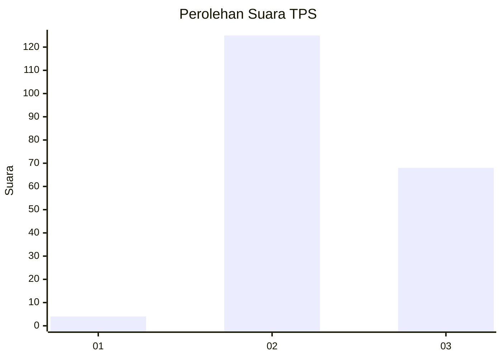
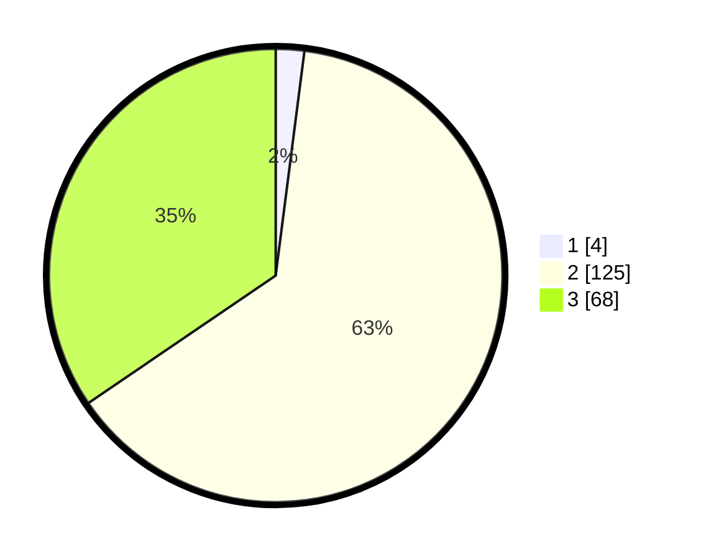

# Hasil

## Grafik

## Tabel

| No. | Nama Paslon    | Suara | Suara (raw) | Persentase |
|:--- |:-------------- | -----:| -----------:| ----------:|
| 1   | ANIES MUHAIMIN | 4     | [4][p-1]    | 2,03       |
| 2   | PRABOWO GIBRAN | 125   | [125][p-2]  | 63,45      |
| 3   | GANJAR MAHFUD  | 68    | [68][p-3]   | 34,52      |

[p-1]: https://github.com/gigit-pemilu/pemilu-2024-51-bali/blob/main/pilpres/hitung-suara/sub/51-bali/sub/04-gianyar/sub/01-sukawati/sub/2001-batubulan/sub/035-tps/sub/paslon-1.txt
[p-2]: https://github.com/gigit-pemilu/pemilu-2024-51-bali/blob/main/pilpres/hitung-suara/sub/51-bali/sub/04-gianyar/sub/01-sukawati/sub/2001-batubulan/sub/035-tps/sub/paslon-2.txt
[p-3]: https://github.com/gigit-pemilu/pemilu-2024-51-bali/blob/main/pilpres/hitung-suara/sub/51-bali/sub/04-gianyar/sub/01-sukawati/sub/2001-batubulan/sub/035-tps/sub/paslon-3.txt

## Foto C Plano

https://sirekap-obj-formc.kpu.go.id/1ec1/pemilu/ppwp/51/04/01/20/01/5104012001035-20240216-222923--b5f7fe90-6880-437e-8e23-38e1b9a7e1df.jpg

https://sirekap-obj-formc.kpu.go.id/1ec1/pemilu/ppwp/51/04/01/20/01/5104012001035-20240216-222924--303726a0-d0c4-4e3d-a194-188af179d17c.jpg

https://sirekap-obj-formc.kpu.go.id/1ec1/pemilu/ppwp/51/04/01/20/01/5104012001035-20240216-222924--a98e8e45-3564-446c-ad8a-12a056a6d81a.jpg

## Metadata

| Key        | Value               |
| ---------- | ------------------- |
| Time Stamp | 2024-02-17 16:52:47 |

## DATA PEMILIH TETAP

Jumlah pemilih dalam DPT: **287**.
 * L: **139**.
 * P: **148**.

## DATA PENGGUNA HAK PILIH

Jumlah pengguna hak pilih dalam DPT: **200**.
 * L: **96**.
 * P: **104**.

Jumlah pengguna hak pilih dalam DPTb: **0**.
 * L: **0**.
 * P: **0**.

Jumlah pengguna hak pilih dalam DPK: **0**.
 * L: **0**.
 * P: **0**.

Jumlah pengguna hak pilih: **200**.
 * L: **96**.
 * P: **104**.

## JUMLAH SUARA SAH DAN TIDAK SAH

JUMLAH SELURUH SUARA SAH: **197**.

JUMLAH SUARA TIDAK SAH: **3**.

JUMLAH SELURUH SUARA SAH DAN SUARA TIDAK SAH: **200**.

