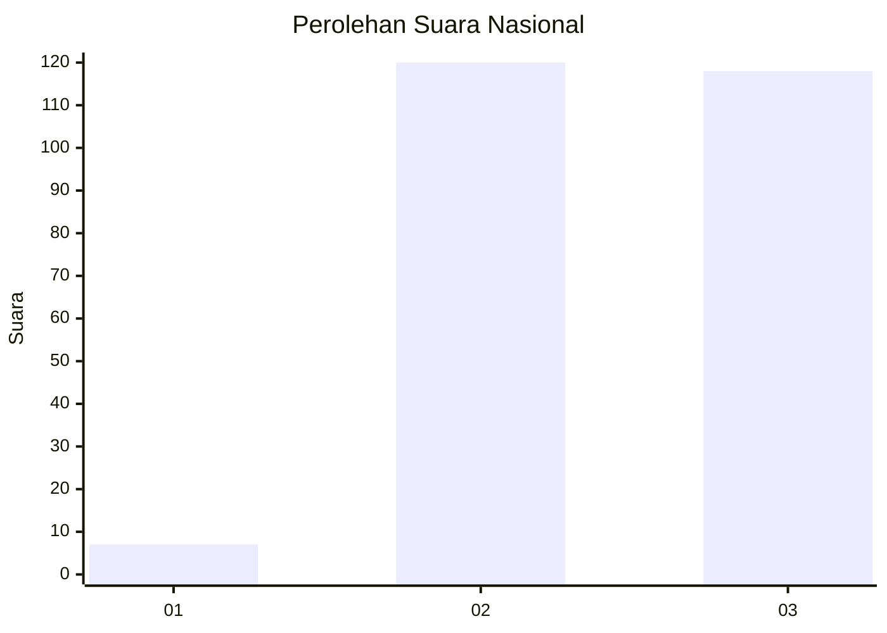
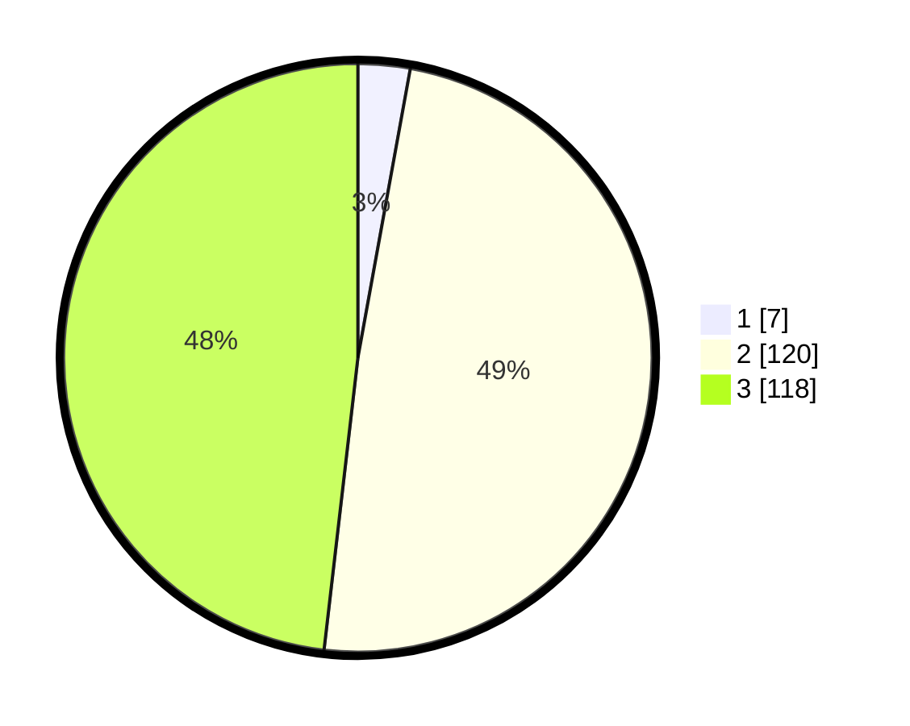

# Hasil

## Grafik

## Tabel

| No. | Nama Paslon    | Suara | Suara (raw) | Persentase |
|:--- |:-------------- | -----:| -----------:| ----------:|
| 1   | ANIES MUHAIMIN | 7     | [7][p-1]    | 2,86       |
| 2   | PRABOWO GIBRAN | 120   | [120][p-2]  | 48,98      |
| 3   | GANJAR MAHFUD  | 118   | [118][p-3]  | 48,16      |

[p-1]: https://github.com/gigit-pemilu/pemilu-2024/blob/main/pilpres/hitung-suara/sub/51-bali/sub/04-gianyar/sub/01-sukawati/sub/2001-batubulan/sub/042-tps/sub/paslon-1.txt
[p-2]: https://github.com/gigit-pemilu/pemilu-2024/blob/main/pilpres/hitung-suara/sub/51-bali/sub/04-gianyar/sub/01-sukawati/sub/2001-batubulan/sub/042-tps/sub/paslon-2.txt
[p-3]: https://github.com/gigit-pemilu/pemilu-2024/blob/main/pilpres/hitung-suara/sub/51-bali/sub/04-gianyar/sub/01-sukawati/sub/2001-batubulan/sub/042-tps/sub/paslon-3.txt

## Foto C Plano

https://sirekap-obj-formc.kpu.go.id/ed4c/pemilu/ppwp/51/04/01/20/01/5104012001042-20240216-223208--96e4601a-4175-405b-919f-4572451f92c0.jpg

https://sirekap-obj-formc.kpu.go.id/ed4c/pemilu/ppwp/51/04/01/20/01/5104012001042-20240216-223210--3a762fa9-e15d-44bc-8ee5-4406fbd6e97d.jpg

https://sirekap-obj-formc.kpu.go.id/ed4c/pemilu/ppwp/51/04/01/20/01/5104012001042-20240216-223209--ddc66767-ef2d-4862-8e03-e43febbb5f04.jpg

## Metadata

| Key        | Value               |
| ---------- | ------------------- |
| Time Stamp | 2024-02-17 16:52:47 |

## DATA PEMILIH TETAP

Jumlah pemilih dalam DPT: **280**.
 * L: **142**.
 * P: **138**.

## DATA PENGGUNA HAK PILIH

Jumlah pengguna hak pilih dalam DPT: **243**.
 * L: **123**.
 * P: **120**.

Jumlah pengguna hak pilih dalam DPTb: **0**.
 * L: **0**.
 * P: **0**.

Jumlah pengguna hak pilih dalam DPK: **6**.
 * L: **3**.
 * P: **3**.

Jumlah pengguna hak pilih: **249**.
 * L: **126**.
 * P: **123**.

## JUMLAH SUARA SAH DAN TIDAK SAH

JUMLAH SELURUH SUARA SAH: **245**.

JUMLAH SUARA TIDAK SAH: **4**.

JUMLAH SELURUH SUARA SAH DAN SUARA TIDAK SAH: **249**.

