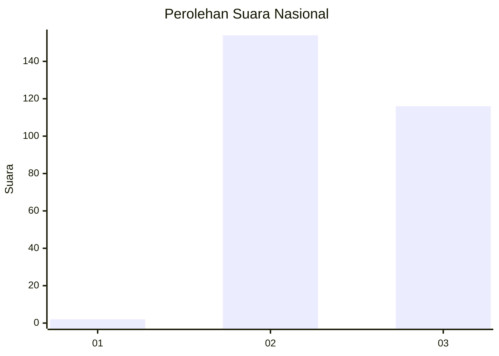
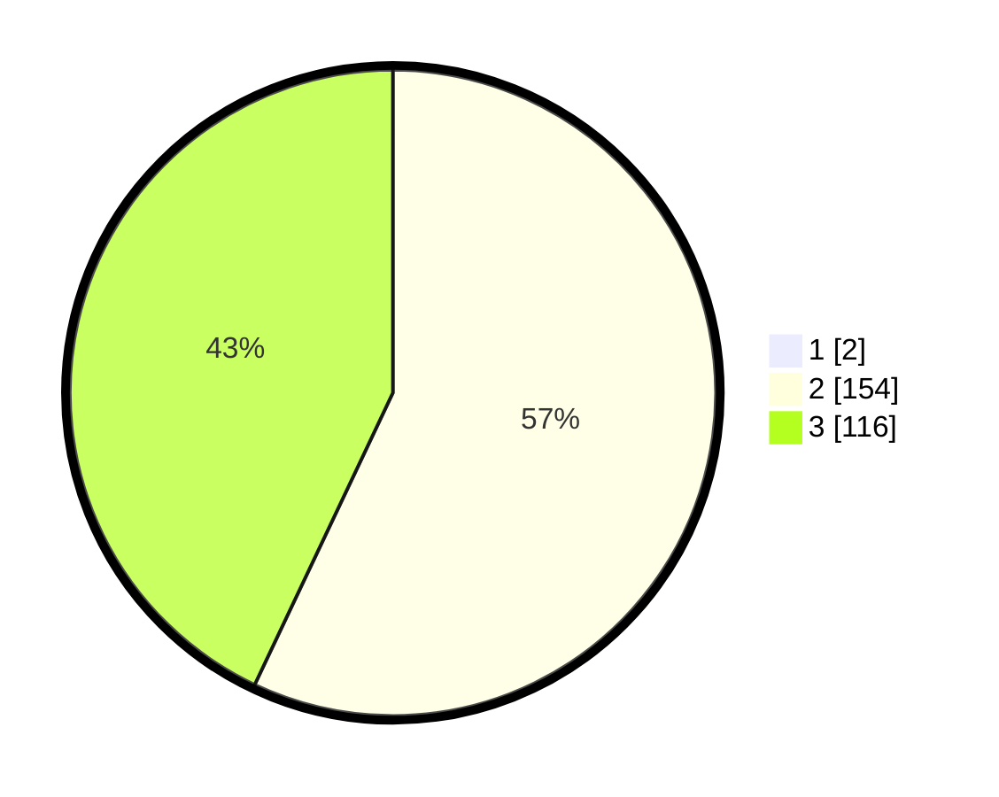

# Hasil

## Grafik

## Tabel

| No. | Nama Paslon    | Suara | Suara (raw) | Persentase |
|:--- |:-------------- | -----:| -----------:| ----------:|
| 1   | ANIES MUHAIMIN | 2     | [2][p-1]    | 0,74       |
| 2   | PRABOWO GIBRAN | 154   | [154][p-2]  | 56,62      |
| 3   | GANJAR MAHFUD  | 116   | [116][p-3]  | 42,65      |

[p-1]: https://github.com/gigit-pemilu/pemilu-2024/blob/main/pilpres/hitung-suara/sub/51-bali/sub/04-gianyar/sub/01-sukawati/sub/2001-batubulan/sub/044-tps/sub/paslon-1.txt
[p-2]: https://github.com/gigit-pemilu/pemilu-2024/blob/main/pilpres/hitung-suara/sub/51-bali/sub/04-gianyar/sub/01-sukawati/sub/2001-batubulan/sub/044-tps/sub/paslon-2.txt
[p-3]: https://github.com/gigit-pemilu/pemilu-2024/blob/main/pilpres/hitung-suara/sub/51-bali/sub/04-gianyar/sub/01-sukawati/sub/2001-batubulan/sub/044-tps/sub/paslon-3.txt

## Foto C Plano

https://sirekap-obj-formc.kpu.go.id/47e4/pemilu/ppwp/51/04/01/20/01/5104012001044-20240216-223925--e0c12907-0e66-41e6-8896-3e27d78c70d4.jpg

https://sirekap-obj-formc.kpu.go.id/47e4/pemilu/ppwp/51/04/01/20/01/5104012001044-20240216-223926--e0093011-bbc4-407a-9e9d-9cbca9b40b06.jpg

https://sirekap-obj-formc.kpu.go.id/47e4/pemilu/ppwp/51/04/01/20/01/5104012001044-20240216-223925--c08ddad5-bd08-4311-b633-4ad4bdb5f263.jpg

## Metadata

| Key        | Value               |
| ---------- | ------------------- |
| Time Stamp | 2024-02-17 17:00:04 |

## DATA PEMILIH TETAP

Jumlah pemilih dalam DPT: **276**.
 * L: **141**.
 * P: **135**.

## DATA PENGGUNA HAK PILIH

Jumlah pengguna hak pilih dalam DPT: **272**.
 * L: **139**.
 * P: **133**.

Jumlah pengguna hak pilih dalam DPTb: **0**.
 * L: **0**.
 * P: **0**.

Jumlah pengguna hak pilih dalam DPK: **6**.
 * L: **2**.
 * P: **4**.

Jumlah pengguna hak pilih: **278**.
 * L: **141**.
 * P: **137**.

## JUMLAH SUARA SAH DAN TIDAK SAH

JUMLAH SELURUH SUARA SAH: **272**.

JUMLAH SUARA TIDAK SAH: **6**.

JUMLAH SELURUH SUARA SAH DAN SUARA TIDAK SAH: **278**.

