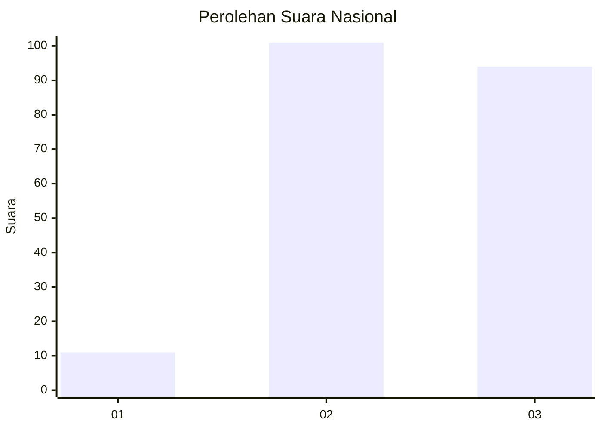
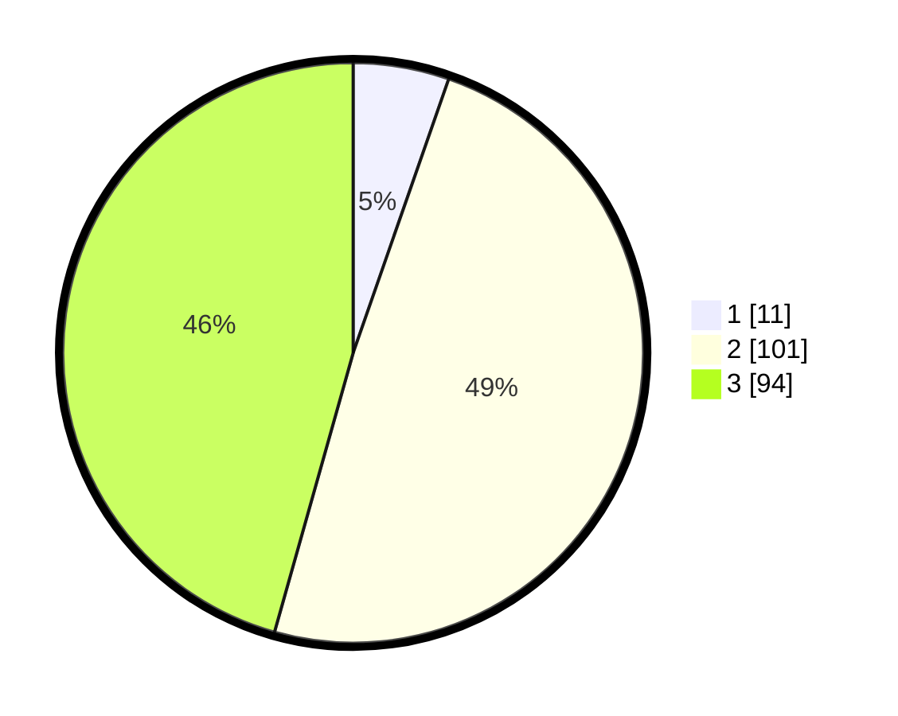

# Hasil

## Grafik

## Tabel

| No. | Nama Paslon    | Suara | Suara (raw) | Persentase |
|:--- |:-------------- | -----:| -----------:| ----------:|
| 1   | ANIES MUHAIMIN | 11    | [11][p-1]   | 5,34       |
| 2   | PRABOWO GIBRAN | 101   | [101][p-2]  | 49,03      |
| 3   | GANJAR MAHFUD  | 94    | [94][p-3]   | 45,63      |

[p-1]: https://github.com/gigit-pemilu/pemilu-2024/blob/main/pilpres/hitung-suara/sub/51-bali/sub/04-gianyar/sub/01-sukawati/sub/2001-batubulan/sub/048-tps/sub/paslon-1.txt
[p-2]: https://github.com/gigit-pemilu/pemilu-2024/blob/main/pilpres/hitung-suara/sub/51-bali/sub/04-gianyar/sub/01-sukawati/sub/2001-batubulan/sub/048-tps/sub/paslon-2.txt
[p-3]: https://github.com/gigit-pemilu/pemilu-2024/blob/main/pilpres/hitung-suara/sub/51-bali/sub/04-gianyar/sub/01-sukawati/sub/2001-batubulan/sub/048-tps/sub/paslon-3.txt

## Foto C Plano

https://sirekap-obj-formc.kpu.go.id/7737/pemilu/ppwp/51/04/01/20/01/5104012001048-20240216-224434--c85a327e-0829-4720-b9d2-6a96bd0a2917.jpg

https://sirekap-obj-formc.kpu.go.id/7737/pemilu/ppwp/51/04/01/20/01/5104012001048-20240216-224435--b60aedbf-2cec-4780-bfab-d973a5662bab.jpg

https://sirekap-obj-formc.kpu.go.id/7737/pemilu/ppwp/51/04/01/20/01/5104012001048-20240216-224434--d951805f-f4e0-48ee-9ba0-13aec42ff924.jpg

## Metadata

| Key        | Value               |
| ---------- | ------------------- |
| Time Stamp | 2024-02-17 17:00:04 |

## DATA PEMILIH TETAP

Jumlah pemilih dalam DPT: **277**.
 * L: **133**.
 * P: **144**.

## DATA PENGGUNA HAK PILIH

Jumlah pengguna hak pilih dalam DPT: **232**.
 * L: **110**.
 * P: **122**.

Jumlah pengguna hak pilih dalam DPTb: **0**.
 * L: **0**.
 * P: **0**.

Jumlah pengguna hak pilih dalam DPK: **7**.
 * L: **4**.
 * P: **3**.

Jumlah pengguna hak pilih: **239**.
 * L: **114**.
 * P: **125**.

## JUMLAH SUARA SAH DAN TIDAK SAH

JUMLAH SELURUH SUARA SAH: **206**.

JUMLAH SUARA TIDAK SAH: **33**.

JUMLAH SELURUH SUARA SAH DAN SUARA TIDAK SAH: **239**.

