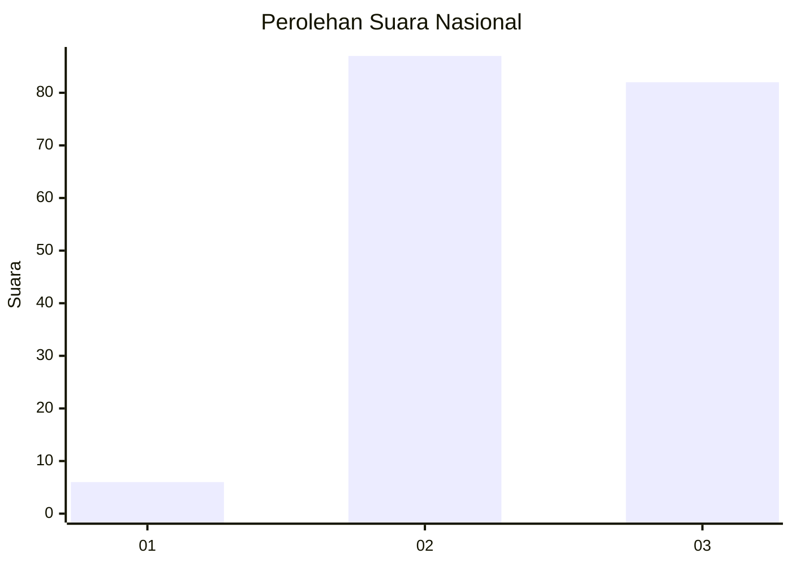
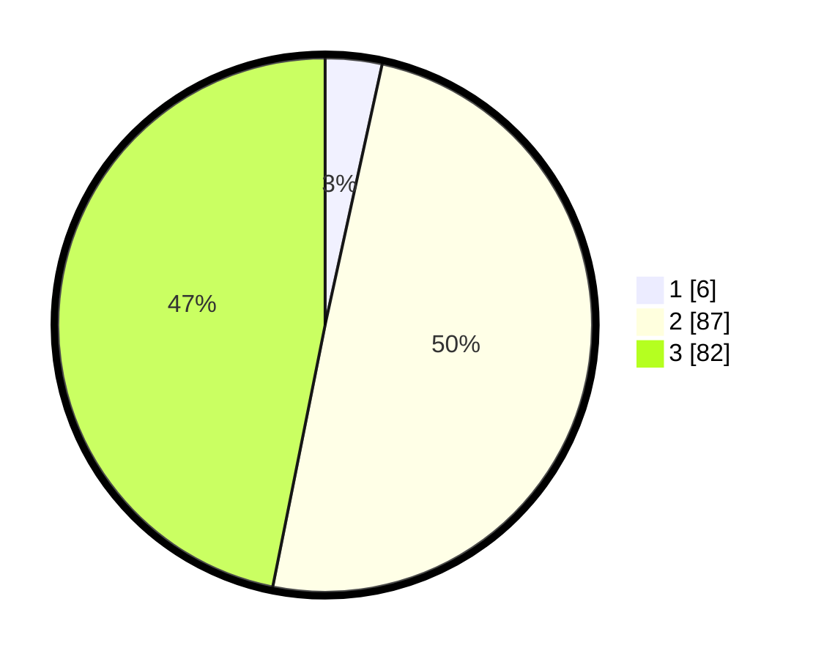

# Hasil

## Grafik

## Tabel

| No. | Nama Paslon    | Suara | Suara (raw) | Persentase |
|:--- |:-------------- | -----:| -----------:| ----------:|
| 1   | ANIES MUHAIMIN | 6     | [6][p-1]    | 3,43       |
| 2   | PRABOWO GIBRAN | 87    | [87][p-2]   | 49,71      |
| 3   | GANJAR MAHFUD  | 82    | [82][p-3]   | 46,86      |

[p-1]: https://github.com/gigit-pemilu/pemilu-2024/blob/main/pilpres/hitung-suara/sub/51-bali/sub/04-gianyar/sub/01-sukawati/sub/2001-batubulan/sub/055-tps/sub/paslon-1.txt
[p-2]: https://github.com/gigit-pemilu/pemilu-2024/blob/main/pilpres/hitung-suara/sub/51-bali/sub/04-gianyar/sub/01-sukawati/sub/2001-batubulan/sub/055-tps/sub/paslon-2.txt
[p-3]: https://github.com/gigit-pemilu/pemilu-2024/blob/main/pilpres/hitung-suara/sub/51-bali/sub/04-gianyar/sub/01-sukawati/sub/2001-batubulan/sub/055-tps/sub/paslon-3.txt

## Foto C Plano

https://sirekap-obj-formc.kpu.go.id/31ec/pemilu/ppwp/51/04/01/20/01/5104012001055-20240214-193224--5df72131-5c44-4984-b297-2fd5363a3800.jpg

https://sirekap-obj-formc.kpu.go.id/31ec/pemilu/ppwp/51/04/01/20/01/5104012001055-20240214-193234--dbea9f5e-9831-417f-a2e4-f3ad9ad2a930.jpg

https://sirekap-obj-formc.kpu.go.id/31ec/pemilu/ppwp/51/04/01/20/01/5104012001055-20240214-231159--ab3068fe-a8bd-4a2a-ab16-2c6d7e16ec0c.jpg

## Metadata

| Key        | Value               |
| ---------- | ------------------- |
| Time Stamp | 2024-02-16 08:00:28 |

## DATA PEMILIH TETAP

Jumlah pemilih dalam DPT: **249**.
 * L: **125**.
 * P: **624**.

## DATA PENGGUNA HAK PILIH

Jumlah pengguna hak pilih dalam DPT: **170**.
 * L: **885**.
 * P: **335**.

Jumlah pengguna hak pilih dalam DPTb: **848**.
 * L: **440**.
 * P: **484**.

Jumlah pengguna hak pilih dalam DPK: **747**.
 * L: **843**.
 * P: **707**.

Jumlah pengguna hak pilih: **177**.
 * L: **288**.
 * P: **239**.

## JUMLAH SUARA SAH DAN TIDAK SAH

JUMLAH SELURUH SUARA SAH: **175**.

JUMLAH SUARA TIDAK SAH: **2**.

JUMLAH SELURUH SUARA SAH DAN SUARA TIDAK SAH: **177**.

