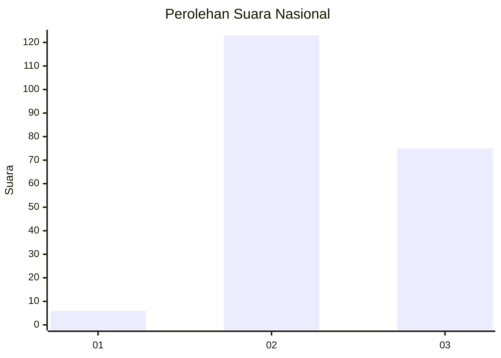
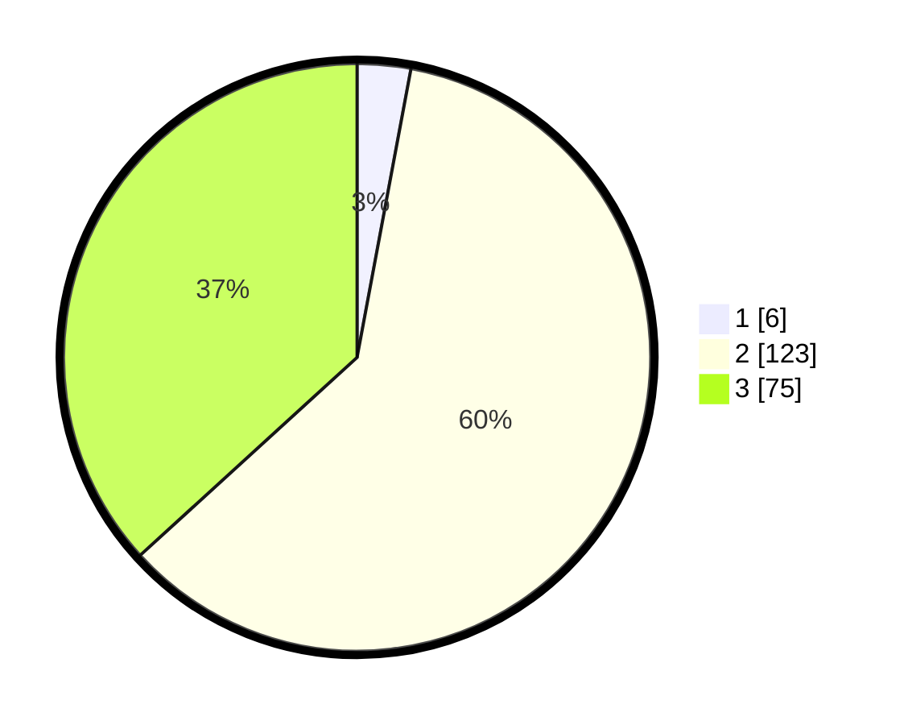

# Hasil

## Grafik

## Tabel

| No. | Nama Paslon    | Suara | Suara (raw) | Persentase |
|:--- |:-------------- | -----:| -----------:| ----------:|
| 1   | ANIES MUHAIMIN | 6     | [6][p-1]    | 2,94       |
| 2   | PRABOWO GIBRAN | 123   | [123][p-2]  | 60,29      |
| 3   | GANJAR MAHFUD  | 75    | [75][p-3]   | 36,76      |

[p-1]: https://github.com/gigit-pemilu/pemilu-2024/blob/main/pilpres/hitung-suara/sub/51-bali/sub/04-gianyar/sub/01-sukawati/sub/2001-batubulan/sub/056-tps/sub/paslon-1.txt
[p-2]: https://github.com/gigit-pemilu/pemilu-2024/blob/main/pilpres/hitung-suara/sub/51-bali/sub/04-gianyar/sub/01-sukawati/sub/2001-batubulan/sub/056-tps/sub/paslon-2.txt
[p-3]: https://github.com/gigit-pemilu/pemilu-2024/blob/main/pilpres/hitung-suara/sub/51-bali/sub/04-gianyar/sub/01-sukawati/sub/2001-batubulan/sub/056-tps/sub/paslon-3.txt

## Foto C Plano

https://sirekap-obj-formc.kpu.go.id/80ad/pemilu/ppwp/51/04/01/20/01/5104012001056-20240215-005306--1d3721a7-2558-4b81-9855-0a1e6cc67072.jpg

https://sirekap-obj-formc.kpu.go.id/80ad/pemilu/ppwp/51/04/01/20/01/5104012001056-20240215-005542--8b37ab05-829d-4ce5-b96e-a84052d6b006.jpg

https://sirekap-obj-formc.kpu.go.id/80ad/pemilu/ppwp/51/04/01/20/01/5104012001056-20240215-005627--57cd08e1-9112-4a0f-a306-fc65d8e44f89.jpg

## Metadata

| Key        | Value               |
| ---------- | ------------------- |
| Time Stamp | 2024-02-15 15:00:29 |

