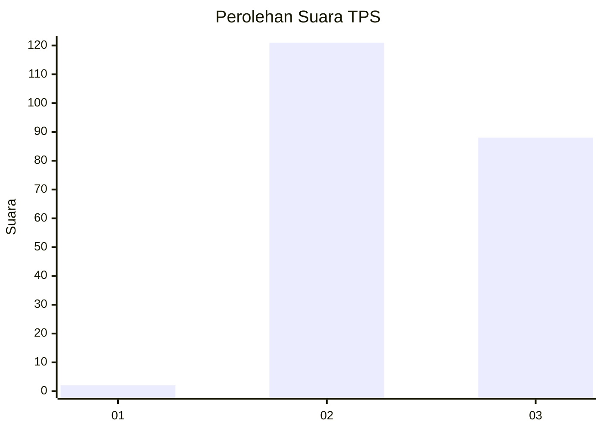
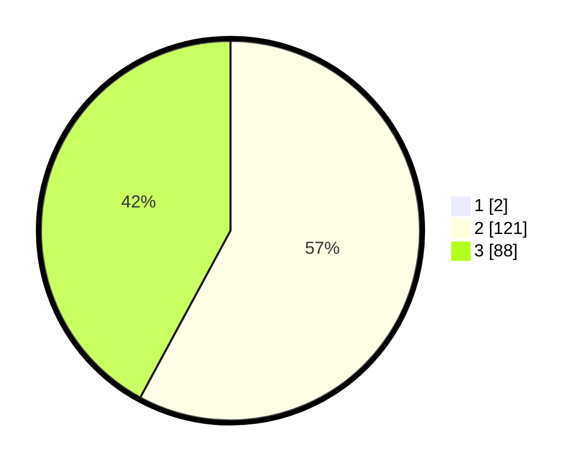

# Hasil

## Grafik

## Tabel

| No. | Nama Paslon    | Suara | Suara (raw) | Persentase |
|:--- |:-------------- | -----:| -----------:| ----------:|
| 1   | ANIES MUHAIMIN | 2     | [2][p-1]    | 0,95       |
| 2   | PRABOWO GIBRAN | 121   | [121][p-2]  | 57,35      |
| 3   | GANJAR MAHFUD  | 88    | [88][p-3]   | 41,71      |

[p-1]: https://github.com/gigit-pemilu/pemilu-2024-51-bali/blob/main/pilpres/hitung-suara/sub/51-bali/sub/04-gianyar/sub/01-sukawati/sub/2001-batubulan/sub/059-tps/sub/paslon-1.txt
[p-2]: https://github.com/gigit-pemilu/pemilu-2024-51-bali/blob/main/pilpres/hitung-suara/sub/51-bali/sub/04-gianyar/sub/01-sukawati/sub/2001-batubulan/sub/059-tps/sub/paslon-2.txt
[p-3]: https://github.com/gigit-pemilu/pemilu-2024-51-bali/blob/main/pilpres/hitung-suara/sub/51-bali/sub/04-gianyar/sub/01-sukawati/sub/2001-batubulan/sub/059-tps/sub/paslon-3.txt

## Foto C Plano

https://sirekap-obj-formc.kpu.go.id/1540/pemilu/ppwp/51/04/01/20/01/5104012001059-20240216-225839--783bd583-c3a0-4d13-9de2-cff345810fca.jpg

https://sirekap-obj-formc.kpu.go.id/1540/pemilu/ppwp/51/04/01/20/01/5104012001059-20240216-225840--80839962-930b-44b1-b0a5-93a5d29a7725.jpg

https://sirekap-obj-formc.kpu.go.id/1540/pemilu/ppwp/51/04/01/20/01/5104012001059-20240216-225840--1e377932-27eb-4146-9f1a-45bb0da63311.jpg

## Metadata

| Key        | Value               |
| ---------- | ------------------- |
| Time Stamp | 2024-02-17 17:30:00 |

## DATA PEMILIH TETAP

Jumlah pemilih dalam DPT: **261**.
 * L: **129**.
 * P: **132**.

## DATA PENGGUNA HAK PILIH

Jumlah pengguna hak pilih dalam DPT: **200**.
 * L: **92**.
 * P: **108**.

Jumlah pengguna hak pilih dalam DPTb: **0**.
 * L: **0**.
 * P: **0**.

Jumlah pengguna hak pilih dalam DPK: **13**.
 * L: **6**.
 * P: **7**.

Jumlah pengguna hak pilih: **213**.
 * L: **98**.
 * P: **115**.

## JUMLAH SUARA SAH DAN TIDAK SAH

JUMLAH SELURUH SUARA SAH: **211**.

JUMLAH SUARA TIDAK SAH: **2**.

JUMLAH SELURUH SUARA SAH DAN SUARA TIDAK SAH: **213**.

