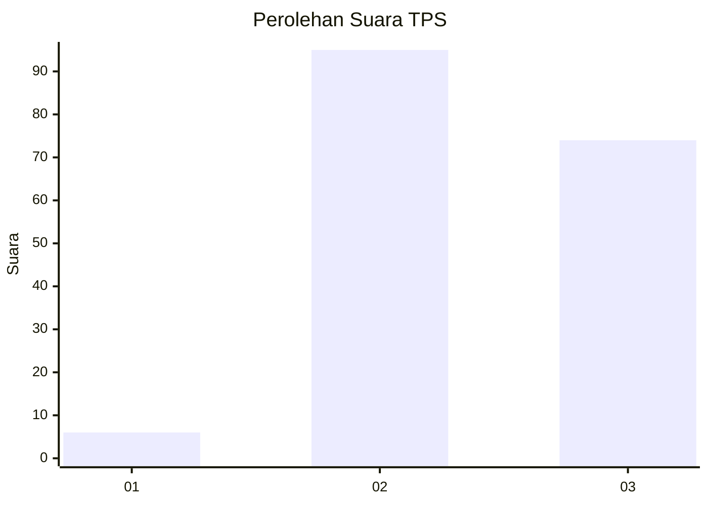
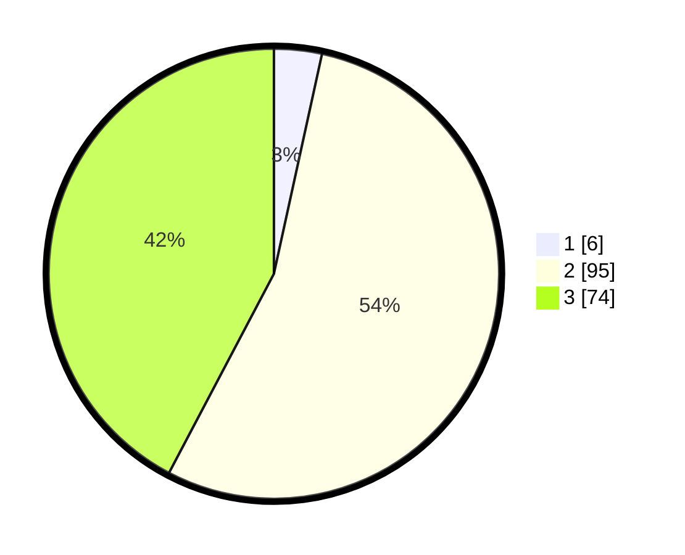

# Hasil

## Grafik

## Tabel

| No. | Nama Paslon    | Suara | Suara (raw) | Persentase |
|:--- |:-------------- | -----:| -----------:| ----------:|
| 1   | ANIES MUHAIMIN | 6     | [6][p-1]    | 3,43       |
| 2   | PRABOWO GIBRAN | 95    | [95][p-2]   | 54,29      |
| 3   | GANJAR MAHFUD  | 74    | [74][p-3]   | 42,29      |

[p-1]: https://github.com/gigit-pemilu/pemilu-2024-51-bali/blob/main/pilpres/hitung-suara/sub/51-bali/sub/04-gianyar/sub/01-sukawati/sub/2001-batubulan/sub/063-tps/sub/paslon-1.txt
[p-2]: https://github.com/gigit-pemilu/pemilu-2024-51-bali/blob/main/pilpres/hitung-suara/sub/51-bali/sub/04-gianyar/sub/01-sukawati/sub/2001-batubulan/sub/063-tps/sub/paslon-2.txt
[p-3]: https://github.com/gigit-pemilu/pemilu-2024-51-bali/blob/main/pilpres/hitung-suara/sub/51-bali/sub/04-gianyar/sub/01-sukawati/sub/2001-batubulan/sub/063-tps/sub/paslon-3.txt

## Foto C Plano

https://sirekap-obj-formc.kpu.go.id/d6bc/pemilu/ppwp/51/04/01/20/01/5104012001063-20240216-153120--6c27b95f-d44f-4f29-8a1a-da58c59a08a3.jpg

https://sirekap-obj-formc.kpu.go.id/d6bc/pemilu/ppwp/51/04/01/20/01/5104012001063-20240216-153121--bc47aff7-53fd-4cf1-a334-8b508aa96a31.jpg

https://sirekap-obj-formc.kpu.go.id/d6bc/pemilu/ppwp/51/04/01/20/01/5104012001063-20240216-153121--476ba33d-0deb-4fda-9a34-13f4f1c21cd5.jpg

## Metadata

| Key        | Value               |
| ---------- | ------------------- |
| Time Stamp | 2024-02-16 16:25:10 |

## DATA PEMILIH TETAP

Jumlah pemilih dalam DPT: **259**.
 * L: **125**.
 * P: **134**.

## DATA PENGGUNA HAK PILIH

Jumlah pengguna hak pilih dalam DPT: **175**.
 * L: **85**.
 * P: **90**.

Jumlah pengguna hak pilih dalam DPTb: **0**.
 * L: **0**.
 * P: **0**.

Jumlah pengguna hak pilih dalam DPK: **0**.
 * L: **2**.
 * P: **0**.

Jumlah pengguna hak pilih: **177**.
 * L: **87**.
 * P: **90**.

## JUMLAH SUARA SAH DAN TIDAK SAH

JUMLAH SELURUH SUARA SAH: **175**.

JUMLAH SUARA TIDAK SAH: **2**.

JUMLAH SELURUH SUARA SAH DAN SUARA TIDAK SAH: **177**.

