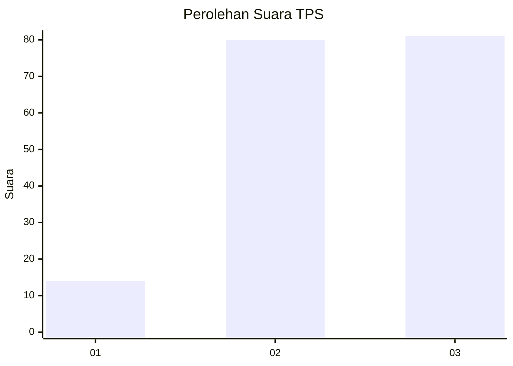
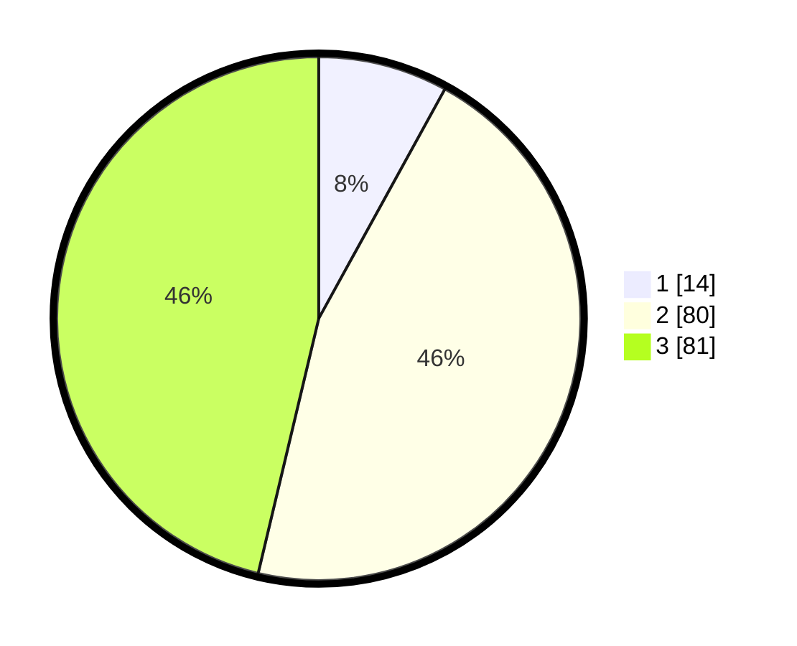

# Hasil

## Grafik

## Tabel

| No. | Nama Paslon    | Suara | Suara (raw) | Persentase |
|:--- |:-------------- | -----:| -----------:| ----------:|
| 1   | ANIES MUHAIMIN | 14    | [14][p-1]   | 8,00       |
| 2   | PRABOWO GIBRAN | 80    | [80][p-2]   | 45,71      |
| 3   | GANJAR MAHFUD  | 81    | [81][p-3]   | 46,29      |

[p-1]: https://github.com/gigit-pemilu/pemilu-2024-51-bali/blob/main/pilpres/hitung-suara/sub/51-bali/sub/04-gianyar/sub/01-sukawati/sub/2001-batubulan/sub/064-tps/sub/paslon-1.txt
[p-2]: https://github.com/gigit-pemilu/pemilu-2024-51-bali/blob/main/pilpres/hitung-suara/sub/51-bali/sub/04-gianyar/sub/01-sukawati/sub/2001-batubulan/sub/064-tps/sub/paslon-2.txt
[p-3]: https://github.com/gigit-pemilu/pemilu-2024-51-bali/blob/main/pilpres/hitung-suara/sub/51-bali/sub/04-gianyar/sub/01-sukawati/sub/2001-batubulan/sub/064-tps/sub/paslon-3.txt

## Foto C Plano

https://sirekap-obj-formc.kpu.go.id/e852/pemilu/ppwp/51/04/01/20/01/5104012001064-20240214-210056--197f6ed3-4b10-4aeb-acd3-75dffb1c2ce1.jpg

https://sirekap-obj-formc.kpu.go.id/e852/pemilu/ppwp/51/04/01/20/01/5104012001064-20240214-210128--5d1b19f3-08cb-4e02-918d-1a40f74c1b94.jpg

https://sirekap-obj-formc.kpu.go.id/e852/pemilu/ppwp/51/04/01/20/01/5104012001064-20240214-210238--0b8899fc-e9b6-460a-abc7-929c62ce810a.jpg

## Metadata

| Key        | Value               |
| ---------- | ------------------- |
| Time Stamp | 2024-02-15 12:00:28 |

