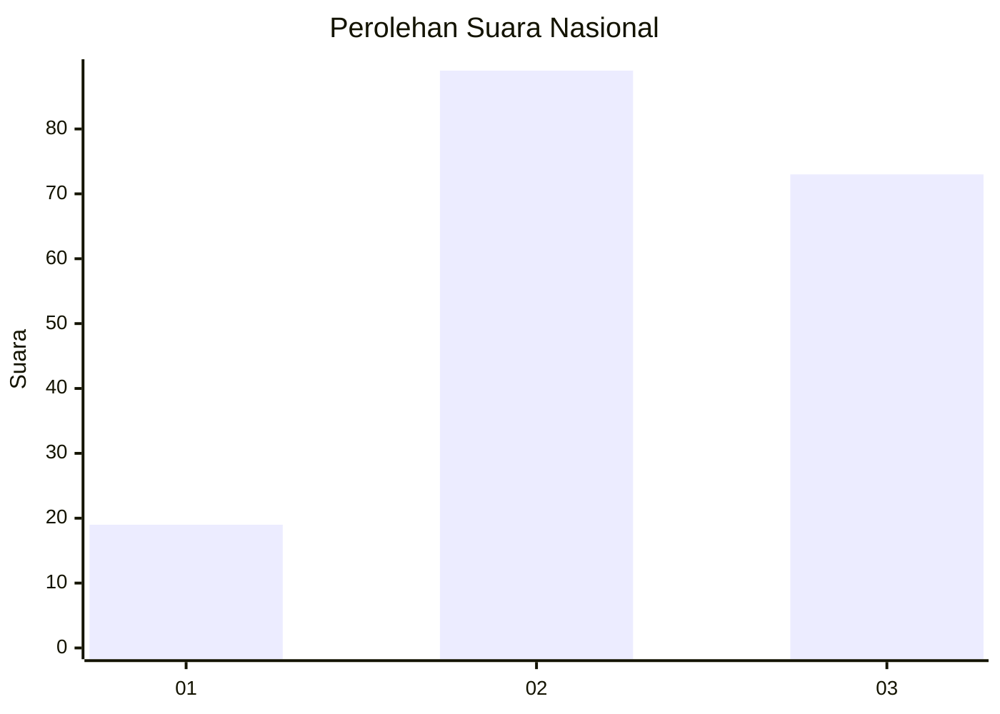
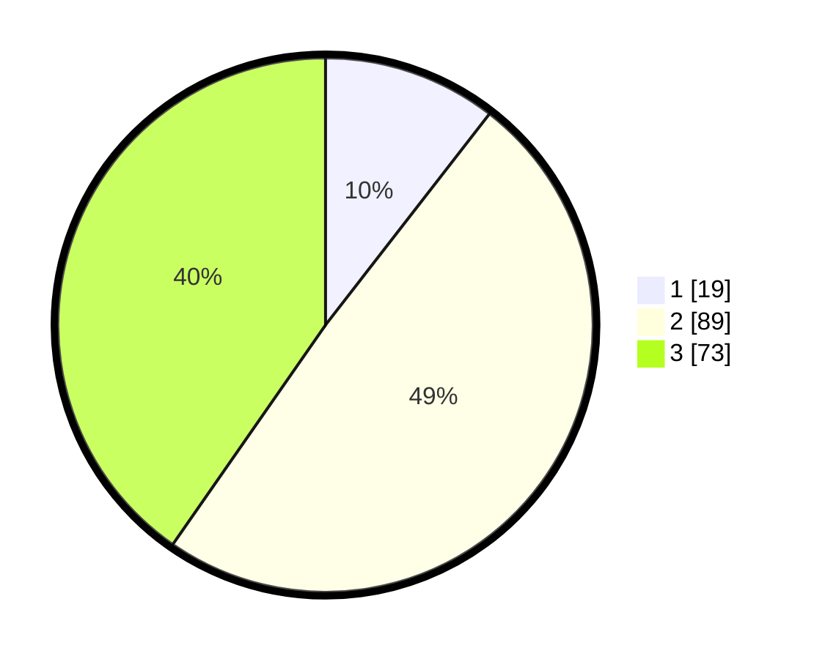

# Hasil

## Grafik

## Tabel

| No. | Nama Paslon    | Suara | Suara (raw) | Persentase |
|:--- |:-------------- | -----:| -----------:| ----------:|
| 1   | ANIES MUHAIMIN | 19    | [19][p-1]   | 10,50      |
| 2   | PRABOWO GIBRAN | 89    | [89][p-2]   | 49,17      |
| 3   | GANJAR MAHFUD  | 73    | [73][p-3]   | 40,33      |

[p-1]: https://github.com/gigit-pemilu/pemilu-2024/blob/main/pilpres/hitung-suara/sub/51-bali/sub/04-gianyar/sub/01-sukawati/sub/2001-batubulan/sub/066-tps/sub/paslon-1.txt
[p-2]: https://github.com/gigit-pemilu/pemilu-2024/blob/main/pilpres/hitung-suara/sub/51-bali/sub/04-gianyar/sub/01-sukawati/sub/2001-batubulan/sub/066-tps/sub/paslon-2.txt
[p-3]: https://github.com/gigit-pemilu/pemilu-2024/blob/main/pilpres/hitung-suara/sub/51-bali/sub/04-gianyar/sub/01-sukawati/sub/2001-batubulan/sub/066-tps/sub/paslon-3.txt

## Foto C Plano

https://sirekap-obj-formc.kpu.go.id/82fd/pemilu/ppwp/51/04/01/20/01/5104012001066-20240214-220008--aa941037-dd2c-4bfb-bd44-252accb1ad16.jpg

https://sirekap-obj-formc.kpu.go.id/82fd/pemilu/ppwp/51/04/01/20/01/5104012001066-20240214-141539--64308f86-ab56-4745-9d21-2ce787ab5502.jpg

https://sirekap-obj-formc.kpu.go.id/82fd/pemilu/ppwp/51/04/01/20/01/5104012001066-20240214-141721--33304c68-8231-48c1-8dc2-78f6e7febb6c.jpg

## Metadata

| Key        | Value               |
| ---------- | ------------------- |
| Time Stamp | 2024-02-15 00:41:44 |

