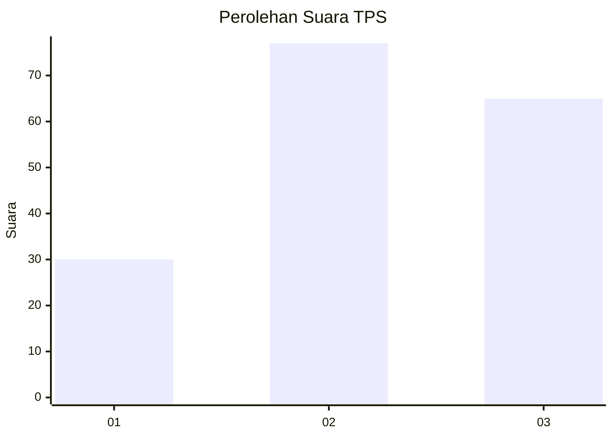
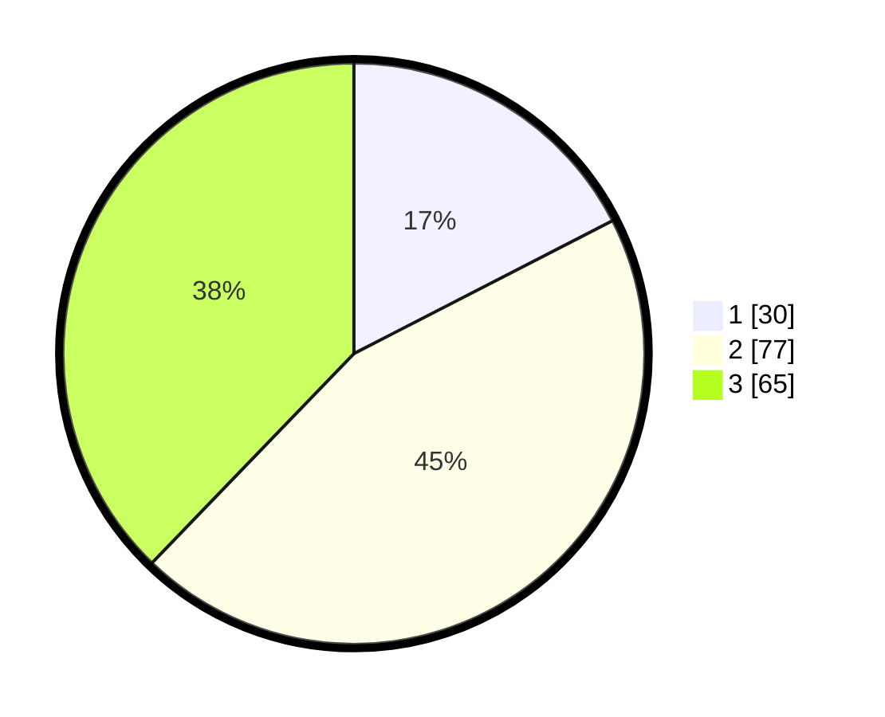

# Hasil

## Grafik

## Tabel

| No. | Nama Paslon    | Suara | Suara (raw) | Persentase |
|:--- |:-------------- | -----:| -----------:| ----------:|
| 1   | ANIES MUHAIMIN | 30    | [30][p-1]   | 17,44      |
| 2   | PRABOWO GIBRAN | 77    | [77][p-2]   | 44,77      |
| 3   | GANJAR MAHFUD  | 65    | [65][p-3]   | 37,79      |

[p-1]: https://github.com/gigit-pemilu/pemilu-2024-51-bali/blob/main/pilpres/hitung-suara/sub/51-bali/sub/04-gianyar/sub/01-sukawati/sub/2001-batubulan/sub/067-tps/sub/paslon-1.txt
[p-2]: https://github.com/gigit-pemilu/pemilu-2024-51-bali/blob/main/pilpres/hitung-suara/sub/51-bali/sub/04-gianyar/sub/01-sukawati/sub/2001-batubulan/sub/067-tps/sub/paslon-2.txt
[p-3]: https://github.com/gigit-pemilu/pemilu-2024-51-bali/blob/main/pilpres/hitung-suara/sub/51-bali/sub/04-gianyar/sub/01-sukawati/sub/2001-batubulan/sub/067-tps/sub/paslon-3.txt

## Foto C Plano

https://sirekap-obj-formc.kpu.go.id/8aa9/pemilu/ppwp/51/04/01/20/01/5104012001067-20240217-114419--d31e3bcc-e06c-484d-b957-0f505f1d9259.jpg

https://sirekap-obj-formc.kpu.go.id/8aa9/pemilu/ppwp/51/04/01/20/01/5104012001067-20240217-114421--4bb6019b-2335-4f6c-9c1d-45f60430d912.jpg

https://sirekap-obj-formc.kpu.go.id/8aa9/pemilu/ppwp/51/04/01/20/01/5104012001067-20240217-114420--535bc186-536e-485a-8a4c-b0dd86cf0890.jpg

## Metadata

| Key        | Value               |
| ---------- | ------------------- |
| Time Stamp | 2024-02-17 17:30:00 |

## DATA PEMILIH TETAP

Jumlah pemilih dalam DPT: **262**.
 * L: **135**.
 * P: **127**.

## DATA PENGGUNA HAK PILIH

Jumlah pengguna hak pilih dalam DPT: **170**.
 * L: **88**.
 * P: **82**.

Jumlah pengguna hak pilih dalam DPTb: **3**.
 * L: **1**.
 * P: **2**.

Jumlah pengguna hak pilih dalam DPK: **0**.
 * L: **0**.
 * P: **0**.

Jumlah pengguna hak pilih: **173**.
 * L: **89**.
 * P: **84**.

## JUMLAH SUARA SAH DAN TIDAK SAH

JUMLAH SELURUH SUARA SAH: **172**.

JUMLAH SUARA TIDAK SAH: **1**.

JUMLAH SELURUH SUARA SAH DAN SUARA TIDAK SAH: **173**.

