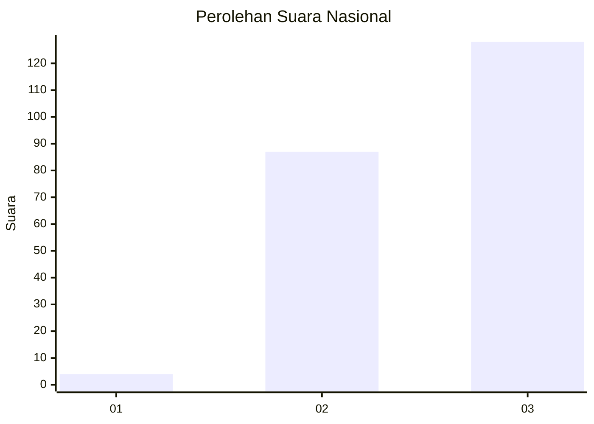
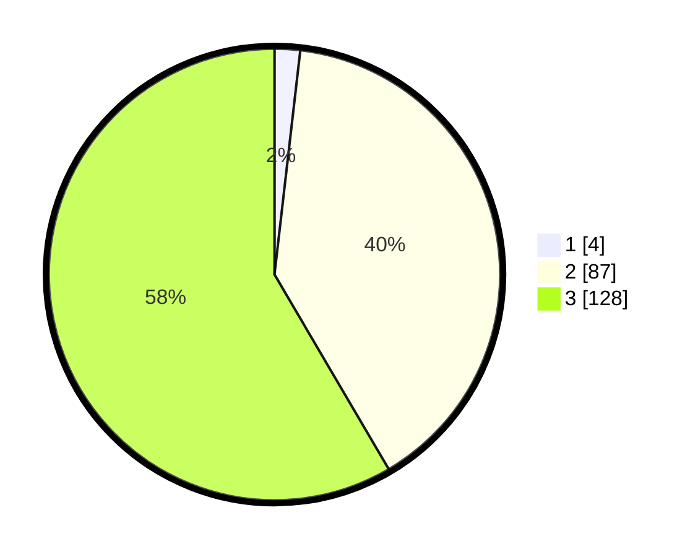

# Hasil

## Grafik

## Tabel

| No. | Nama Paslon    | Suara | Suara (raw) | Persentase |
|:--- |:-------------- | -----:| -----------:| ----------:|
| 1   | ANIES MUHAIMIN | 4     | [4][p-1]    | 1,83       |
| 2   | PRABOWO GIBRAN | 87    | [87][p-2]   | 39,73      |
| 3   | GANJAR MAHFUD  | 128   | [128][p-3]  | 58,45      |

[p-1]: https://github.com/gigit-pemilu/pemilu-2024/blob/main/pilpres/hitung-suara/sub/51-bali/sub/04-gianyar/sub/01-sukawati/sub/2002-ketewel/sub/001-tps/sub/paslon-1.txt
[p-2]: https://github.com/gigit-pemilu/pemilu-2024/blob/main/pilpres/hitung-suara/sub/51-bali/sub/04-gianyar/sub/01-sukawati/sub/2002-ketewel/sub/001-tps/sub/paslon-2.txt
[p-3]: https://github.com/gigit-pemilu/pemilu-2024/blob/main/pilpres/hitung-suara/sub/51-bali/sub/04-gianyar/sub/01-sukawati/sub/2002-ketewel/sub/001-tps/sub/paslon-3.txt

## Foto C Plano

https://sirekap-obj-formc.kpu.go.id/2e7d/pemilu/ppwp/51/04/01/20/02/5104012002001-20240216-050020--a0219825-60fe-405e-848c-42d8c733f81b.jpg

https://sirekap-obj-formc.kpu.go.id/2e7d/pemilu/ppwp/51/04/01/20/02/5104012002001-20240216-050022--7d257ded-927e-4fa7-8ae8-b2e0d027de92.jpg

https://sirekap-obj-formc.kpu.go.id/2e7d/pemilu/ppwp/51/04/01/20/02/5104012002001-20240216-050021--08a430c6-2722-412a-8462-b32f737d9b8c.jpg

## Metadata

| Key        | Value               |
| ---------- | ------------------- |
| Time Stamp | 2024-02-16 09:30:28 |

## DATA PEMILIH TETAP

Jumlah pemilih dalam DPT: **232**.
 * L: **107**.
 * P: **125**.

## DATA PENGGUNA HAK PILIH

Jumlah pengguna hak pilih dalam DPT: **208**.
 * L: **99**.
 * P: **109**.

Jumlah pengguna hak pilih dalam DPTb: **10**.
 * L: **3**.
 * P: **7**.

Jumlah pengguna hak pilih dalam DPK: **2**.
 * L: **1**.
 * P: **1**.

Jumlah pengguna hak pilih: **220**.
 * L: **103**.
 * P: **117**.

## JUMLAH SUARA SAH DAN TIDAK SAH

JUMLAH SELURUH SUARA SAH: **219**.

JUMLAH SUARA TIDAK SAH: **1**.

JUMLAH SELURUH SUARA SAH DAN SUARA TIDAK SAH: **220**.

