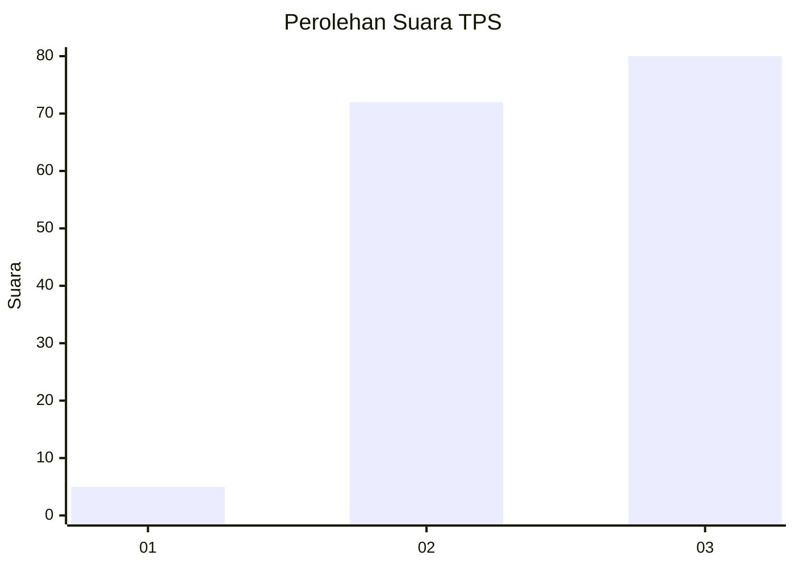
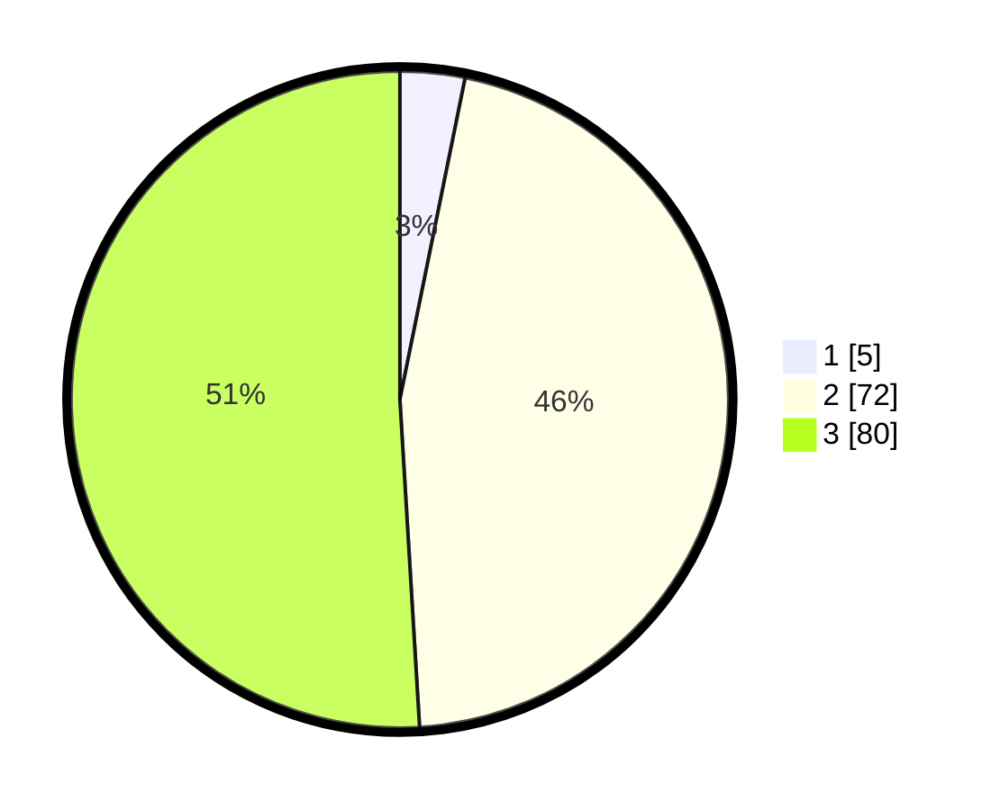

# Hasil

## Grafik

## Tabel

| No. | Nama Paslon    | Suara | Suara (raw) | Persentase |
|:--- |:-------------- | -----:| -----------:| ----------:|
| 1   | ANIES MUHAIMIN | 5     | [5][p-1]    | 3,18       |
| 2   | PRABOWO GIBRAN | 72    | [72][p-2]   | 45,86      |
| 3   | GANJAR MAHFUD  | 80    | [80][p-3]   | 50,96      |

[p-1]: https://github.com/gigit-pemilu/pemilu-2024-51-bali/blob/main/pilpres/hitung-suara/sub/51-bali/sub/04-gianyar/sub/01-sukawati/sub/2002-ketewel/sub/018-tps/sub/paslon-1.txt
[p-2]: https://github.com/gigit-pemilu/pemilu-2024-51-bali/blob/main/pilpres/hitung-suara/sub/51-bali/sub/04-gianyar/sub/01-sukawati/sub/2002-ketewel/sub/018-tps/sub/paslon-2.txt
[p-3]: https://github.com/gigit-pemilu/pemilu-2024-51-bali/blob/main/pilpres/hitung-suara/sub/51-bali/sub/04-gianyar/sub/01-sukawati/sub/2002-ketewel/sub/018-tps/sub/paslon-3.txt

## Foto C Plano

https://sirekap-obj-formc.kpu.go.id/bdab/pemilu/ppwp/51/04/01/20/02/5104012002018-20240215-190251--e9fb8355-ae3e-4ddd-a358-10f00adc55e8.jpg

https://sirekap-obj-formc.kpu.go.id/bdab/pemilu/ppwp/51/04/01/20/02/5104012002018-20240215-190319--7b5f229b-326b-4ede-98b5-dc949a5ef9aa.jpg

https://sirekap-obj-formc.kpu.go.id/bdab/pemilu/ppwp/51/04/01/20/02/5104012002018-20240215-190308--1c6773f5-3021-4220-a6a7-d7966a332db4.jpg

## Metadata

| Key        | Value               |
| ---------- | ------------------- |
| Time Stamp | 2024-02-15 19:30:26 |

## DATA PEMILIH TETAP

Jumlah pemilih dalam DPT: **169**.
 * L: **86**.
 * P: **83**.

## DATA PENGGUNA HAK PILIH

Jumlah pengguna hak pilih dalam DPT: **158**.
 * L: **80**.
 * P: **78**.

Jumlah pengguna hak pilih dalam DPTb: **0**.
 * L: **0**.
 * P: **0**.

Jumlah pengguna hak pilih dalam DPK: **0**.
 * L: **0**.
 * P: **0**.

Jumlah pengguna hak pilih: **158**.
 * L: **80**.
 * P: **78**.

## JUMLAH SUARA SAH DAN TIDAK SAH

JUMLAH SELURUH SUARA SAH: **157**.

JUMLAH SUARA TIDAK SAH: **1**.

JUMLAH SELURUH SUARA SAH DAN SUARA TIDAK SAH: **158**.

