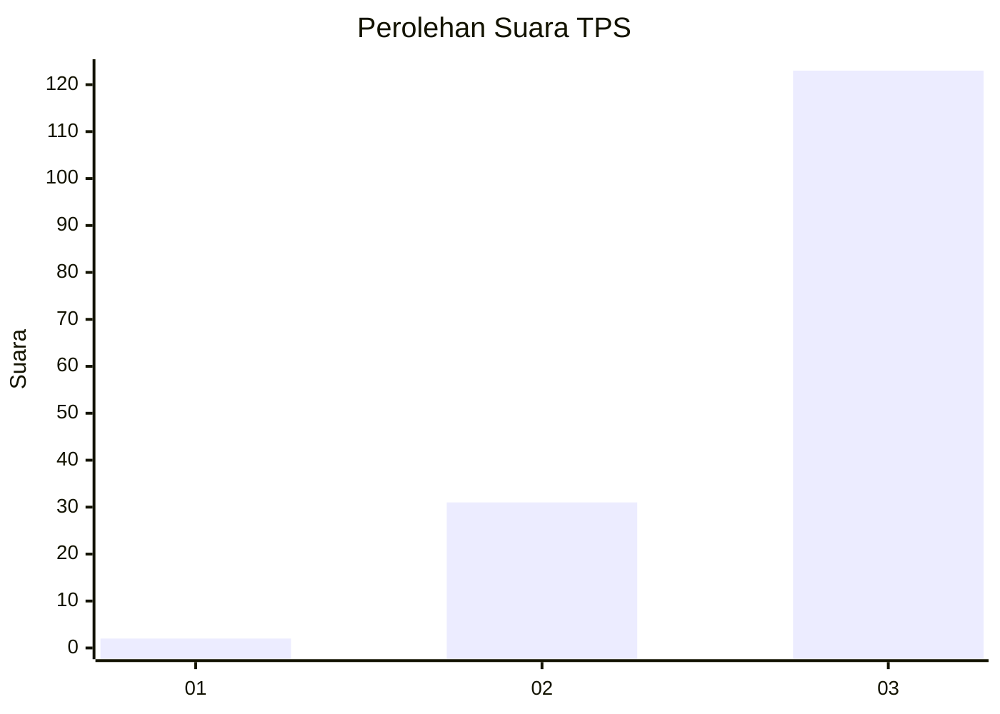
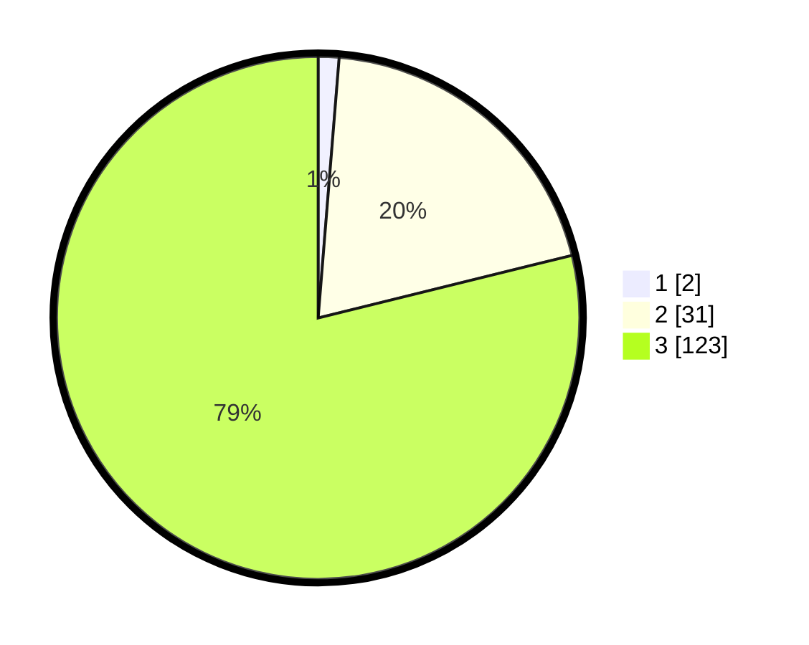

# Hasil

## Grafik

## Tabel

| No. | Nama Paslon    | Suara | Suara (raw) | Persentase |
|:--- |:-------------- | -----:| -----------:| ----------:|
| 1   | ANIES MUHAIMIN | 2     | [2][p-1]    | 1,28       |
| 2   | PRABOWO GIBRAN | 31    | [31][p-2]   | 19,87      |
| 3   | GANJAR MAHFUD  | 123   | [123][p-3]  | 78,85      |

[p-1]: https://github.com/gigit-pemilu/pemilu-2024-51-bali/blob/main/pilpres/hitung-suara/sub/51-bali/sub/04-gianyar/sub/01-sukawati/sub/2002-ketewel/sub/033-tps/sub/paslon-1.txt
[p-2]: https://github.com/gigit-pemilu/pemilu-2024-51-bali/blob/main/pilpres/hitung-suara/sub/51-bali/sub/04-gianyar/sub/01-sukawati/sub/2002-ketewel/sub/033-tps/sub/paslon-2.txt
[p-3]: https://github.com/gigit-pemilu/pemilu-2024-51-bali/blob/main/pilpres/hitung-suara/sub/51-bali/sub/04-gianyar/sub/01-sukawati/sub/2002-ketewel/sub/033-tps/sub/paslon-3.txt

## Foto C Plano

https://sirekap-obj-formc.kpu.go.id/c1a4/pemilu/ppwp/51/04/01/20/02/5104012002033-20240215-210557--41b833c9-1e88-4e3b-aa59-e5940cdf3555.jpg

https://sirekap-obj-formc.kpu.go.id/c1a4/pemilu/ppwp/51/04/01/20/02/5104012002033-20240215-210559--97c54619-ba1e-4d36-8968-048ce1660640.jpg

https://sirekap-obj-formc.kpu.go.id/c1a4/pemilu/ppwp/51/04/01/20/02/5104012002033-20240215-210558--d8396f45-dedd-41e5-8e8b-88b19a4ef39c.jpg

## Metadata

| Key        | Value               |
| ---------- | ------------------- |
| Time Stamp | 2024-02-15 22:40:13 |

## DATA PEMILIH TETAP

Jumlah pemilih dalam DPT: **164**.
 * L: **82**.
 * P: **82**.

## DATA PENGGUNA HAK PILIH

Jumlah pengguna hak pilih dalam DPT: **156**.
 * L: **80**.
 * P: **76**.

Jumlah pengguna hak pilih dalam DPTb: **0**.
 * L: **0**.
 * P: **0**.

Jumlah pengguna hak pilih dalam DPK: **0**.
 * L: **0**.
 * P: **0**.

Jumlah pengguna hak pilih: **156**.
 * L: **80**.
 * P: **76**.

## JUMLAH SUARA SAH DAN TIDAK SAH

JUMLAH SELURUH SUARA SAH: **156**.

JUMLAH SUARA TIDAK SAH: **0**.

JUMLAH SELURUH SUARA SAH DAN SUARA TIDAK SAH: **156**.

