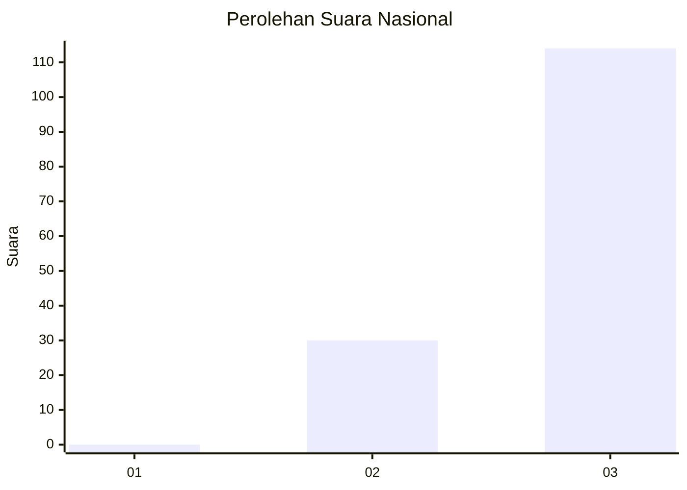
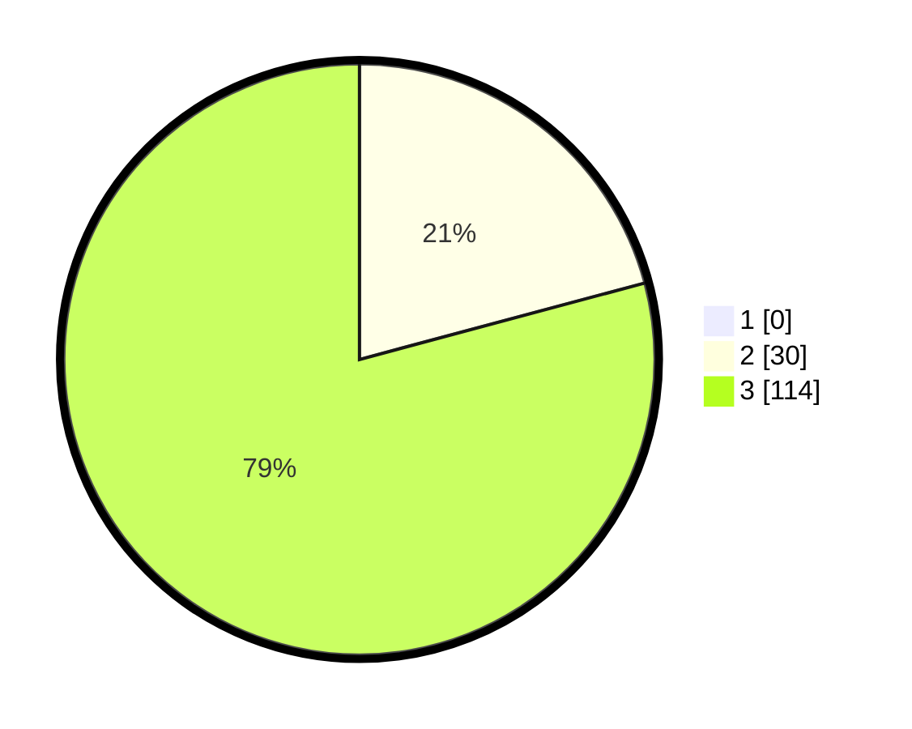

# Hasil

## Grafik

## Tabel

| No. | Nama Paslon    | Suara | Suara (raw) | Persentase |
|:--- |:-------------- | -----:| -----------:| ----------:|
| 1   | ANIES MUHAIMIN | 0     | [0][p-1]    | 0,00       |
| 2   | PRABOWO GIBRAN | 30    | [30][p-2]   | 20,83      |
| 3   | GANJAR MAHFUD  | 114   | [114][p-3]  | 79,17      |

[p-1]: https://github.com/gigit-pemilu/pemilu-2024/blob/main/pilpres/hitung-suara/sub/51-bali/sub/04-gianyar/sub/01-sukawati/sub/2003-guwang/sub/017-tps/sub/paslon-1.txt
[p-2]: https://github.com/gigit-pemilu/pemilu-2024/blob/main/pilpres/hitung-suara/sub/51-bali/sub/04-gianyar/sub/01-sukawati/sub/2003-guwang/sub/017-tps/sub/paslon-2.txt
[p-3]: https://github.com/gigit-pemilu/pemilu-2024/blob/main/pilpres/hitung-suara/sub/51-bali/sub/04-gianyar/sub/01-sukawati/sub/2003-guwang/sub/017-tps/sub/paslon-3.txt

## Foto C Plano

https://sirekap-obj-formc.kpu.go.id/4ae4/pemilu/ppwp/51/04/01/20/03/5104012003017-20240214-203853--36f713ff-1aa4-4d67-aa7a-af9bdac376b6.jpg

https://sirekap-obj-formc.kpu.go.id/4ae4/pemilu/ppwp/51/04/01/20/03/5104012003017-20240214-203912--324b4d6e-6194-45be-8d09-49b7677413b4.jpg

https://sirekap-obj-formc.kpu.go.id/4ae4/pemilu/ppwp/51/04/01/20/03/5104012003017-20240214-203918--c60476df-f391-4c76-8c29-8b729c93bbbd.jpg

## Metadata

| Key        | Value               |
| ---------- | ------------------- |
| Time Stamp | 2024-02-14 21:46:01 |

## DATA PEMILIH TETAP

Jumlah pemilih dalam DPT: **154**.
 * L: **79**.
 * P: **75**.

## DATA PENGGUNA HAK PILIH

Jumlah pengguna hak pilih dalam DPT: **147**.
 * L: **74**.
 * P: **73**.

Jumlah pengguna hak pilih dalam DPTb: **0**.
 * L: **0**.
 * P: **0**.

Jumlah pengguna hak pilih dalam DPK: **0**.
 * L: **0**.
 * P: **0**.

Jumlah pengguna hak pilih: **147**.
 * L: **73**.
 * P: **74**.

## JUMLAH SUARA SAH DAN TIDAK SAH

JUMLAH SELURUH SUARA SAH: **144**.

JUMLAH SUARA TIDAK SAH: **3**.

JUMLAH SELURUH SUARA SAH DAN SUARA TIDAK SAH: **147**.

