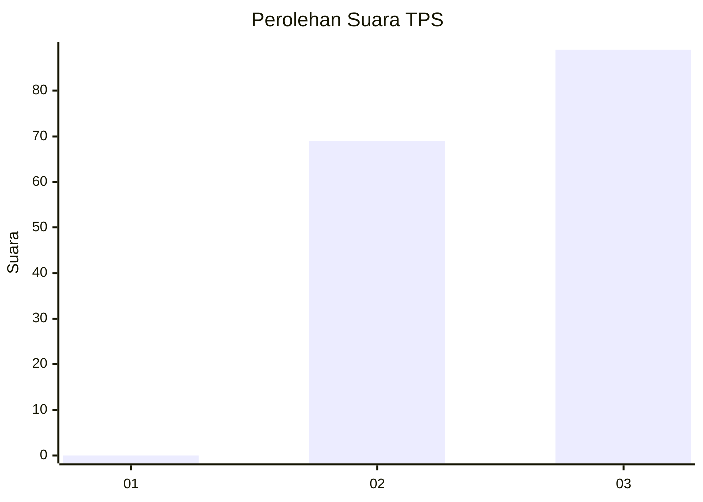
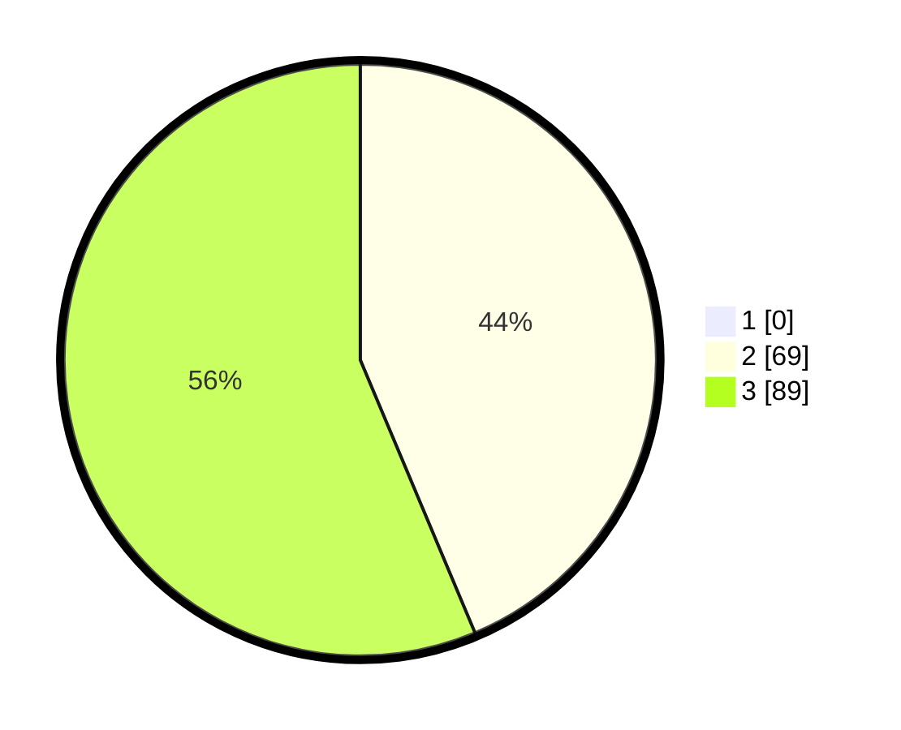

# Hasil

## Grafik

## Tabel

| No. | Nama Paslon    | Suara | Suara (raw) | Persentase |
|:--- |:-------------- | -----:| -----------:| ----------:|
| 1   | ANIES MUHAIMIN | 0     | [0][p-1]    | 0,00       |
| 2   | PRABOWO GIBRAN | 69    | [69][p-2]   | 43,67      |
| 3   | GANJAR MAHFUD  | 89    | [89][p-3]   | 56,33      |

[p-1]: https://github.com/gigit-pemilu/pemilu-2024-51-bali/blob/main/pilpres/hitung-suara/sub/51-bali/sub/04-gianyar/sub/01-sukawati/sub/2004-sukawati/sub/002-tps/sub/paslon-1.txt
[p-2]: https://github.com/gigit-pemilu/pemilu-2024-51-bali/blob/main/pilpres/hitung-suara/sub/51-bali/sub/04-gianyar/sub/01-sukawati/sub/2004-sukawati/sub/002-tps/sub/paslon-2.txt
[p-3]: https://github.com/gigit-pemilu/pemilu-2024-51-bali/blob/main/pilpres/hitung-suara/sub/51-bali/sub/04-gianyar/sub/01-sukawati/sub/2004-sukawati/sub/002-tps/sub/paslon-3.txt

## Foto C Plano

https://sirekap-obj-formc.kpu.go.id/b954/pemilu/ppwp/51/04/01/20/04/5104012004002-20240214-193401--a6dbb219-d3a3-424c-a664-a728cfed0871.jpg

https://sirekap-obj-formc.kpu.go.id/b954/pemilu/ppwp/51/04/01/20/04/5104012004002-20240215-162035--22388e89-3d59-493c-a613-1dfb7ad61310.jpg

https://sirekap-obj-formc.kpu.go.id/b954/pemilu/ppwp/51/04/01/20/04/5104012004002-20240215-162024--8e954df3-373c-4558-9175-fabb9b6d3299.jpg

## Metadata

| Key        | Value               |
| ---------- | ------------------- |
| Time Stamp | 2024-02-15 18:30:25 |

## DATA PEMILIH TETAP

Jumlah pemilih dalam DPT: **208**.
 * L: **104**.
 * P: **104**.

## DATA PENGGUNA HAK PILIH

Jumlah pengguna hak pilih dalam DPT: **164**.
 * L: **84**.
 * P: **80**.

Jumlah pengguna hak pilih dalam DPTb: **0**.
 * L: **0**.
 * P: **0**.

Jumlah pengguna hak pilih dalam DPK: **0**.
 * L: **0**.
 * P: **0**.

Jumlah pengguna hak pilih: **164**.
 * L: **84**.
 * P: **80**.

## JUMLAH SUARA SAH DAN TIDAK SAH

JUMLAH SELURUH SUARA SAH: **158**.

JUMLAH SUARA TIDAK SAH: **6**.

JUMLAH SELURUH SUARA SAH DAN SUARA TIDAK SAH: **164**.

