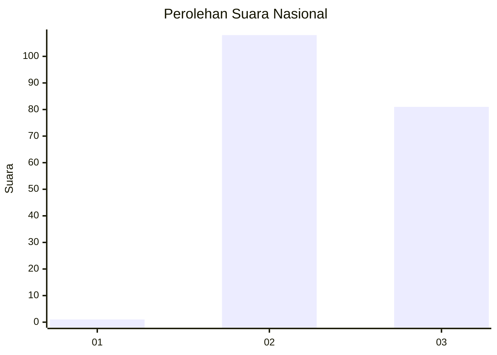
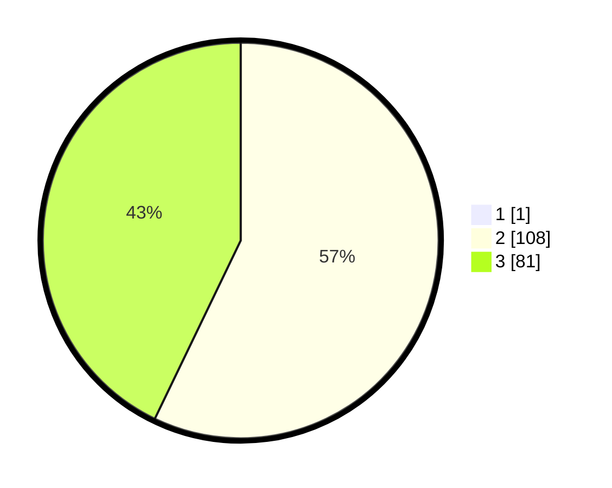

# Hasil

## Grafik

## Tabel

| No. | Nama Paslon    | Suara | Suara (raw) | Persentase |
|:--- |:-------------- | -----:| -----------:| ----------:|
| 1   | ANIES MUHAIMIN | 1     | [1][p-1]    | 0,53       |
| 2   | PRABOWO GIBRAN | 108   | [108][p-2]  | 56,84      |
| 3   | GANJAR MAHFUD  | 81    | [81][p-3]   | 42,63      |

[p-1]: https://github.com/gigit-pemilu/pemilu-2024/blob/main/pilpres/hitung-suara/sub/51-bali/sub/04-gianyar/sub/01-sukawati/sub/2004-sukawati/sub/029-tps/sub/paslon-1.txt
[p-2]: https://github.com/gigit-pemilu/pemilu-2024/blob/main/pilpres/hitung-suara/sub/51-bali/sub/04-gianyar/sub/01-sukawati/sub/2004-sukawati/sub/029-tps/sub/paslon-2.txt
[p-3]: https://github.com/gigit-pemilu/pemilu-2024/blob/main/pilpres/hitung-suara/sub/51-bali/sub/04-gianyar/sub/01-sukawati/sub/2004-sukawati/sub/029-tps/sub/paslon-3.txt

## Foto C Plano

https://sirekap-obj-formc.kpu.go.id/d687/pemilu/ppwp/51/04/01/20/04/5104012004029-20240214-213301--153e4821-ffab-4258-82c0-c8a8dd93f226.jpg

https://sirekap-obj-formc.kpu.go.id/d687/pemilu/ppwp/51/04/01/20/04/5104012004029-20240214-201754--dfa27688-5cfa-4c31-9c39-480c6af58cd8.jpg

https://sirekap-obj-formc.kpu.go.id/d687/pemilu/ppwp/51/04/01/20/04/5104012004029-20240214-202127--11b1a8db-851f-4495-8f78-f5ea5051d968.jpg

## Metadata

| Key        | Value               |
| ---------- | ------------------- |
| Time Stamp | 2024-02-15 12:00:28 |

