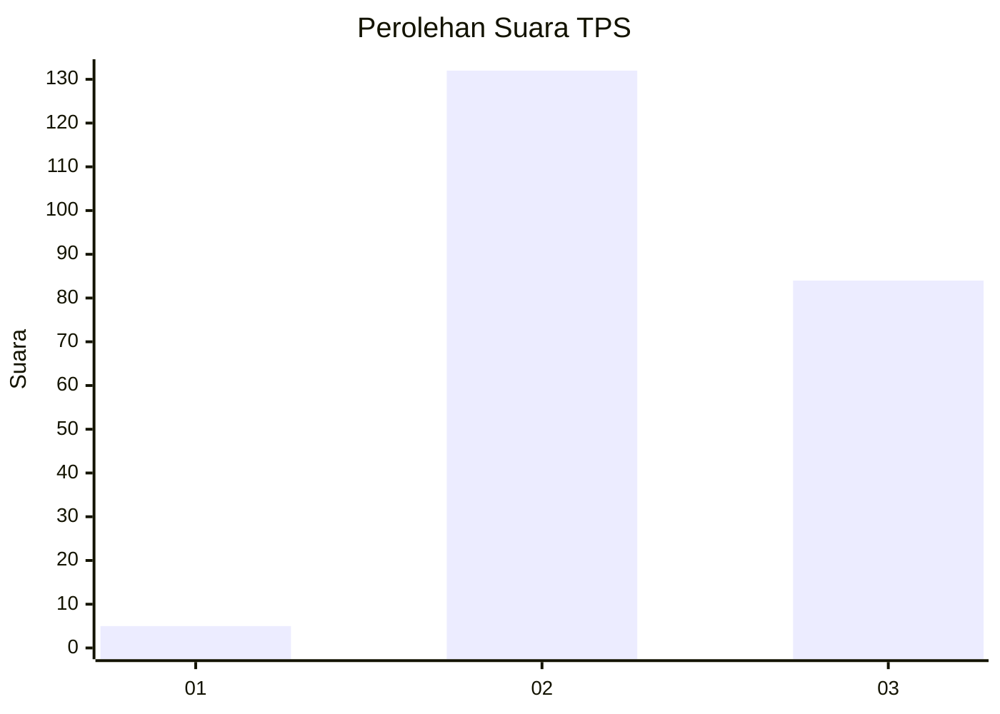
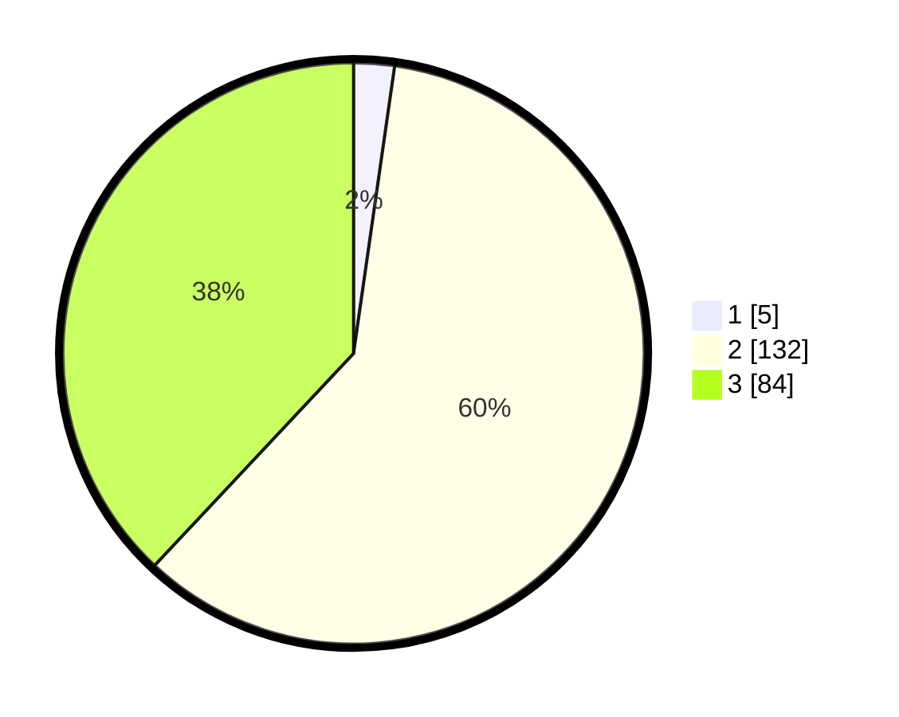

# Hasil

## Grafik

## Tabel

| No. | Nama Paslon    | Suara | Suara (raw) | Persentase |
|:--- |:-------------- | -----:| -----------:| ----------:|
| 1   | ANIES MUHAIMIN | 5     | [5][p-1]    | 2,26       |
| 2   | PRABOWO GIBRAN | 132   | [132][p-2]  | 59,73      |
| 3   | GANJAR MAHFUD  | 84    | [84][p-3]   | 38,01      |

[p-1]: https://github.com/gigit-pemilu/pemilu-2024-51-bali/blob/main/pilpres/hitung-suara/sub/51-bali/sub/04-gianyar/sub/01-sukawati/sub/2004-sukawati/sub/031-tps/sub/paslon-1.txt
[p-2]: https://github.com/gigit-pemilu/pemilu-2024-51-bali/blob/main/pilpres/hitung-suara/sub/51-bali/sub/04-gianyar/sub/01-sukawati/sub/2004-sukawati/sub/031-tps/sub/paslon-2.txt
[p-3]: https://github.com/gigit-pemilu/pemilu-2024-51-bali/blob/main/pilpres/hitung-suara/sub/51-bali/sub/04-gianyar/sub/01-sukawati/sub/2004-sukawati/sub/031-tps/sub/paslon-3.txt

## Foto C Plano

https://sirekap-obj-formc.kpu.go.id/ff08/pemilu/ppwp/51/04/01/20/04/5104012004031-20240214-141148--4ec06cb5-e166-4a60-81c7-26cb6c378059.jpg

https://sirekap-obj-formc.kpu.go.id/ff08/pemilu/ppwp/51/04/01/20/04/5104012004031-20240214-141226--dcef8b82-9489-4cb5-90e7-4fe34a7eb674.jpg

https://sirekap-obj-formc.kpu.go.id/ff08/pemilu/ppwp/51/04/01/20/04/5104012004031-20240216-041143--e928001e-7207-4dbc-bb08-3b70c1facf8e.jpg

## Metadata

| Key        | Value               |
| ---------- | ------------------- |
| Time Stamp | 2024-02-16 04:30:27 |

## DATA PEMILIH TETAP

Jumlah pemilih dalam DPT: **248**.
 * L: **121**.
 * P: **127**.

## DATA PENGGUNA HAK PILIH

Jumlah pengguna hak pilih dalam DPT: **214**.
 * L: **108**.
 * P: **106**.

Jumlah pengguna hak pilih dalam DPTb: **0**.
 * L: **0**.
 * P: **0**.

Jumlah pengguna hak pilih dalam DPK: **9**.
 * L: **6**.
 * P: **3**.

Jumlah pengguna hak pilih: **223**.
 * L: **114**.
 * P: **109**.

## JUMLAH SUARA SAH DAN TIDAK SAH

JUMLAH SELURUH SUARA SAH: **221**.

JUMLAH SUARA TIDAK SAH: **2**.

JUMLAH SELURUH SUARA SAH DAN SUARA TIDAK SAH: **223**.

