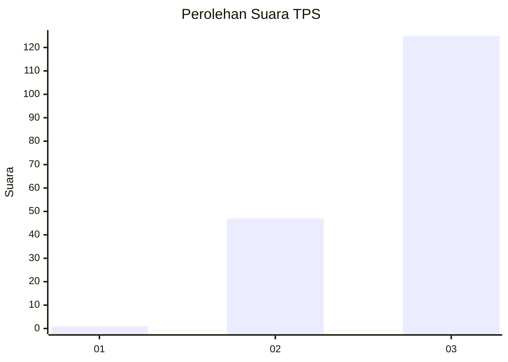
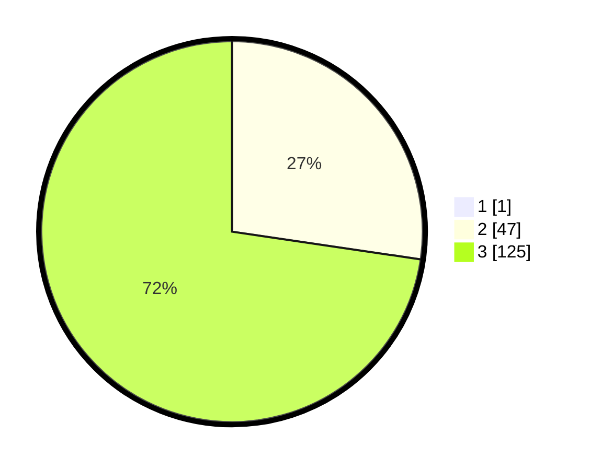

# Hasil

## Grafik

## Tabel

| No. | Nama Paslon    | Suara | Suara (raw) | Persentase |
|:--- |:-------------- | -----:| -----------:| ----------:|
| 1   | ANIES MUHAIMIN | 1     | [1][p-1]    | 0,58       |
| 2   | PRABOWO GIBRAN | 47    | [47][p-2]   | 27,17      |
| 3   | GANJAR MAHFUD  | 125   | [125][p-3]  | 72,25      |

[p-1]: https://github.com/gigit-pemilu/pemilu-2024-51-bali/blob/main/pilpres/hitung-suara/sub/51-bali/sub/04-gianyar/sub/01-sukawati/sub/2004-sukawati/sub/037-tps/sub/paslon-1.txt
[p-2]: https://github.com/gigit-pemilu/pemilu-2024-51-bali/blob/main/pilpres/hitung-suara/sub/51-bali/sub/04-gianyar/sub/01-sukawati/sub/2004-sukawati/sub/037-tps/sub/paslon-2.txt
[p-3]: https://github.com/gigit-pemilu/pemilu-2024-51-bali/blob/main/pilpres/hitung-suara/sub/51-bali/sub/04-gianyar/sub/01-sukawati/sub/2004-sukawati/sub/037-tps/sub/paslon-3.txt

## Foto C Plano

https://sirekap-obj-formc.kpu.go.id/f559/pemilu/ppwp/51/04/01/20/04/5104012004037-20240214-221304--ad31f2a4-e80a-4aae-8130-ea6acae51841.jpg

https://sirekap-obj-formc.kpu.go.id/f559/pemilu/ppwp/51/04/01/20/04/5104012004037-20240214-214102--290f8b6e-d8ab-43ab-b5a5-528a8c0c6226.jpg

https://sirekap-obj-formc.kpu.go.id/f559/pemilu/ppwp/51/04/01/20/04/5104012004037-20240214-221410--d70a08c7-640a-468b-a9e0-1ea778b9d694.jpg

## Metadata

| Key        | Value               |
| ---------- | ------------------- |
| Time Stamp | 2024-02-15 19:00:26 |

## DATA PEMILIH TETAP

Jumlah pemilih dalam DPT: **198**.
 * L: **92**.
 * P: **106**.

## DATA PENGGUNA HAK PILIH

Jumlah pengguna hak pilih dalam DPT: **172**.
 * L: **83**.
 * P: **89**.

Jumlah pengguna hak pilih dalam DPTb: **3**.
 * L: **3**.
 * P: **0**.

Jumlah pengguna hak pilih dalam DPK: **0**.
 * L: **0**.
 * P: **0**.

Jumlah pengguna hak pilih: **175**.
 * L: **86**.
 * P: **89**.

## JUMLAH SUARA SAH DAN TIDAK SAH

JUMLAH SELURUH SUARA SAH: **173**.

JUMLAH SUARA TIDAK SAH: **2**.

JUMLAH SELURUH SUARA SAH DAN SUARA TIDAK SAH: **175**.

