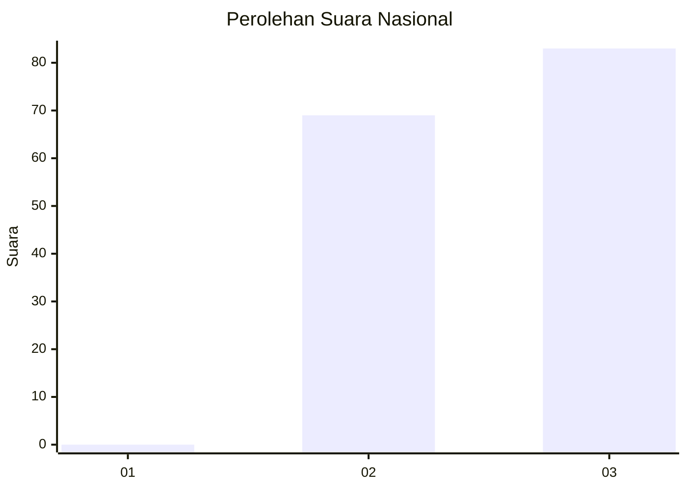
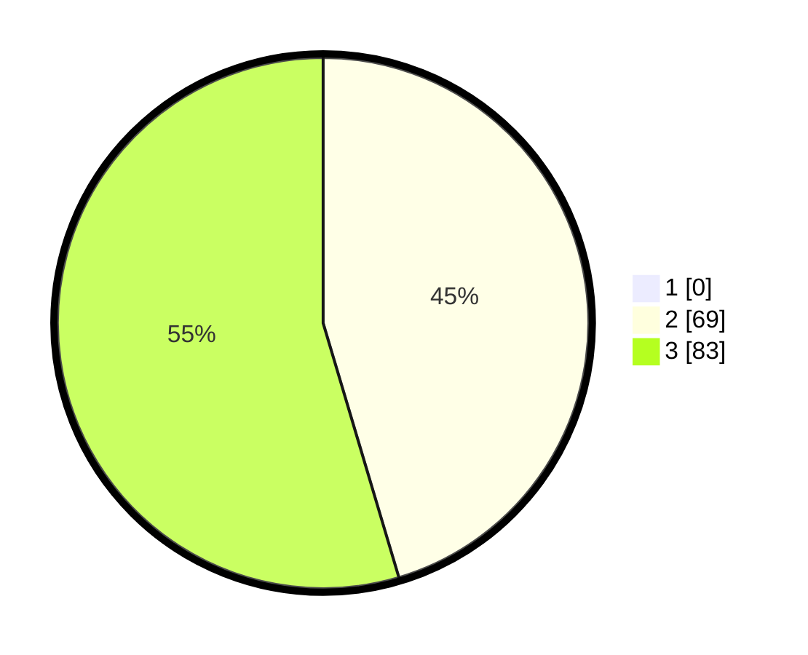

# Hasil

## Grafik

## Tabel

| No. | Nama Paslon    | Suara | Suara (raw) | Persentase |
|:--- |:-------------- | -----:| -----------:| ----------:|
| 1   | ANIES MUHAIMIN | 0     | [0][p-1]    | 0,00       |
| 2   | PRABOWO GIBRAN | 69    | [69][p-2]   | 45,39      |
| 3   | GANJAR MAHFUD  | 83    | [83][p-3]   | 54,61      |

[p-1]: https://github.com/gigit-pemilu/pemilu-2024/blob/main/pilpres/hitung-suara/sub/51-bali/sub/04-gianyar/sub/01-sukawati/sub/2007-batuan/sub/003-tps/sub/paslon-1.txt
[p-2]: https://github.com/gigit-pemilu/pemilu-2024/blob/main/pilpres/hitung-suara/sub/51-bali/sub/04-gianyar/sub/01-sukawati/sub/2007-batuan/sub/003-tps/sub/paslon-2.txt
[p-3]: https://github.com/gigit-pemilu/pemilu-2024/blob/main/pilpres/hitung-suara/sub/51-bali/sub/04-gianyar/sub/01-sukawati/sub/2007-batuan/sub/003-tps/sub/paslon-3.txt

## Foto C Plano

https://sirekap-obj-formc.kpu.go.id/ec3c/pemilu/ppwp/51/04/01/20/07/5104012007003-20240216-193212--6fc46a3b-7747-437e-9a83-196efb361a22.jpg

https://sirekap-obj-formc.kpu.go.id/ec3c/pemilu/ppwp/51/04/01/20/07/5104012007003-20240216-193213--062167ab-67e5-440a-9674-6226de65ef56.jpg

https://sirekap-obj-formc.kpu.go.id/ec3c/pemilu/ppwp/51/04/01/20/07/5104012007003-20240216-193212--be64a8b5-bb95-4365-b16a-12aa320a539d.jpg

## Metadata

| Key        | Value               |
| ---------- | ------------------- |
| Time Stamp | 2024-02-16 21:01:00 |

## DATA PEMILIH TETAP

Jumlah pemilih dalam DPT: **155**.
 * L: **76**.
 * P: **79**.

## DATA PENGGUNA HAK PILIH

Jumlah pengguna hak pilih dalam DPT: **155**.
 * L: **76**.
 * P: **79**.

Jumlah pengguna hak pilih dalam DPTb: **0**.
 * L: **0**.
 * P: **0**.

Jumlah pengguna hak pilih dalam DPK: **0**.
 * L: **0**.
 * P: **0**.

Jumlah pengguna hak pilih: **155**.
 * L: **76**.
 * P: **79**.

## JUMLAH SUARA SAH DAN TIDAK SAH

JUMLAH SELURUH SUARA SAH: **152**.

JUMLAH SUARA TIDAK SAH: **0**.

JUMLAH SELURUH SUARA SAH DAN SUARA TIDAK SAH: **152**.

