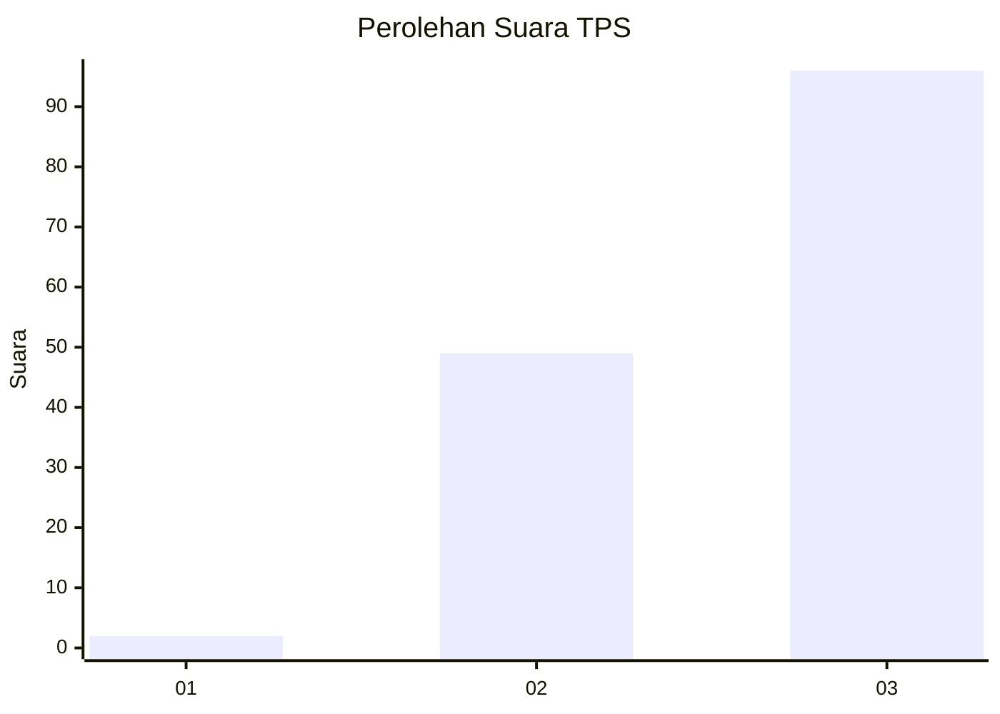
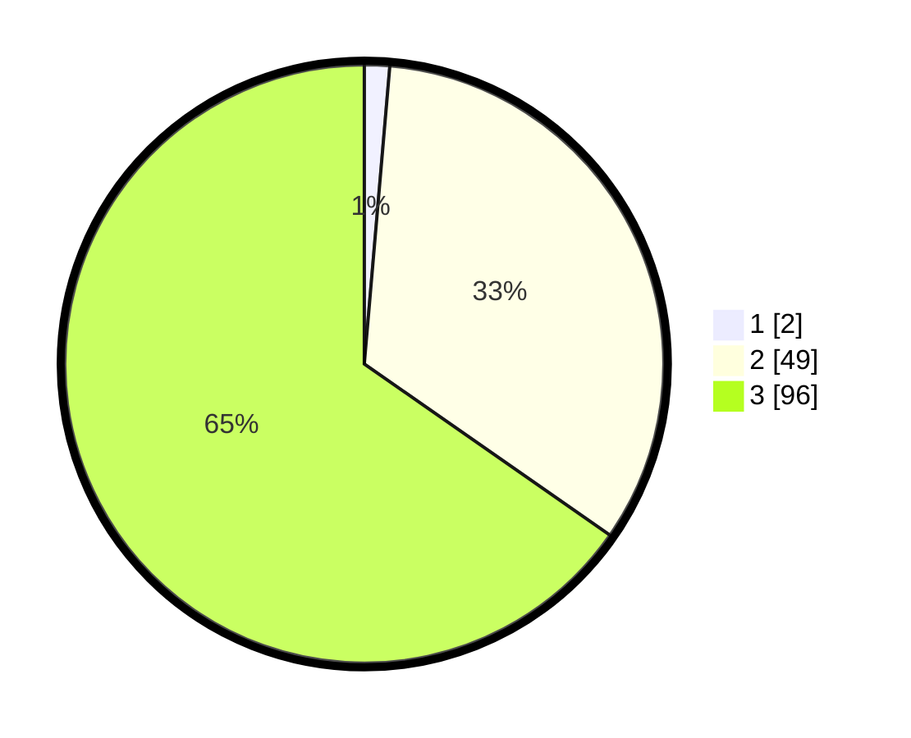

# Hasil

## Grafik

## Tabel

| No. | Nama Paslon    | Suara | Suara (raw) | Persentase |
|:--- |:-------------- | -----:| -----------:| ----------:|
| 1   | ANIES MUHAIMIN | 2     | [2][p-1]    | 1,36       |
| 2   | PRABOWO GIBRAN | 49    | [49][p-2]   | 33,33      |
| 3   | GANJAR MAHFUD  | 96    | [96][p-3]   | 65,31      |

[p-1]: https://github.com/gigit-pemilu/pemilu-2024-51-bali/blob/main/pilpres/hitung-suara/sub/51-bali/sub/04-gianyar/sub/01-sukawati/sub/2007-batuan/sub/004-tps/sub/paslon-1.txt
[p-2]: https://github.com/gigit-pemilu/pemilu-2024-51-bali/blob/main/pilpres/hitung-suara/sub/51-bali/sub/04-gianyar/sub/01-sukawati/sub/2007-batuan/sub/004-tps/sub/paslon-2.txt
[p-3]: https://github.com/gigit-pemilu/pemilu-2024-51-bali/blob/main/pilpres/hitung-suara/sub/51-bali/sub/04-gianyar/sub/01-sukawati/sub/2007-batuan/sub/004-tps/sub/paslon-3.txt

## Foto C Plano

https://sirekap-obj-formc.kpu.go.id/b0c1/pemilu/ppwp/51/04/01/20/07/5104012007004-20240215-050636--db3fb83d-f97f-46c9-a613-1f755642f312.jpg

https://sirekap-obj-formc.kpu.go.id/b0c1/pemilu/ppwp/51/04/01/20/07/5104012007004-20240215-050657--7501904e-f8d2-43de-b224-6c9b964525df.jpg

https://sirekap-obj-formc.kpu.go.id/b0c1/pemilu/ppwp/51/04/01/20/07/5104012007004-20240215-050646--1e7f2e9b-effd-40fc-9bbd-7f9abd9a14e1.jpg

## Metadata

| Key        | Value               |
| ---------- | ------------------- |
| Time Stamp | 2024-02-15 12:00:28 |

## DATA PEMILIH TETAP

Jumlah pemilih dalam DPT: **156**.
 * L: **77**.
 * P: **79**.

## DATA PENGGUNA HAK PILIH

Jumlah pengguna hak pilih dalam DPT: **147**.
 * L: **72**.
 * P: **75**.

Jumlah pengguna hak pilih dalam DPTb: **0**.
 * L: **0**.
 * P: **0**.

Jumlah pengguna hak pilih dalam DPK: **0**.
 * L: **0**.
 * P: **0**.

Jumlah pengguna hak pilih: **147**.
 * L: **72**.
 * P: **75**.

## JUMLAH SUARA SAH DAN TIDAK SAH

JUMLAH SELURUH SUARA SAH: **147**.

JUMLAH SUARA TIDAK SAH: **0**.

JUMLAH SELURUH SUARA SAH DAN SUARA TIDAK SAH: **147**.

