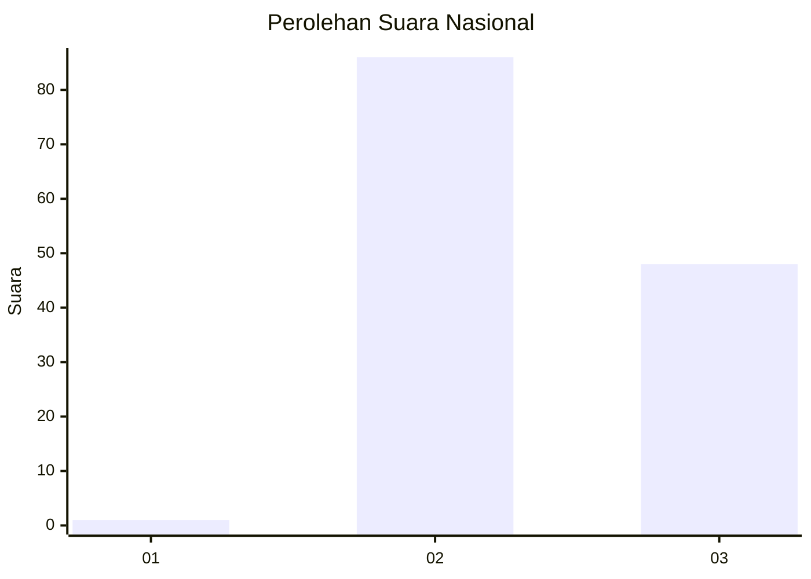
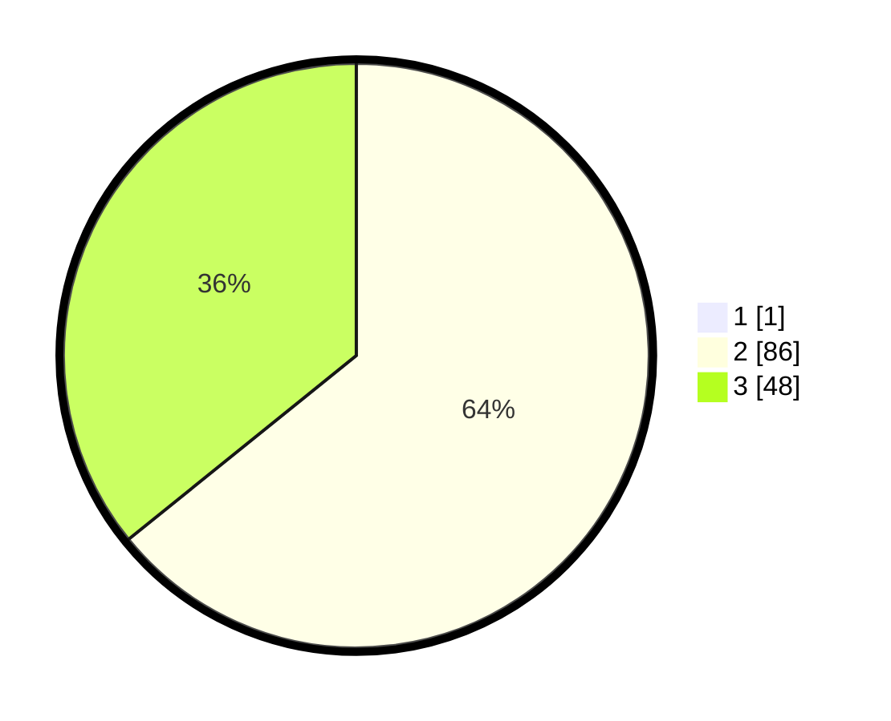

# Hasil

## Grafik

## Tabel

| No. | Nama Paslon    | Suara | Suara (raw) | Persentase |
|:--- |:-------------- | -----:| -----------:| ----------:|
| 1   | ANIES MUHAIMIN | 1     | [1][p-1]    | 0,74       |
| 2   | PRABOWO GIBRAN | 86    | [86][p-2]   | 63,70      |
| 3   | GANJAR MAHFUD  | 48    | [48][p-3]   | 35,56      |

[p-1]: https://github.com/gigit-pemilu/pemilu-2024/blob/main/pilpres/hitung-suara/sub/51-bali/sub/04-gianyar/sub/01-sukawati/sub/2007-batuan/sub/023-tps/sub/paslon-1.txt
[p-2]: https://github.com/gigit-pemilu/pemilu-2024/blob/main/pilpres/hitung-suara/sub/51-bali/sub/04-gianyar/sub/01-sukawati/sub/2007-batuan/sub/023-tps/sub/paslon-2.txt
[p-3]: https://github.com/gigit-pemilu/pemilu-2024/blob/main/pilpres/hitung-suara/sub/51-bali/sub/04-gianyar/sub/01-sukawati/sub/2007-batuan/sub/023-tps/sub/paslon-3.txt

## Foto C Plano

https://sirekap-obj-formc.kpu.go.id/5474/pemilu/ppwp/51/04/01/20/07/5104012007023-20240214-221803--67bf0c82-9f27-424c-9366-6fb4f6e0a662.jpg

https://sirekap-obj-formc.kpu.go.id/5474/pemilu/ppwp/51/04/01/20/07/5104012007023-20240214-221858--37fc0a55-c2d2-4fba-87cf-a24c8a5af27a.jpg

https://sirekap-obj-formc.kpu.go.id/5474/pemilu/ppwp/51/04/01/20/07/5104012007023-20240214-222002--89cac204-49c1-430e-accb-c3c0363ec341.jpg

## Metadata

| Key        | Value               |
| ---------- | ------------------- |
| Time Stamp | 2024-02-15 16:30:25 |

## DATA PEMILIH TETAP

Jumlah pemilih dalam DPT: **148**.
 * L: **76**.
 * P: **72**.

## DATA PENGGUNA HAK PILIH

Jumlah pengguna hak pilih dalam DPT: **136**.
 * L: **70**.
 * P: **66**.

Jumlah pengguna hak pilih dalam DPTb: **0**.
 * L: **0**.
 * P: **0**.

Jumlah pengguna hak pilih dalam DPK: **0**.
 * L: **0**.
 * P: **0**.

Jumlah pengguna hak pilih: **136**.
 * L: **70**.
 * P: **66**.

## JUMLAH SUARA SAH DAN TIDAK SAH

JUMLAH SELURUH SUARA SAH: **135**.

JUMLAH SUARA TIDAK SAH: **1**.

JUMLAH SELURUH SUARA SAH DAN SUARA TIDAK SAH: **136**.

