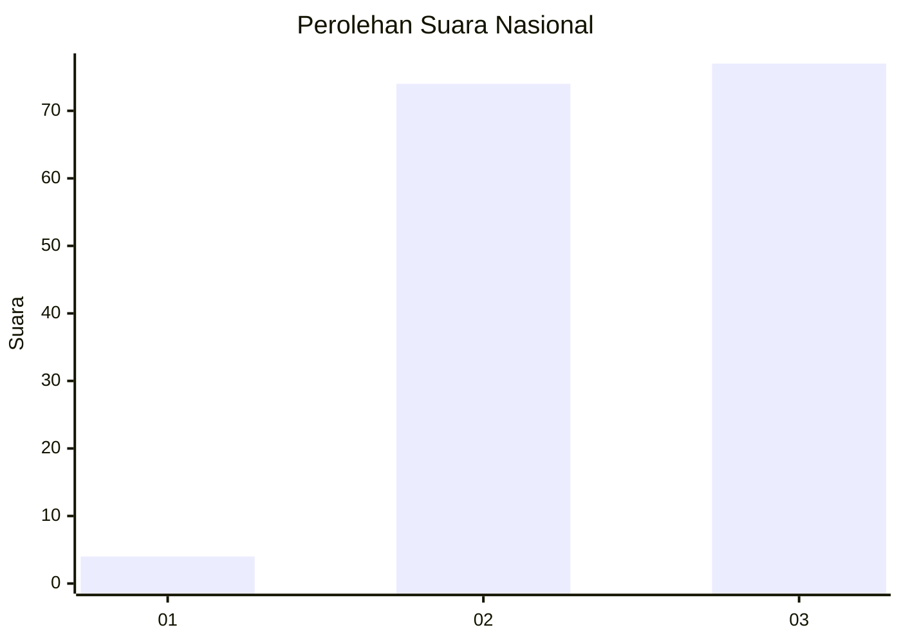
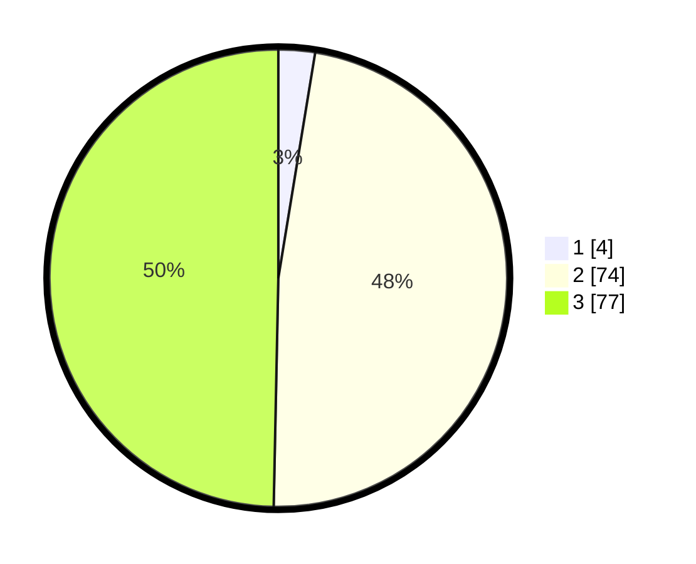

# Hasil

## Grafik

## Tabel

| No. | Nama Paslon    | Suara | Suara (raw) | Persentase |
|:--- |:-------------- | -----:| -----------:| ----------:|
| 1   | ANIES MUHAIMIN | 4     | [4][p-1]    | 2,58       |
| 2   | PRABOWO GIBRAN | 74    | [74][p-2]   | 47,74      |
| 3   | GANJAR MAHFUD  | 77    | [77][p-3]   | 49,68      |

[p-1]: https://github.com/gigit-pemilu/pemilu-2024/blob/main/pilpres/hitung-suara/sub/51-bali/sub/04-gianyar/sub/01-sukawati/sub/2007-batuan/sub/027-tps/sub/paslon-1.txt
[p-2]: https://github.com/gigit-pemilu/pemilu-2024/blob/main/pilpres/hitung-suara/sub/51-bali/sub/04-gianyar/sub/01-sukawati/sub/2007-batuan/sub/027-tps/sub/paslon-2.txt
[p-3]: https://github.com/gigit-pemilu/pemilu-2024/blob/main/pilpres/hitung-suara/sub/51-bali/sub/04-gianyar/sub/01-sukawati/sub/2007-batuan/sub/027-tps/sub/paslon-3.txt

## Foto C Plano

https://sirekap-obj-formc.kpu.go.id/73d7/pemilu/ppwp/51/04/01/20/07/5104012007027-20240215-092350--cf0ff2fe-0c50-437e-90bb-7eb4b1ba53a8.jpg

https://sirekap-obj-formc.kpu.go.id/73d7/pemilu/ppwp/51/04/01/20/07/5104012007027-20240215-092419--663fa609-4ef0-424a-8e69-5a045a89aaac.jpg

https://sirekap-obj-formc.kpu.go.id/73d7/pemilu/ppwp/51/04/01/20/07/5104012007027-20240215-205140--0836b9d3-f81a-4d5a-b33b-342f801ba508.jpg

## Metadata

| Key        | Value               |
| ---------- | ------------------- |
| Time Stamp | 2024-02-15 21:01:18 |

## DATA PEMILIH TETAP

Jumlah pemilih dalam DPT: **174**.
 * L: **86**.
 * P: **88**.

## DATA PENGGUNA HAK PILIH

Jumlah pengguna hak pilih dalam DPT: **158**.
 * L: **76**.
 * P: **82**.

Jumlah pengguna hak pilih dalam DPTb: **0**.
 * L: **0**.
 * P: **0**.

Jumlah pengguna hak pilih dalam DPK: **0**.
 * L: **0**.
 * P: **0**.

Jumlah pengguna hak pilih: **158**.
 * L: **76**.
 * P: **82**.

## JUMLAH SUARA SAH DAN TIDAK SAH

JUMLAH SELURUH SUARA SAH: **155**.

JUMLAH SUARA TIDAK SAH: **3**.

JUMLAH SELURUH SUARA SAH DAN SUARA TIDAK SAH: **158**.

